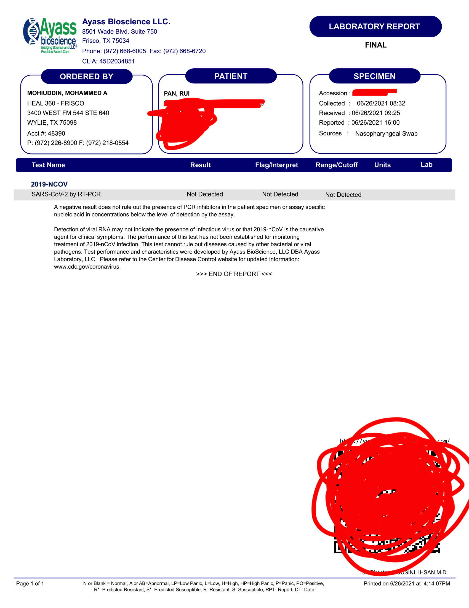

# How to Travel from the U.S. to China onboard AA127 in June 2021

## 前言

* 路上拍了个[vlog](https://youtu.be/TfZENTQxdkA) :)
* 本文写于2021年6月28日。请参考北美票帝的微信公众号/微博和大使馆官网来获取最新的政策/要求。
* 建议在出行前一个月找到飞友微信群互帮互助，我是在北美票帝的微博评论区里找到了拉我进群的好心陌生人。进群了之后参考了很多飞友总结的资料（最全面的是这篇[AA127情况汇总](https://docs.google.com/document/d/1-m6GvE3ZDos4Mtm27KZhwPAYH0CTZme-Jh3zi\_Cygwk/edit)和[从零开始回国指南](https://mp.weixin.qq.com/s/8Z4nrqtVh0IdvMMaaokYwA)，其他的文章我也在文中附了链接），身边也有数不胜数的朋友（Haochen, Yuhan, Yushun等等）提供了帮助，在此道一声感谢！
* AA127这班航班比较特殊，目前仅建议持F/J/M签证或有驻美大使馆认可的“紧急必要”原因的乘客乘坐，非学生签证的可以参考北美票帝的航班表选择其他路线；所有非中国公民，请事先与各个使领馆确认中国签证/居留许可的有效性和回国的“紧急必要”性。
* 购买国内航司的航班之前需要注意，国内为了“公共安全“会每周取消一个国内航司的航班，具体信息可以参考[这篇文章](https://mp.weixin.qq.com/s/HEIGvLELF5OHEIw8kCEX2g)。

## **时间线**

* 4/5: 在UHS接种第一针Moderna
* 5/7: 在UHS接种第二针Moderna
* 5/14: 购买6/28 AA127 DFW-PVG
* 5/15: 购买6/25 AA4231 MSN-DFW
* 5/20: 预约RealTime在6/25的PCR\&IgM检测
* 6/8: 经群友提醒Realtime存在IgM-N蛋白假阳的可能性，reschedule了DFW附近仅有的，经大使馆批准的另一家检测机构 (Ayass)
* 6/26 5:50 AM: 从Hyatt Regency DFW出发，乘坐机场shuttle去car rental center
* 6/26 6:00 AM: 到达Car Rental Center, 在Dollar的柜台排队
* 6/26, 7:00 AM: 在Dollar Car Rental checkout车辆
* 6/26, 7:35 AM: 到达Ayass (顺位是第四辆车), 开始排队
* 6/26, 8:34 AM: Drive-through测PCR, 下车排队测IgM
* 6/26, 9:10 AM: 测完IgM
* 6/26, 4:16 PM: 拿到PCR的阴性报告
* 6/26, 11:43 PM: 拿到IgM的报告 (IgM-S Reactive/Positive, IgM-N Non-Reactive/Negative)
* 6/27, 12:30 AM: 提交健康码审核材料
* 6/27, 2:24 AM: 收到绿码
* ???: 申请指尖码
* ???: 顺利登机
* ???: 到达PVG
* ???: 提行李
* ???: 等大巴
* ???: 入住酒店，开始隔离

## 交通和住宿

* MSN -> [DFW](https://goo.gl/maps/Pjqdba8vd3yMQRmVA)
  * 由于现在中国大使馆要求旅客在飞往中国的航班始发地进行检测，乘客需要提前两天到达出发地。我选择了分开购买MSN-DFW和DFW-PVG的机票（非联程，中间相隔两天）。如果检测点不在常住地，请谨慎购买联程机票，否则有可能在前往检测点的这一班航班check in时就会被不熟练业务的地勤要求出示健康码...
* DFW -> [Hyatt Regency DFW](https://goo.gl/maps/ZL7V2AzvH8nTQ8Fp9)
  * 无托运行李：下飞机后可以坐DFW的Skylink小火车到Terminal C。
  * 有托运行李：需要先出terminal提行李，之后可以坐十分钟一班的Terminal Link Shuttle Bus到Terminal C。
  * Hyatt这家酒店虽然地理位置紧靠Terminal C，但它和terminal不是连着的。
  * 不怕热，行李不重的同学可以直接跟着指示牌走这条路线：Gate C19 -> DFW Parking Lot -> Hyatt Regency DFW Parking Lot。这段路程大概只要走五分钟，但是台阶大概要上上下下三四层，而且德州夏天会非常热。另一条路线是给酒店打电话然后直接乘Hyatt Regency到Terminal C的shuttle（20分钟一班）坐到酒店门口，不过这条路线我没有走过不太熟悉...
* Hyatt Regency DFW
  * 用GrubHub可以点外卖送到前台，周围可以送GrubHub的店有Shake Shack, Chipotle, Panda Express, Hooters, Potbelly, Jersey Mike's等等
* Hyatt Regency DFW -> [DFW Car Rental Center](https://goo.gl/maps/r1ZzqfeAJTtpVeP29)
  * 机场有到Car Rental Center的shuttle，频次大约是15分钟一班，车程十分钟左右。注意DFW Terminal出来后有两层，行李转盘的那一层是露天的，shuttle的站是在下面一层，可以通过 {在terminal里坐自动扶梯, 走到terminal parking lot后走楼梯下楼}到达。
* DFW Car Rental Center -> [Ayass Lab](https://goo.gl/maps/TXeuN6Fg7MBBTwPG8):
  * 自己租车的话走toll road全程高速，开过去只要半小时。德州交过路费比较麻烦（要么买pass，要么pay by mail）。为了方便，我在Dollar Car Rental买了一天12刀的toll pass。
  * 如果不会开车/嫌麻烦，可以在飞友群里联系华人司机/和他人拼车！
* Checking in at DFW
  * 我这班AA127是在Terminal D飞。因为AA[独占了大半个DFW](https://www.airport-dallas.com/terminals.php)，理论上在任意一个terminal都可以check in。

## Ayass检测流程

* PCR
  * Drive through: 在指示牌后排队
  * Walk in: 直接走到蓝色棚子里和工作人员说，不过不清楚walk in的需要排多久队
  * 工作人员会给每个人发放两张表格，分别是PCR和IgM的检测表格
  * 填表格：填写个人信息，billing info（虽然PCR免费，但如果有学生保险，还是可以在这里填写保险信息，Ayass大概会bill保险公司？），questionnaire，然后print name + signature。具体怎么填写可以看[这篇文章](https://docs.qq.com/pdf/DTWtFWHZLbWp3Umpn)
  * 工作人员会收走护照和PCR的测试表格
  * 在蓝色棚子里进行鼻咽拭子的样本采集。采集前，工作人员会交还护照和护照首页的复印件
* IgM
  * 测完IgM，停好车，在Ayass八号楼排队测试，准备好护照，护照首页复印件和IgM的测试表格
  * 如果要加测N蛋白，进入测试点后跟医生说，医生会让你填两张表，第一张在划黄色荧光笔的地方填写个人信息，第二张需要签字
  * 准备好450刀现金（如果不测N蛋白，只需要350），工作人员可以提供找零
  * 收钱之后，工作人员会提供receipt，这张收据一定要收好，之后拍照要用
  * 抽血前请和工作人员仔细double check个人信息
* 测完后
  * 拍三张照片，详见“申请健康码“section
* 上厕所：Ayass没有public bathroom，憋得慌可以去一迈之外的[Walgreens](https://goo.gl/maps/pchSCYdAs6PAeUj89)解决（开车五分钟，走路20分钟）
* 周边吃饭：Walgreens那一片有很多饭店，可以点个pick up或者drive through在车里吃
  * 这次来德州最大的收获是发现Walgreens有卖[Nice!](https://www.walgreens.com/store/c/productlist/nice!-snacks/N=360665-362398)这个牌子的零食，好吃又便宜我真的爱了

## 申请健康码

* PCR, IgM-S, IgM-N, IgG解释（参考了[这篇文章](https://docs.qq.com/doc/DSHpwV0NDYkdZSVFT)）：
  * PCR（SARS-CoV-2 by RT-PCR 阴性报告）：鼻咽拭子测试，要拿到绿码这个必须是阴/Not Detected。
  * IgM-S（IgM for “Spike Protein (S-Protein)，S蛋白）：要拿到绿码，没打过疫苗的话S蛋白必须是阴/Non-Reactive，打过疫苗的话S蛋白可以阳，但是N蛋白必须阴。
  * IgM-N（IgM for “Nucleocapsid Protein (N-Protein)，N蛋白）：阴性表明近期没有感染新冠病毒，或者近期没有暴露在新冠病毒的环境下；如果是阳性，表明有近期新冠病毒感染 。这是大使馆最重视的一项结果。
  * IgG：IgG是长期抗体，Ayass没有测，我也不太了解，可以看看上面链接的那篇文章
* 申请健康码的portal是一个微信小程序，全名叫“防疫健康码国际版“。
* 对于打了疫苗的同学，申请健康码所需的图片可能会超过健康码小程序的上传照片数量限制（十张）。我用[Scanner Pro](https://apps.apple.com/us/app/scanner-pro-pdf-scanner-app/id333710667)扫描了文档，然后用[Picsew](https://apps.apple.com/us/app/picsew-screenshot-stitching/id1208145167)对图片进行了拼接。
* 健康码需要的十张图片（**附录里会附上打了码的照片供参考**）：
  1. 护照首页 + 签证页&#x20;
  2. 疫苗接种声明书 + CDC小白卡 + 疫苗接种机构证明
     1. 疫苗接种声明书可以从大使馆官网下载，链接[在这](http://www.china-embassy.org/eng/notices/P020210421787870030822.pdf)。注意网上有好几个版本的接种声明表，现在应该是只认这个有英文的表格
     2. 疫苗接种机构证明：Walgreens应该有自己的documentation。我是在学校的UHS进行的接种，所以在Wisconsin Immunization Registry request了record。全美50州获取疫苗接种记录的方法可以看[这里](https://www.cdc.gov/vaccines/programs/iis/contacts-locate-records.html)
  3. I20
  4. 回国航班的Itinerary&#x20;
     1. AA官网，confirmation email里都可以找到
  5. Ayass预约邮件
     1. 在[Ayass官网预约](https://ayassbioscience.com/covid-19-testing-for-travelers-to-china/)之后，confirmation email里可以找到，保存成PDF
  6. PCR报告
  7. IgM报告
     1. 如果同时测了IgM-S和IgM-N，可以把Ayass发来的两页PDF转成png再拼图
  8. 在Ayass拍的另外三张照片
     1. 要求：手持护照首页，Ayass的收款receipt，露出静脉抽血伤口，露脸。戴眼镜但是护照照片上没戴的同学们在拍照时建议把眼镜摘了
     2. 照片一：Ayass Bioscience Inc 八号楼楼下，COVID-19 IgM Testing牌子前
     3. 照片二：IgM Sample Collection门前
     4. 照片三：Ayass Bioscience门前
* 可能需要提交的其他材料
  * 做PCR时捅鼻子的照片。注意Ayass要求拍摄时不能拍到工作人员
  * 回国必要性证明（F签坐AA127应该不用写，其他身份/始发地可以看[这里](https://docs.qq.com/doc/DSE9Ga2dudG9jZkZu)做个参考）
* 健康码的小程序做得比较捞，每次审核只能上传十张照片，超过十张可能会在提交申请 -> final confirmation的这一步被吞图。有时图片尺寸过大可能还会上传失败，这种情况的话把图片删了重新上传多试几次即可。注意上传的图片会被压缩，提交之前最好检查一下护照/I20上的字样是否清晰
* 健康码的有效期是48小时，不过还是建议一拿到检测报告就提交申请以防出问题
* 申请海关码
  * 申请的portal也是微信小程序，叫“海关旅客指尖服务“
  * 申请海关码不需要人工审核
  * 这个二维码是在中国海关入关的时候用，有效期是24小时，所以建议在值机前几小时填写
* 健康码在check in的时候柜台工作人员会查，在登机之前会检查两个码，要去检票口敲个章才能登机

## 到中国机场后怎么走

本来打算关于这个topic写一整个section的，但是落地了才发现检测区域不让拍照... 虽然人多，但是工作人员也多，所以落地了把所有材料（护照，健康码，海关码，疫苗接种证明）拿在手上，听从工作人员的指挥就行。

## 隔离

* 上海目前对本地人的政策是14+7（14天集中隔离，7天居家隔离），外省的政策不一
* 我坐的AA127是6/29 14:50落地，解除隔离的时间是7/13 14:00
* 隔离期间第{1, 4, 7, 14, 16, 21}天 (1-based indexing)要做核酸检测，其中第一天/在机场坐的那次是捅鼻子/喉咙，后面的都是鼻子

## 附录

### 申请健康码需要的十张图片（顺序同上）

#### 1. 护照首页 + 签证页，这个就不附图了🐶

#### 2. 疫苗接种声明书 + CDC小白卡 + 疫苗接种机构证明

#### 3. I20，也不上图了

#### 4. 回国航班的Itinerary

#### 5. Ayass/检测机构预约邮件

#### 6. PCR报告

#### 7. IgM报告

#### 8.1. Ayass Bioscience Inc 八号楼楼下，COVID-19 IgM Testing牌子前

#### 8.2. IgM Sample Collection门前

#### 8.3. Ayass Bioscience门前

### 上传申请材料的位置

### 费用总结

* 来回机票：现在最便宜的直飞机票差不多是两千五朝上，加上在美国飞去检测地/在中国隔离完飞回老家的机票钱，这里一共算6000
* 检测费用：Ayass加测N蛋白一共是450
* 检测地住宿+交通：2-3天酒店，一晚100刀左右；租车/请司机一天100+，因为我有人同行，所以这里的费用加起来算250
* 上海隔离酒店：我住的是400一天包吃住，一共是14天 -> 800刀左右
* 这么看一趟下来是7500刀左右，肉真的疼:\_(，不过回去能陪陪两年没见的爸妈/同学/家里老人，这些是钱买不到的
