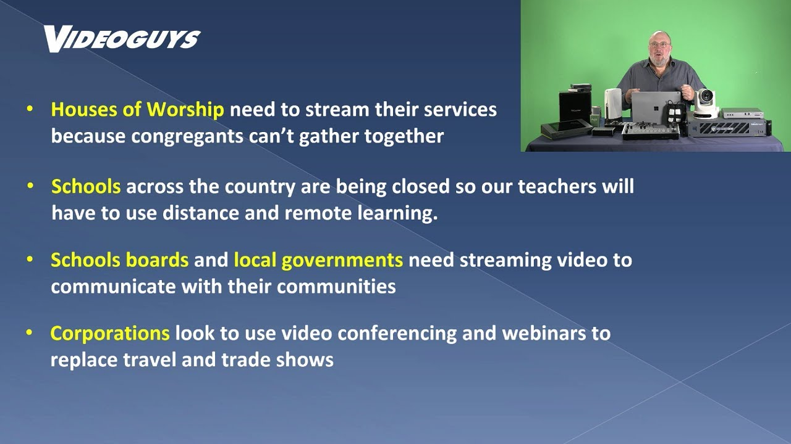

# How to Create Picture-in-Picture Effect / Video Overlay for a Presentation Video

The picture-in-picture effect (video overlay) allows you to place a video clip in a small frame on top of another so that they play at the same time like this:

There are multiple ways to make such videos. Here, I will be introducing my workflow on macOS to create these videos using an easy-to-use, PowerPoint-like application, [ActivePresenter](https://atomisystems.com/activepresenter/) by Atomi Systems.

## Requirements

* [Download and install ActivePresenter](https://atomisystems.com/download/)
* A computer that runs Windows /  macOS
* A webcam
* A microphone (recommended for audio quality)

## Creating Presentation Slides

ActivePresenter is like Microsoft PowerPoint but with additional support for embedding video clips. ActivePresenter supports creating slides and video recordings from within the application. It also supports importing slides from PowerPoint.

## Create a Screen Recording / Import a Pre-Recorded Video

In ActivePresenter, videos can be inserted either by recording a webcam footage in ActivePresenter or doing a drag-and-drop to import pre-recorded videos. Personally, I prefer to do many takes using the macOS-built-in QuickTime Player app, and have one separate clip for each slide in the presentation. The videos can be resized to the same size and placed in a specific corner of the output video.

When recording a video clip, considering using a microphone to record the audio. All built-in microphones in laptops and earphones create static noises that impact the audio quality by a lot. Also, consider adding closed captions for deaf and hard-of-hearing viewers.

## Managing Animations, Closed Captions, etc.

ActivePresenter has a neat functionality that allows users to control the timeline of events in a slide. By dragging the horizontal bars, I can control when elements appear/disappear, adjust the properties of the embedded video clip, and even add closed captions. Closed captions can either be exported as soft subtitles (.SRT) that can be uploaded to platforms like YouTube or as hard subtitles embedded into videos.

## Exporting the video

As easy as a click of a button, final videos can be exported as mp4 files.

