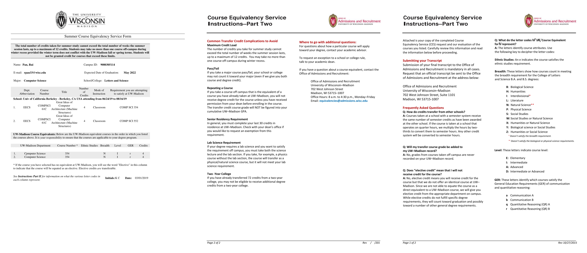

# How to Transfer Credits Back to UW-Madison

**Update: As of Dec 2020,** [**UW College Online is no longer offering courses**](https://online.uwc.edu/)**. The best alternative at this point seems to be** [**UC Berkeley Extension**](https://extension.berkeley.edu/)**.**

Looking back, I have a mixed feeling about my course plan at UW-Madison. Taking courses that's not in my area of interest is fun and challenging by pushing me out of my comfort zone. The problem is that as of spring 2020, the tuition for taking 12-18 credits as an international student is about $19,500, which means each 3-credit class costs you $3,250.

This sucks, a lot.

The beauty of online classes is that they are **cheap**. I took BIO141 at [UW College Online](https://online.uwc.edu/), and the 3-credit class cost merely $789. Aside from that, the grade you receive will not be calculated into your UW-Madison GPA, and the credit can be transferred as long as you get a C or above, so you don't need to worry about breadth classes hurting your GPA at UW-Madison. With the credits you save, you get to take more major-related classes during a regular term.

Just as a recap, the pros of transferring credits back are:

* It saves you a lot of $;
* It relieves you from worrying about your GPA being held back by a biology class;
* You get to take more major-related classes at your home campus;
* If you take enough classes, you could graduate early and potentially save $$$!

**Note that the information I'm sharing may be outdated, so please refer to the latest policy before you take a class. Always reach out to your advisor for any questions!** As of 2020/01/30, I'm looking at [this page](https://registrar.wisc.edu/transfer-your-credit-to-uw-madison/) as I write down this blog.

## Step 1: Make sure a course transfers

Generally, there are two types of courses you can take: courses **in** the Wisconsin system and courses **not** in the Wisconsin system.

For courses in the Wisconsin system, see the [Credit Transfer Wizard](https://www.wisconsin.edu/transfer/wizards/) to check if a course transfers \(and what class it is equivalent to\). Most of the classes at [UWC](https://online.uwc.edu/) are transferrable.

For a course that's not in the Wisconsin system, there is a [Transfer Equivalency Database](https://apps.admissions.wisc.edu/apply/transfer/ted/) that you can refer to when taking a class in Illinois and Minnesota. If you don't see your institution \(say you are taking a class at UC Berkeley\), you need to submit a course equivalency request to the [Course Evaluation Service](https://apps.admissions.wisc.edu/ces/ces_portal.php) before you enroll in the class.



The CES will be available from March 1 to May 15 for summer term evaluation and from November 1 to December 1 for winter term evaluation. Once you receive a confirmation from the Office of Admissions and Recruitment \(like the picture shown above\), just sign up for the class and move on to the next part...

## Step 2: Get a C or above

Yeah, it's that simple... As the grade of this class will not show up on your UW-Madison transcript, you just need to pass this class for the credit to transfer. Seriously, don't screw this up. \(I almost did XD\)

## Step 3: Submit a transcript

After weeks \(might be hours though, if you know you know\) of binge studying for this class, you got your grade! Now, you just have to request an official transcript and send it to the Office of Admissions and Recruitment at the address below...

```text
Office of Admissions and Recruitment
University of Wisconsin–Madison
702 West Johnson Street, Suite 1101
Madison, WI 53715-1007
```

... and the course will be in your record in a couple of days!

Update: Apparently UW-Madison accepts digital transcripts now, so you can order a transcript in PDF.

Update: You need to send an email to `crediteval@registrar.wisc.edu` once you've submitted the transcript for the registrar people to add the class to your student record.


## As we close to an end...

Hopefully, you got your class officially transferred. If this guide helped you \(even by just a little bit\), please let your friends know about this opportunity so they don't have to tear their hair out over a class they hate. I for one wouldn't have known this without [Shawn Zhong](https://shawnzhong.com/), so kudos to him for sharing this information!

