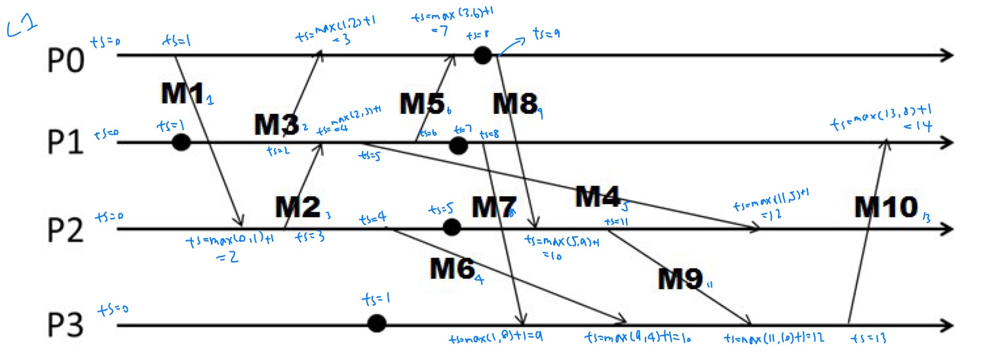
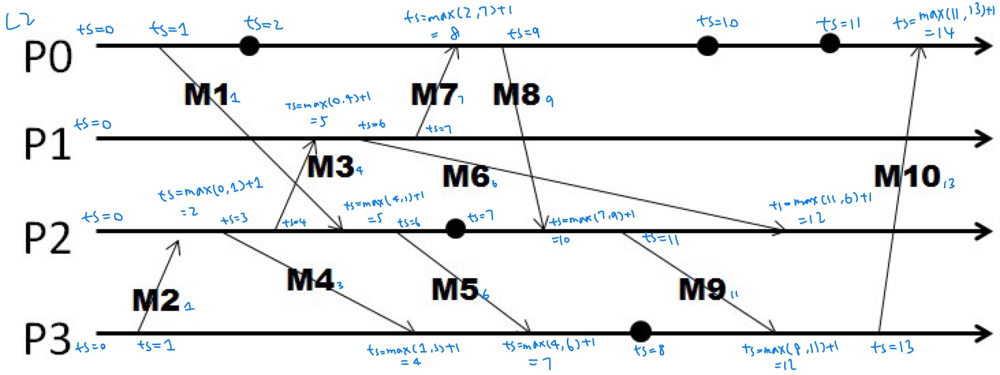
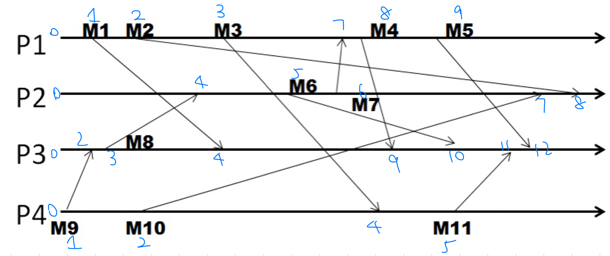
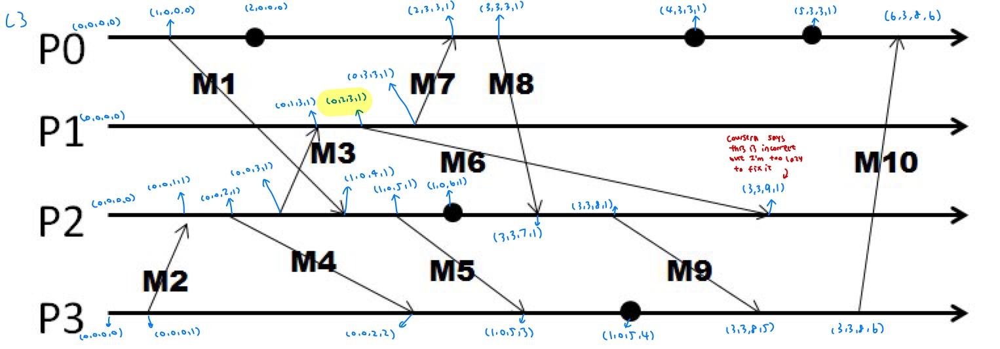
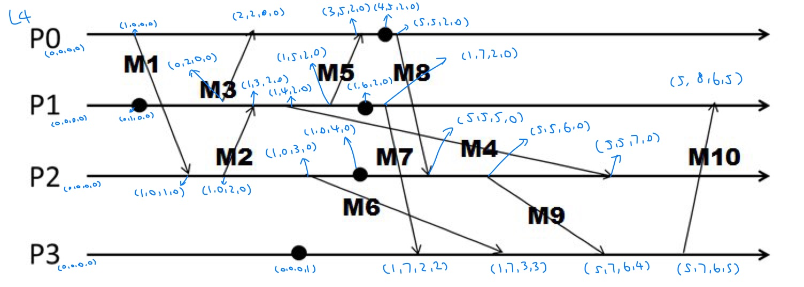
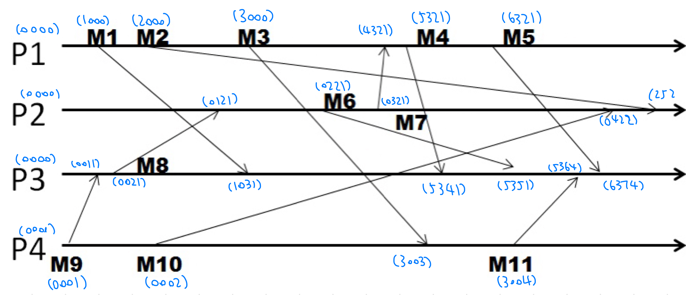

# 1.4 Key-Value Stores, Time, and Ordering

## Lesson 1: Key-Value Stores

### Why Key-Value / NoSQL?

* The Key-Value Abstraction
  * Twitter: Tweet ID -> Info about tweet
  * Amazon: Item ID -> Info about it
  * Chase: Account # -> Info about it
* Kind of like a distributed dictionary/DHT in P2P systems
* Kind of like a database
  * Why not use relational DBMS? Mismatch with today's workloads
    * Data: Large and unstructured
    * Lots of random reads and writes from lots of clients
    * Sometimes write-heavy, while RDBMS are often optimized for reads
    * Foreign keys rarely needed
    * Joins frequent
* Demands of today's workloads
  * Speed
  * Avoid Single Point of Failure (SPoF)
  * Low Total Cost of Operation (TCO)
  * Fewer System Administrators
  * Incremental Scalability
  * Scale out, not up
    * Scale up: Grow the cluster capacity by replacing with more powerful machines
    * Scale out: Incrementally grow the cluster capacity by adding more COTS machines (Components Of The Shelf, sweet spot on the price curve)
      * This is cheaper, and we can phase in/out newer/older machines over a long duration
* NoSQL: Not Only SQL
  * Necessary API operations: get(key) and put(key, value)
  * There are tables like in RDBMS systems, but they may be unstructured/may not have schemas/don't always support joins/foreign keys, but they can have index tables
  * Storage: column-oriented storage
    * RDBMS stores an entire row together (on disk or at a server)
    * NoSQL systems store a column (or groups of columns) together
      * Entries within a column are indexed and easy to locate given a key (and vice versa)
      * This makes ranged searches within a column faster (as we don't need to fetch the entire database)
        * E.g., get me all the blog\_ids from the blog table that were updated within the past month&#x20;

### Cassandra

* Data placement strategies
  * SimpleStrategy
    * RandomPartitioner: Chord-like hash partitioning
    * ByteOrderedPartitioner: Assigns ranges of keys to servers, easier for range queries
  * NetworkTopologyStrategy: For multi-DC deployments
    * Two/three replicas per DC
    * Per DC: The first replica is placed according to partitioner, then go clockwise until you hit a different rack
* Snitches: Maps IPs to racks and DCs
  * SimpleSnitch: Unaware of topology/rack
  * RackInferring: Assumes network topology by octet of server's IP address
    * 101.102.103.104 = x.\<DC octet>.\<rack octet>.\<node octet>
  * PropertyFileSnitch: Uses a config file
  * EC2Snitch: EC2 region = DC, availability zone = rack
* Writes
  * Client sends write to one coordinator node in Cassandra cluster
  * Coordinator uses partitioner to send query to all replica nodes responsible for key
  * When X replicas respond, coordinator returns an acknowledgment to the client
    * X is specified by the client -- we'll come back to this later
  * Hinted Handoff mechanism: If any replica is down, the coordinator writes to all other replicas, and keeps the write locally until down replica comes back up, when it sends a copy of that write. When all replicas are down, the coordinator buffers the write locally

* When a replica nodes receives a write
  * Log it in disk commit log for failure recovery
  * Make changes to appropriate memtables, in-memory representations of multiple key-value pairs. Memtables are flushed to disk when they are full/old.
  * Data files: An SSTable (Sorted String Table), list of key-value pairs sorted by key
  * Index file: An SSTable of (key, position in data SSTable) pairs
  * Efficient search: Bloom filters!
* Bloom filters: Large bit maps
  * Checking for existence in set is cheap
  * Some probabilities of false positives (an item not in set reported as being in there -> incur a slight overhead for going into the SSTable), but never false negatives
  * The bit map starts with all zeros. On insert, we use k hash functions to map a key to k indexes. Then, all hashed bits are set to 1 for those k indexes (if they hadn't been set already)

* Compaction
  * Each server periodically merges SSTables by merging updates for a key
* Delete
  * Instead of deleting right away, add a tombstone to the log, and eventually, it will be deleted by the compaction process
* Reads
  * Coordinator contacts X replicas
  * When X replicas respond, the coordinator returns the latest-timestamped value from those X replicas
  * The coordinator also fetches values from other replicas
    * This checks consistency in the background, initiating a read repair if any two values are different
    * This mechanism seeks to eventually bring all replicas up-to-date
  * A row may span across multiple SSTables -> reads need to touch multiple SSTables -> reads are slower than writes
* Membership
  * Any server could be the coordinator -> every server needs to know about all the servers in the cluster, and the list of servers needs to be updated as servers join/leave/fail
  * Cassandra uses gossip-style membership
* Suspicion mechanism: Sets timeouts on a server-by-server basis
* Reads/writes are orders of magnitudes faster than MySQL. But what did we lose?

### The Mystery of X-The Cap Theorem

* In a distributed system, at most two out of these three can be satisfied:
  * Consistency: All nodes see the same data at any time/reads return the latest value written by any client
    * Thousands of people booking the same flight
  * Availability: The system allows operations all the time & operations return quickly
    * Amazon: each extra ms of latency implies a $6M yearly loss
  * Partition-tolerance: The system continues to work in spite of network partitions (within/across DCs)

* RDBMS provides ACID: Atomicity, Consistency, Isolation, Durability
* KV Stores provides BASE: Basically Available Soft-state Eventual Consistency (prefers availability over consistency)
* In Cassandra, for each operation, a client is allowed to choose a consistency level
  * ANY: Any server (may not be replica)
    * Fastest (coordinator caches write & replies quickly)
  * ALL: All replicas
    * Strong consistency but slow
  * ONE: At least one replica
    * Faster than ALL but no failure tolerance (if all replica fails)
  * QUORUM: Quorum across all replicas in all DCs
    * Quorum = majority (>50%)
    * Any two quorums intersect
    * Faster than ALL while still guaranteeing strong consistency
  * More quorum-related
* Quorum (N = total number of replicas)
  * Read consistency level: R <= N, coordinator waits for R replicas to respond before sending result to client, while in background, coordinator checks for consistency of remaining (N-R) replicas
  * Write consistency level: W <= N. Two flavors: (1) Coordinator blocks until quorum is reached, (2) Async: just write and return
  * For strong consistency:
    * W + R > N (write & read quorums intersect in at least one server among replicas of a key)
    * W > N / 2 (two write quorums ..., which keeps the latest value of the write)

### The Consistency Spectrum

* Cassandra offers eventual consistency: If writes to a key stop, all replicas of key will converge

* Per-key sequential: Per key, all operations have a global order
* CRDT: Commutative Replicated Data Types, commutated writes give same result
  * Servers do not need to worry about consistency/ordering
* Red-Blue: Rewrites client operations and split them into red/blue ops
  * Red ops: Need to be executed in the same order at each DC
  * Blue ops: Can be commutated in any order across DCs
* Casual: Reads must respect partial order based on information flow
* Strong consistency models: Linearizability/Sequential consistency

### HBase

* API functions
  * Get/Put (row)
  * Scan (row range, filter) - range queries
  * MultiPut
* Prefers consistency over availability (unlike Cassandra)

* HBase uses write-ahead log (before writing to memstore) to ensure strong consistency
* Cross-datacenter replication: Single master + other slave clusters replicate the same tables

## Lesson 2: Time and Ordering

### Introduction and Basics

* Time synchronization is required for both correctness and fairness
* Challenges
  * End hosts in Internet-based systems like clouds have their own clocks
  * Processes in Internet-based systems follow an asynchronous system model (no bounds on message delays/processing delays)
* Clock skew/drift: Relative difference in clock values/frequencies of two processes
* MDR: Maximum Drift Rate of a clock. Between any pair of clocks, given a max acceptable skew M, need to synchronize every M / (2 \* MDR) time units

* Consider a group of processes:
  * External synchronization: Each process's clock is within a bound D of a well-known external clock (e.g., UTC)
  * Internal synchronization: Every pair of processes have clocks within bound D
  * External sync. within D implies internal sync. within 2D

### Cristian's Algorithm

* Process P synchronizes with a time server S
* Problem: Time response message is inaccurate, the inaccuracy being a function of message latencies (and since latencies are unbounded, the inaccuracy cannot be bounnded)
* Cristian's Algorithm measures the RTT of message exchanges
* The actual time at P when it receives response is between `[t + min2, t + RTT - min1]`
  * min1 = P -> S latency, min2 = S -> P latency
* Cristian's Algorithm sets its time to `t + (RTT + min2 - min1) / 2` (halfway through this interval)
  * Error is now bounded, being at most `(RTT - min2 + min1) / 2`

### NTP

* NTP = Network Time Protocol
* Each client is a leaf of the tree, each node synchronizes with its parent

* Suppose child is ahead of parent by oreal, and suppose one-way latency of message i is Li, and suppose offset `o = (tr1 - tr2 + ts2 - ts1) / 2`, then
  * `tr1 = ts1 + L1 + oreal`
  * `tr2 = ts2 + L2 - oreal`
  * Then, `oreal = o + (L2 - L1) / 2`, and then,
  * `|oreal - o| < |(L2 - L1) / 2| < |(L2 + L1) / 2|`, making the error bounded by RTT
* Can we avoid clock synchronization and still be able to order events?

### Lamport Timestamps

* As long as timestamps obey causality, we can assign to events timestamps that are not absolute time
* Happens-before is denoted as ->

* Rules for assigning timestamps
  * Each process uses a local counter that is initialized as 0
  * A process increments its counter when a send/instruction happens
  * A send(message) event carries its timestamp
  * For a receive(message) event, the counter is updated by max(local clock, message timestamp) + 1
    * To obey the causality order
* Lamport timestamps are not guaranteed to be ordered or unequal for concurrent events
  * `E1 -> E2` implies `timestamp(E1) < timestamp(E2)`
  * `timestamp(E1) < timestamp(E2)` implies `{E1 -> E2} OR {E1 and E2 are concurrent}`
* Can we tell if two events are concurrent or casually related? -> Vector clocks!

### Vector Clocks

* N processes
* Each process uses a vector of integer clocks: Process i maintains `Vi[1, ..., N]`
* jth element of vector clock at process i, `Vi[j]`, is i's knowledge of latest events at process j
* Rules for assigning vector timestamps
  * On an instruction or send event at process i, it increments only the ith element of its vector clock
  * Each message carries the send event's vector timestamp
  * When process i receives a message
    * `Vi[i] += 1`
    * `Vi[j] = max(Vmessage[j], Vi[j]) for j != i`
* Casually-related:
  * `VT1 = VT2` iff `VT1[i] = VT2[i]` for all i = 1, ..., N
  * `VT1 <= VT2` iff `VT1[i] <= VT2[i]` for all i = 1, ..., N
  * Two events are casually related iff `VT1 < VT2`
    * i.e., iff `VT1 <= VT2` & there exists j such that `1 <= j <= N & VT1[j] < VT2[j]`
  * Two events are concurrent iff `NOT(VT1 <= VT2) AND NOT (VT2 <= VT1)`
    * Denote as `VT1 ||| VT2`

