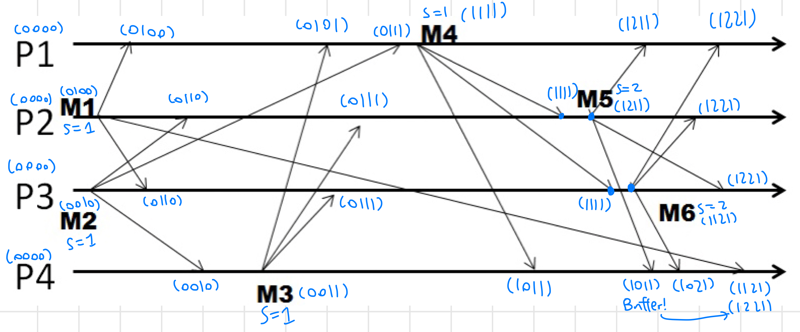
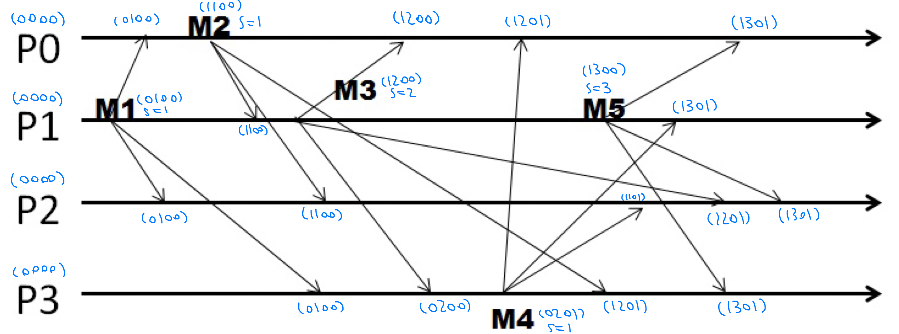
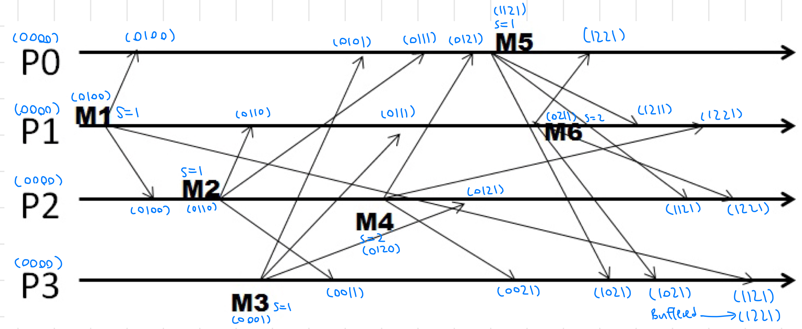
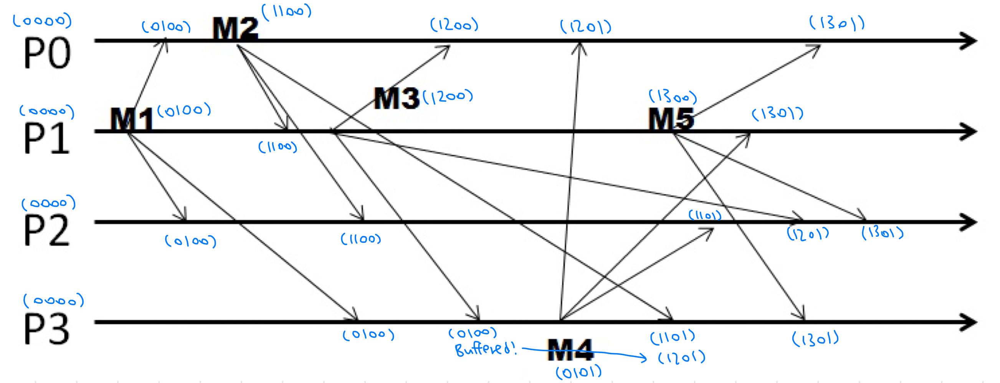
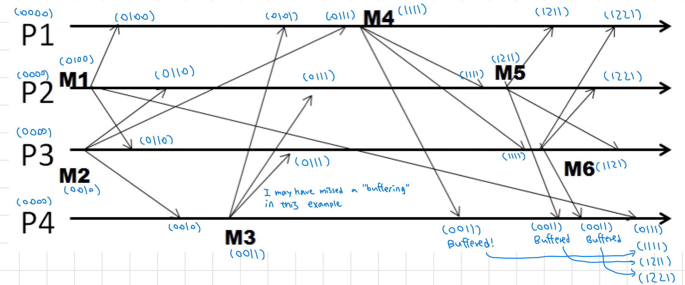
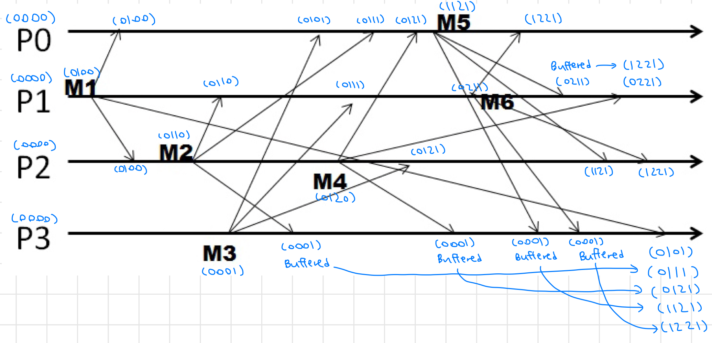

# 1.5 Classical Distributed Algorithms

## Lesson 1: Snapshots

### What is Global Snapshot?

* In the cloud: Each application or service is running on multiple servers which handle concurrent events and interact with each other. Thus, the ability to obtain a "global photograph" of the system is important
* **Global snapshot = global state = individual state of each process/channel in the distributed system**
* First solution: Synchronize clocks of all processes
  * Ask all processes to record their states at know time t
  * Problems
    * Time synchronization always has error
    * Does not record the state of messages
  * Causality is enough!

### Global Snapshot Algorithm

* System model:
  * N processes in the system
  * Two uni-directional communication channels between each ordered process pair
  * Channels are FIFO
  * No failures
  * All messages arrive intact and are not duplicated
* Requirements
  * Snapshot should not interfere with/block normal application actions
  * Each process is able to record its own state
  * The global state is collected in a distributed manner
  * Any process may initiate the snapshot
* Chandy-Lamport Global Snapshot Algorithm
  * First, Initiator Pi records its own state
    * The initiator process creates special messages called "Marker" messages
    * For all other processes j, Pi sends out a Marker message on outgoing channel Cij (N-1 channels in total)
    * Starts recording the incoming messages on each of the incoming channels at Pi: Cji for j = 1 to N excluding i
  * Whenever a process Pi receives a Marker message on an incoming channel Cki
    * If this is the first Marker Pi is seeing
      * Pi records its own state first
      * Marks the state of channel Cki as "empty"
      * For j = 1 to N except i, Pi sends out a Marker message on outgoing channel Cij
      * Starts recording incoming messages on each of the incoming channels at Pi: Cji for j = 1 to N except i and k
    * Else (if it has already seen a Marker message):
      * Mark the state of channel Cki as all the messages that have arrived on it since recording was turned on for Cki
  * The algorithm terminates when
    * All processes have received a Marker (to record their own state)
    * All processes have received a Marker on all the N-1 incoming channels (to make sure each process has its state recorded)
  * Then, optionally, a central server collects all these partial state pieces to obtain the full global snapshot

### **Consistent Cuts**

* Cut = time frontier at each process and at each channel
* Events at the process/channel that happen before the cut are "in the cut"
* Consistent cut: A cut that obeys causality
  * A cut is consistent iff for each pair of events (e, f) in the system s.t. event e is in the cut C, and if f -> e, then f is also in the cut C

* Any run of the Chandy-Lamport Global Snapshot algorithm creates a consistent cut
  * Proof by contradiction

### Safety and Liveness

* Liveness: Guarantee that something good will happen eventually
* Safety: Guarantee that something bad will never happen
* Can be difficult to satisfy both in an asynchronous distributed system
  * Failure detector: Completeness/liveness & accuracy/safety cannot both be guaranteed in an asynchronous distributed system
  * Consensus: Decisions/liveness and correct decisions/safety cannot both be guaranteed by any consensus protocol in an asynchronous distributed system
* Liveness w.r.t. a property Pr in a given state S means
  * S satisfies Pr, or there is some causal path of global states from S to S' where S' satisfies Pr
* Safety w.r.t. a property Pr in a given state S means
  * S satisfies Pr, and all global states S' reachable from S also satisfy Pr
* Chandy-Lamport algorithm can be used to detect global properties that are stable (once true, stays true forever afterwards)

## Lesson 2: Multicast

### Multicast Ordering

* Different communication forms
  * Multicast: Message sent to a group of processes
  * Broadcast: Message sent to all processes anywhere
  * Unicast: Message sent from one sender process to one receiver process
* FIFO Ordering
  * Multicasts from each sender are received in the order they are sent, at all receivers
  * Doesn't care about multicasts from different senders
* Casual Ordering
  * Multicasts whose send events are causally related must be received in the same causality-obeying order at all receivers
  * Concurrent multicasts are ok to be received in different orders at different receivers
  * Casual Ordering -> FIFO Ordering (the reverse is not true)
* Total Ordering/Atomic Broadcast
  * Ensures all receivers receive all multicasts in the same order
  * Doesn't care about the order of multicast sending
  * May need to delay delivery of some messages at sender

### Implementing Ordering

* FIFO Ordering
  * Each receiver Pi maintains a per-sender sequence number Pi\[1...N], initially all zeros
  * Pi\[j] is the latest sequence number Pi has received from Pj
  * Send multicast from Pj:
    * Pj\[j] += 1
    * Include new Pj\[j] in the multicast message
  * Receive multicast (Pi receives from Pj with sequence number S in the message):
    * If S == Pi\[j] + 1, then
      * Deliver message to application
      * Pi\[j] += 1
    * Else
      * Buffer this multicast until the above condition is true

* Casual Ordering
  * Each receiver Pi maintains a per-sender sequence number Pi\[1...N], initially all zeros
  * Send multicast from Pj:
    * Pj\[j] += 1
    * Include new **entire vector** Pj\[1...N] in the multicast message
  * Receive multicast (Pi receives from Pj with vector M\[1...N], buffer it until both:)
    * This message is the next one Pi is expecting from Pj, i.e. M\[j] = Pi\[j] + 1
    * All multicasts, anywhere in the group, which happened-before M, have been received at Pi, i.e.
      * For all k != j, M\[k] <= Pi\[k] (Receiver satisfies causality)
    * When the above two conditions are met, deliver M to application and set Pi\[j] = M\[j]

* Total Ordering: Sequencer-based approach

### Reliable Multicast

* Reliable multicast loosely says that every process in the group receives all multicasts
  * Reliability is orthogonal to ordering
* When it comes to process failures, the definition becomes vague
* Definition: Need all correct/non-faulty processes to receive the same set of multicasts as all other correct processes

### Virtual Synchrony

* Each process maintains a membership list, called a View
* An update to this membership list is called a View Change
* Virtual synchrony guarantees that all view changes are delivered in the same order at all correct processes
  * A multicast M is said to be "delivered in a view V at process Pi" iff Pi receives view V, and then some time before Pi receives the next view, it delivers multicast M
* Views may be delivered at different physical times at processes, but they are delivered in the same order
* Virtual synchrony ensures that
  * The set of multicasts delivered in a given view is the same set at all correct processes that were in that view
    * **What happens in a view, stays in that view**
  * The sender of the multicast message also belongs to that view
  * If a process Pi does not deliver a multicast M in view V while other processes in the view V delivered M in V, the Pi will be forcibly removed from the next view delivered after V at the other processes
* TODO: Add some examples

## Lesson 3: Paxos

* TODO
