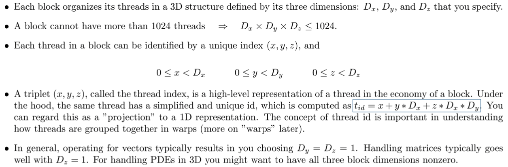
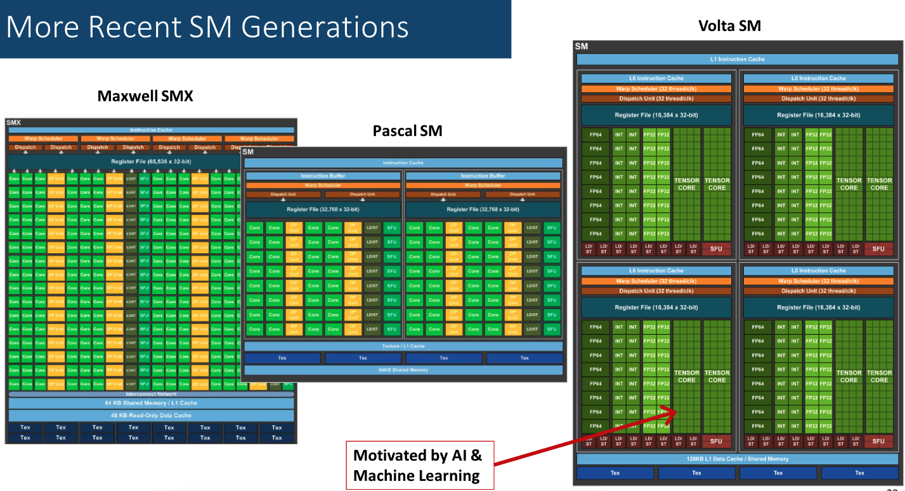
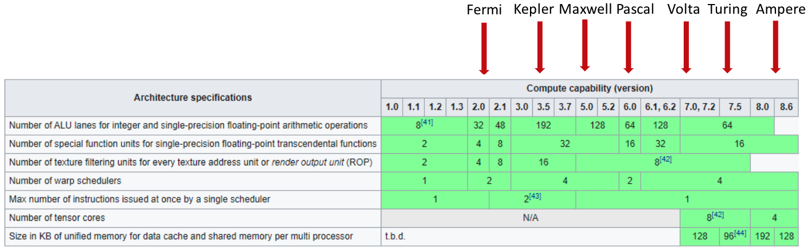
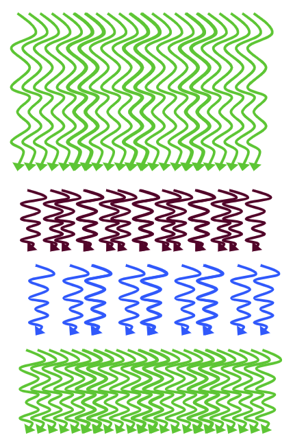

# Lecture 10: GPU Scheduling Issues.

## Lecture Summary

* Wrap up GPU computing: generalities, execution configuration
* GPU computing: scheduling execution

## Using Multiple Blocks


## Execution Scheduling Issues



Scheduling questions:

* What is the order for the blocks to be executed?
* How is this execution process managed?
* When/How are the threads in a block executed?

Two levels of schedulers:

1. Device-level scheduler \(NVIDIA GigaThread engine\): Assigns \(large numbers of\) blocks to \(small numbers of\) SMs that signal that they have “excess capacity”
   1. Once a block is picked up for execution by one SM, it does not leave the SM before all threads in that block finish executing the kernel. Only when a block is finished & retired can we place another block on that SM. Thus, more SMs means a more expensive card.
2. SM-level scheduler \(more interesting\): Schedules the execution of the threads in a block onto the SM functional units

### SM-Level Scheduling



* Each block of threads are divided into 32-thread warps
  * 32: Selected by NVIDIA
  * Warp: A group of 32 thread of consecutive IDs, basic scheduling unit on the SM
* SM hardware implements almost zero-overhead warp scheduling/switching



* Thread IDs within a warp are consecutive and increasing
* But we cannot assume ordering among warps


* There are three possible states for warps:
  * Active warps \(deployed on an SM\)
  * Eligible warps \(a subset of active warps\)
  * Issued warps \(a subset of eligible warps\)
* Warp stalling: No new instruction issued at a clock cycle
  * Possible reasons
    * Instruction fetch
    * Memory dependency
    * Execution dependency
    * Synchronization barrier
* In execution configurations, we should have thread block sizes that result in mostly full warps

## Thread Divergence \(pre-Volta\)

Consider this:

```text
__global__ void odd_even(int n, int* x)
{
    int i = threadIdx.x + blockDim.x * blockIdx.x;
    if( (i & 0x01) == 0 )
    {
        x[i] = x[i] + 1;
    }
    else
    {
        x[i] = x[i] + 2;
    }
}
// half of the threads in the warp execute the if clause, and the other half the else clause

```



* The performance decreases with the degree of divergence in warps, say a 32-case switch statement
* Solutions
  * Pre-Volta: a single program counter is shared amongst all 32 threads, combined with an active mask that specifies which threads of the warp are active at any given time
  * Post-Volta: enables equal concurrency between all threads, regardless of warp
    * Execution state \(PC, program counter & S, call stack\) are maintained per thread \(as opposed to one per warp up until Pascal\)


