# Lecture 14: CUDA Case Studies. \(1\) 1D Stencil Operation. \(2\) Vector Reduction in CUDA.

## Lecture Summary

* Last time
  * Atomic operations
  * Things that shape the speed of execution of a kernel
    * The concept of "occupancy" and what impacts it \(how many threads per block, how many registers/thread, how much ShMem/block\)
  * Rules of thumb, for good execution speed in GPU computing
  * The nvcc toolchain, and how code is sent to host or gpu compilers
* Today
  * Case studies: parallel reduction on the GPU & 1D convolution
  * Looking beyond today: some more GPU computing feature, but looking for a while into optimization features

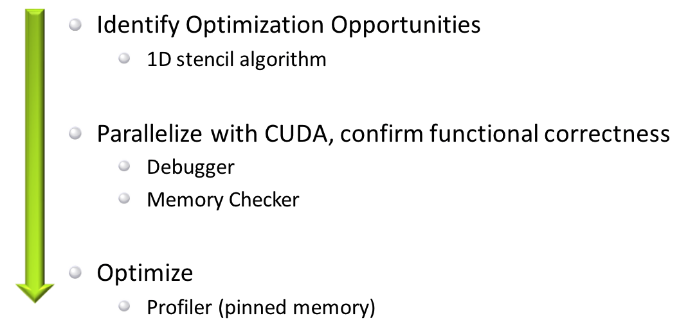

## 1D Stencil Operation

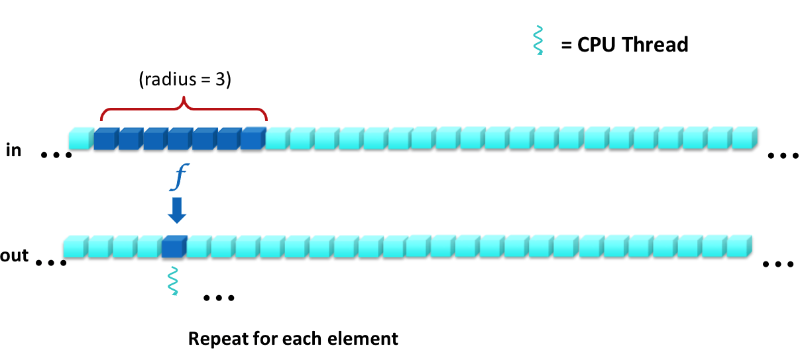

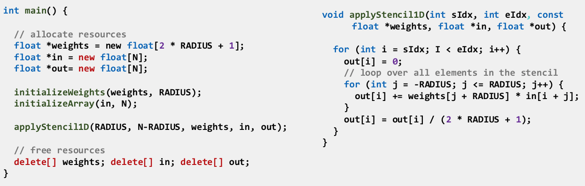

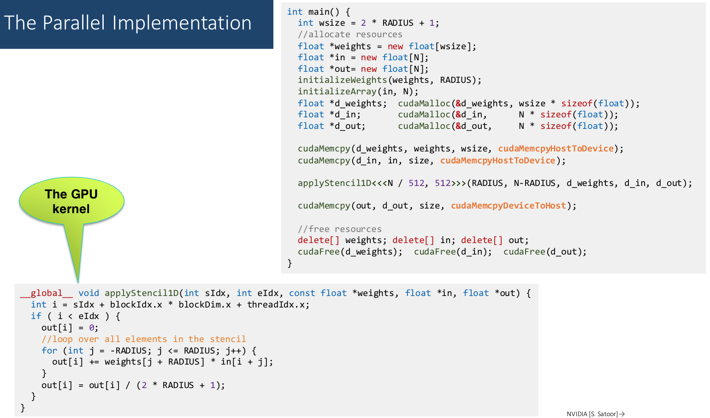

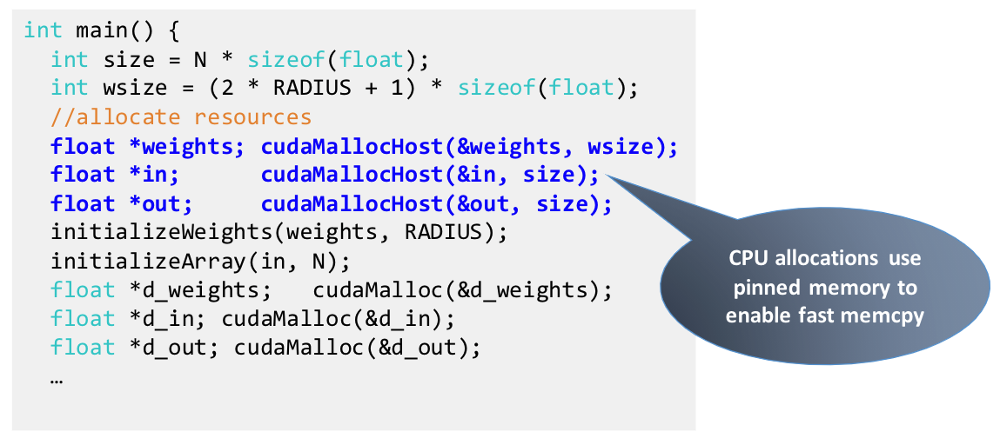

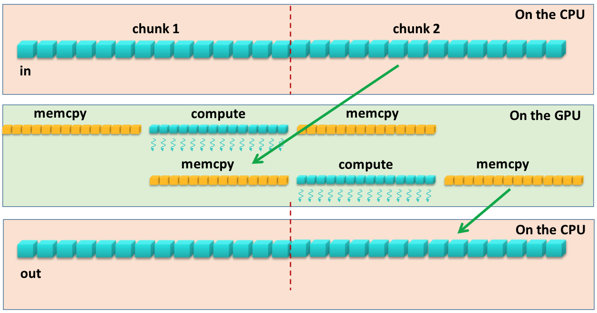

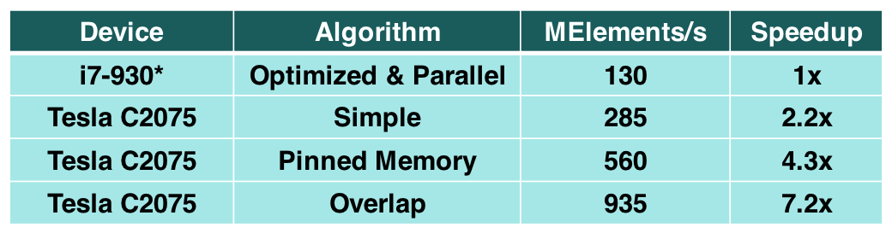

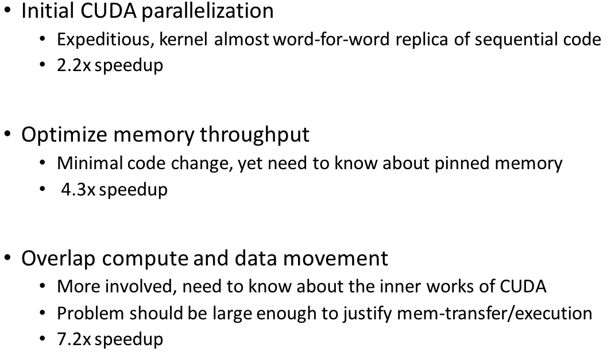

## Vector Reduction in CUDA

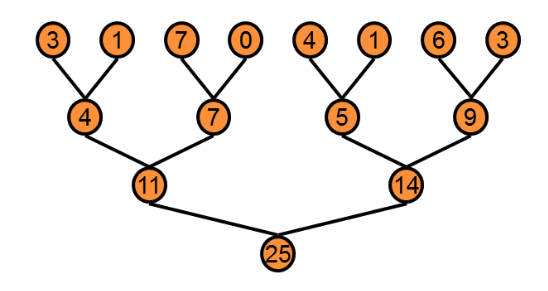

Problem: Ideally we want to synchronize across all thread blocks, but CUDA does not have global synchronization. Our workaround is to decompose into multiple kernels.

* Optimization goal: Reaching GPU peak performance
  * Choosing the right metric
    * GFLOP/s: for compute-bound kernels
    * Bandwidth: for memory-bound kernels
* Reductions have low arithmetic intensity \(1 flop/2 elements loaded\), so we should go for peak bandwidth

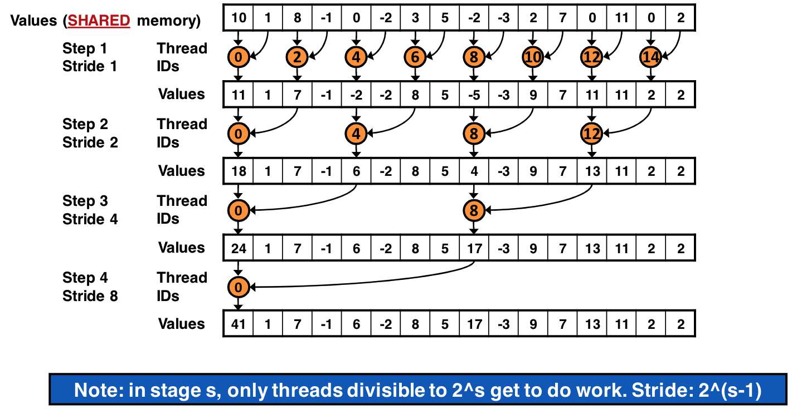

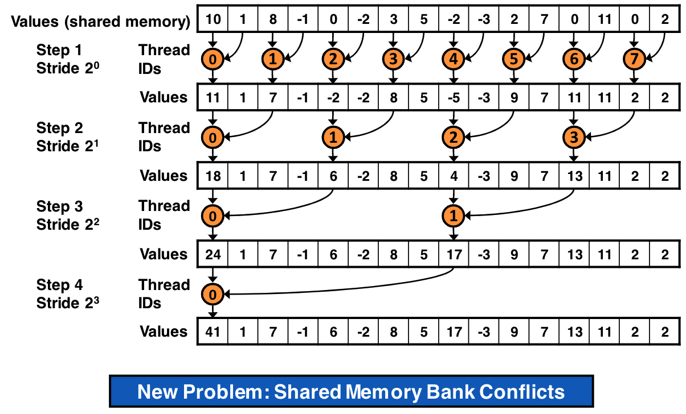

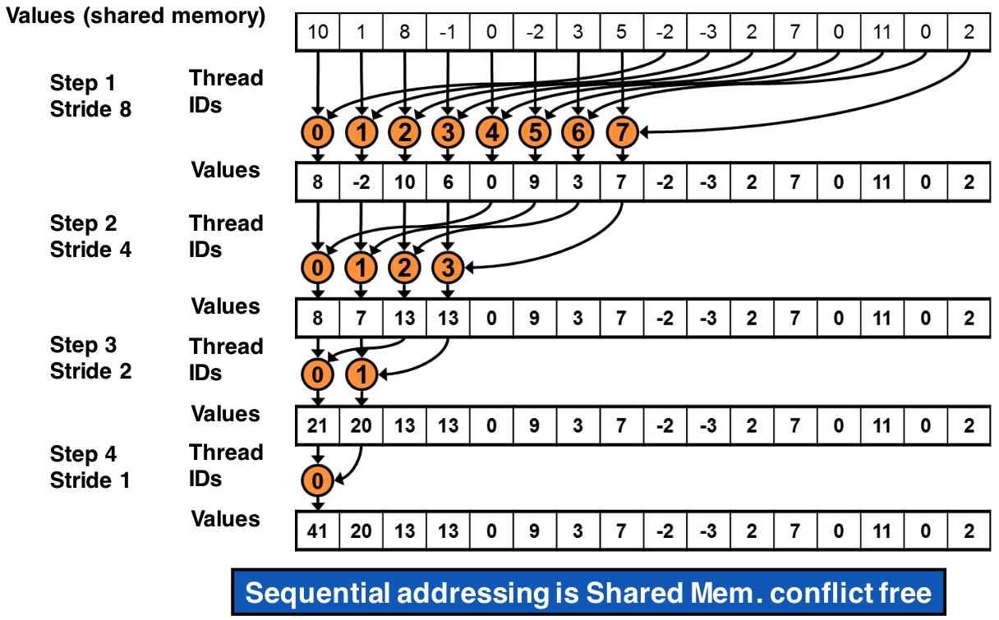

* Kernel 4: Replace single load w/ two loads and first add of the reduction
* Kernel 5: Loop unrolling \(unroll last warp\)
* Kernel 6: Completely unrolling \(using templates\)
* Kernel 7: Multiple elements per thread

