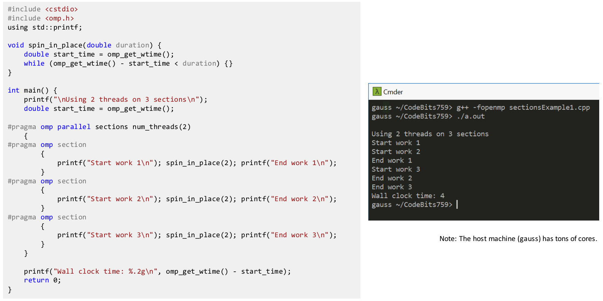
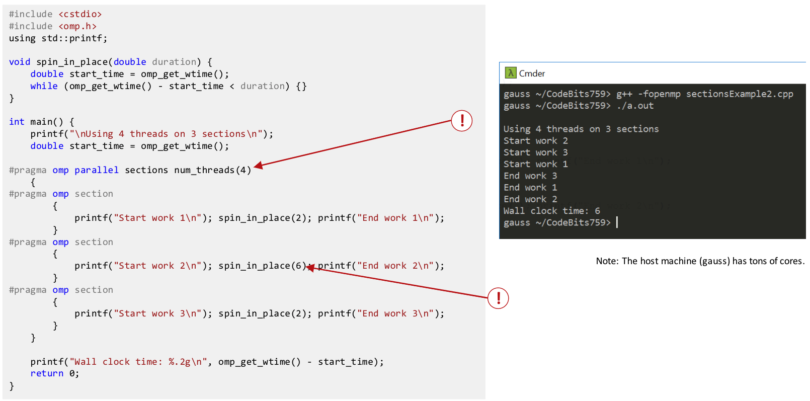
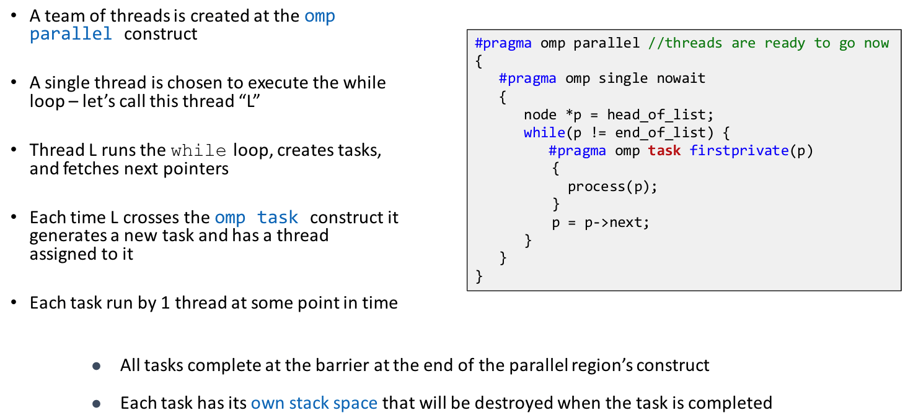
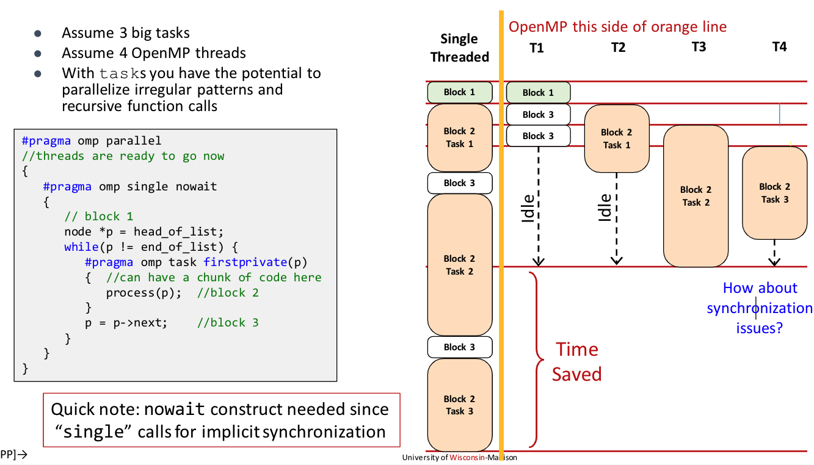
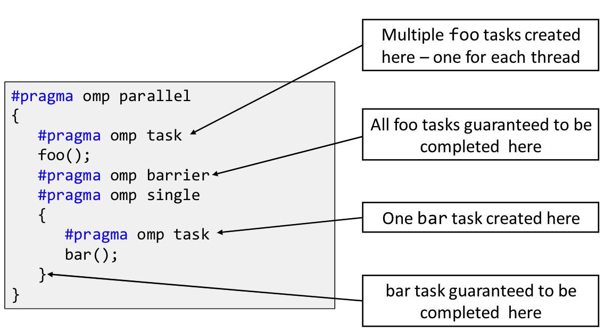
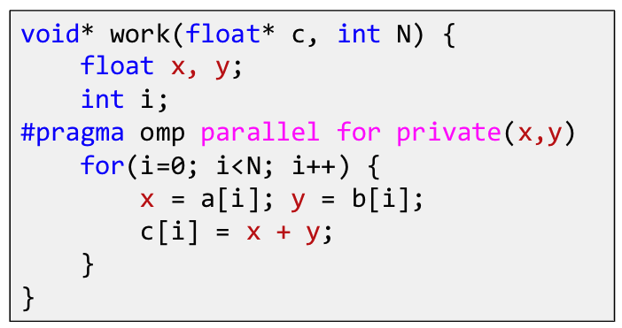
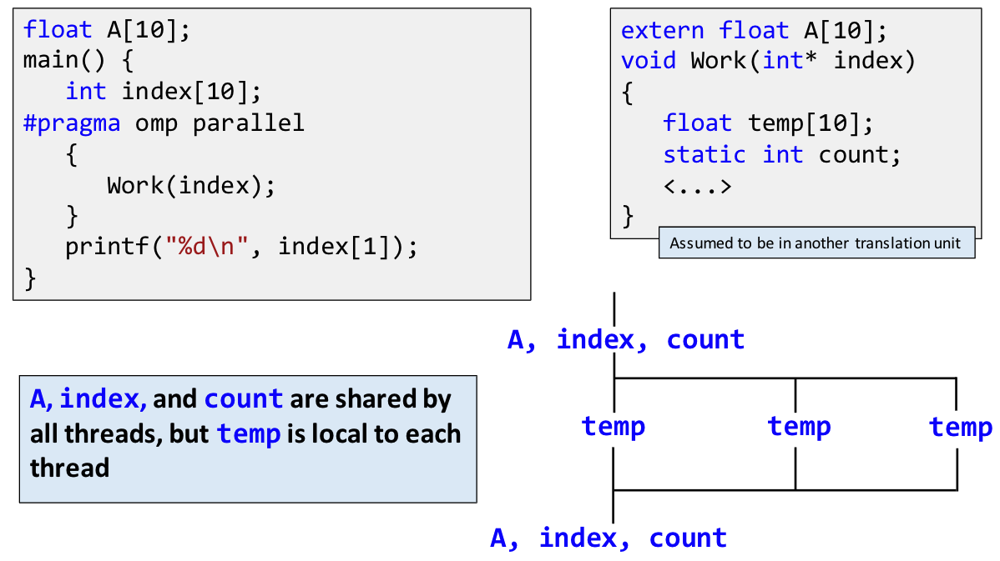
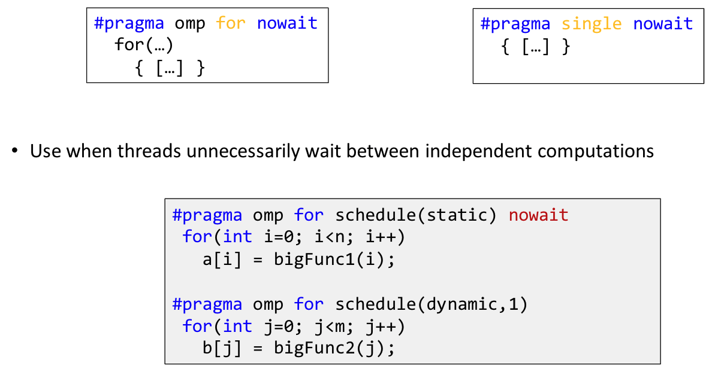
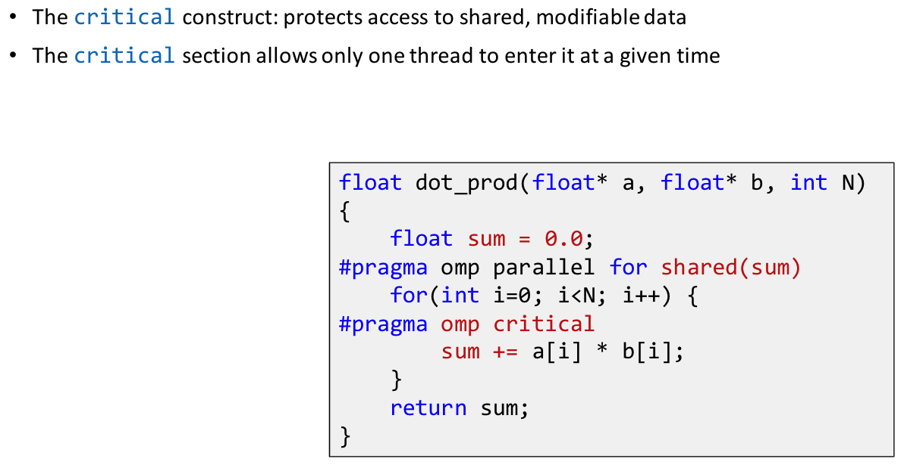
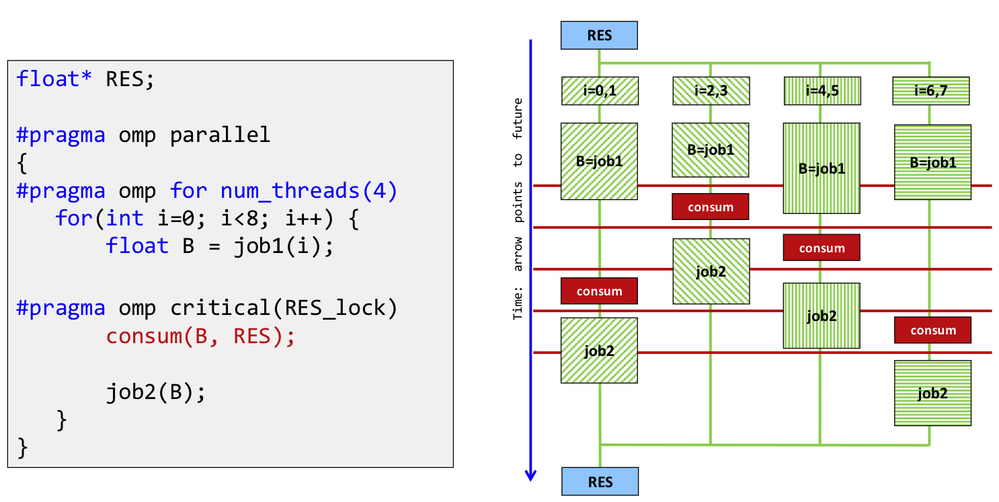

# Lecture 21: OpenMP Work Sharing.

## Lecture Summary

* Last time: OpenMP nested parallelism, work sharing \(for loops, sections\)
* Today
  * OpenMP: nested parallelism, work sharing \(tasks\)
  * OpenMP: variable scoping, synchronization, loose ends

## OpenMP Work Sharing

### omp sections

Ending example

### omp tasks

* Pros: Allows parallelization of irregular problems
  * Unbounded loops
  * Recursive algorithms
  * Producer/consumer
* Cons: Relatively tricky to deal with & introduce some overhead 
* Motivations
  * OpenMP started to be tailored for large array-based applications
  * For example, the parallelization of a dynamic list traversal cannot be done in OpenMP for a long time
  * Storing pointers to list elements in an array: High overhead for array construction \(not easy to parallelize\)
  * Using single nowait inside a parallel region: High cost of the single construct. Also, each thread needs to traverse the entire list to determine if another thread has already processed that element
* Who does what and when?
  * The developer
    * Uses a pragma to specify where & what the tasks are
    * Ensures that there are no dependencies \(that is, tasks can be executed independently\)
  * The OpenMP runtime system
    * Generates a new task whenever a thread encounters a task construct
    * Decide the moment of execution \(can be immediate or delayed\)
* Definition: A task is a specific instance/combo of executable code along w/ its data environment \(the shared & private data manipulated by the task\) and ICV \(internal control variables: thread scheduling and environment variables, typically associated with OpenMP\)
* Synchronization issues. Solution: use task barriers \(`#pragma omp barrier`, `#pragma omp taskwait`\) to ensure the completion of tasks.

## OpenMP Variable Scoping Issues

* Threads have access to a pool of memory that is shared
* Threads can also have private data
* Basic rule: Any variable declared prior to a parallel region is shared in that parallel region
* The private clause reproduces for each thread variables declared private in the pragma
* There are also OpenMP variables treated as private by default
  * Stack \(local\) variables in functions called from within parallel regions
  * Loop iteration variables
  * Automatic variables within a statement block
* When in doubt, always explicitly indicate something to be private
* firstprivate: Specifies that each thread should have its own instance of a variable. Moreover, the variable is initializes using the value of the variable of the same name from the master thread
  * Usage: \#pragma omp parallel num\_threads\(4\) firstprivate\(i\) 
* lastprivate: The enclosing context's version of the variable is set equal to the private version of whichever thread executes the final iteration of the work-sharing construct \(for or section\)
* Data scoping is a common source of errors in OpenMP. It is the programmer's responsibility to make sure data dependencies do not lead to race conditions

## OpenMP Synchronization

* Explicit barrier: \#pragma omp barrier
* Implicit barriers: parallel, for, single, sections
* Unnecessary barriers hurt performance and can be removed with the nowait clause \(applicable to for, single, sections\)

