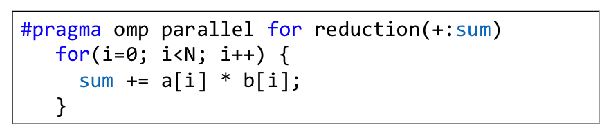

# Lecture 22: OpenMP Work Sharing

## Lecture Summary

* Last time
  * OpenMP: Tasks, variable scoping, synchronization \(barrier & critical constructs\)
* Today
  * Wrap up synchronization
  * OpenMP rules of thumb
  * Parallel computing w/ OpenMP: NUMA aspects & how caches come into play

## Synchronization

* The atomic directive
  * A guarded memory access operation
  * Can only protect a single assignment
  * Applies only to simple update of memory
  * Is a special case of a critical section with significantly less overhead due to atomicity
* The reduction construct \(see example down below\)
  * Local copy of sum for each thread engaged in the reduction is private
    * Each local sum is initialized to the identity operand associated with the operator that comes into play. In this case, we have "+", so the init value is 0.
  * All local copies of sum are added together and stored in a "global" variable
  * \#pragma omp for reduction\(op:list\)
    * The variables in list will be shared in the enclosing parallel region 
* The simd directive
  * \#pragma omp for simd reduction\(+:sum\)

## Performance Issues

* Common causes are:
  * Too much sequential code in your app
    * Seek to reduce amount of execution time where only one thread executes code
  * Too much communication
    * Difficult to pin down costly memory operations
  * Load imbalance
    * One thread gets too much work, while others idle waiting for it
    * For OpenMP for, one can use schedule\(runtime\)
      * Example: `setenv OMP_SCHEDULE "dynamic,5"`
  * Synchronization
    * Barriers can be expensive
    * Avoid them using
      * Careful use of the `nowait` clause
      * Parallelize at the outermost level possible
      * Use `critical` or `atomic`
      * Use other OpenMP facilities like `reduce`
  * Compiler \(non-\)optimizations
    * Sometimes the addition of parallel directives can prevent the compiler from performing sequential optimization
    * Symptom: parallel code running with 1 thread has longer execution and higher instruction count than sequential code

## NUMA

* Up to this point, we have been using the Symmetric Multi-Processing \(SMP\) model and we haven't been concerned about the mechanics of shared memory access
* In today's servers/clusters, nodes have many CPUs, each with many cores \(this is called multi-socket configurations, as opposed to one chip per motherboard\), and not all memory access are equal
* NUMA: Non-uniform memory access
  * Cost of memory access depends on which memory bank stores your data
* The NUMA factor: the ratio between the largest and shortest average amount of time for a thread running on a particular core to reach data in memory
  * A low NUMA factor is desirable \(not much of a difference which bank data is stored\)
  * Numa factor = 1: SMP system
  * Accessing memory outside a NUMA node: 20% slowdown for reads, 30% slowdown for writes
* NUMA aspects where OS comes into play
  * When a thread mallocs memory, how should this memory be allocated
  * Affinity: How the runtime/OS assigns a thread to a certain core
    * OMP\_PROC\_BIND: Allows you to dictate a distribution policy
      * master: Collocate threads with the master thread
      * close: Place threads close to the master in the places list
        * Useful if code is compute-bound and don't do many trips to main memory
        * Reduce synchronization costs \(single, barrier, etc.\)
      * spread \(default\): Spread out thread as much as possible
        * Useful if code is memory-bound as it improves aggregate system memory bandwidth
      * false: Set no binding
      * true: lock thread to a core
    * OMP\_PLACES: Allows you to control locations. OMP\_PLACES can assume one of these values
      * threads: Hardware thread, assuming hyper threading is on
      * cores: Core
      * sockets: Node \(socket\)
      * A place list: Defined by user, explicitly referencing the underlying hardware of the machine
    * An extensive list of examples can be found in the slides

