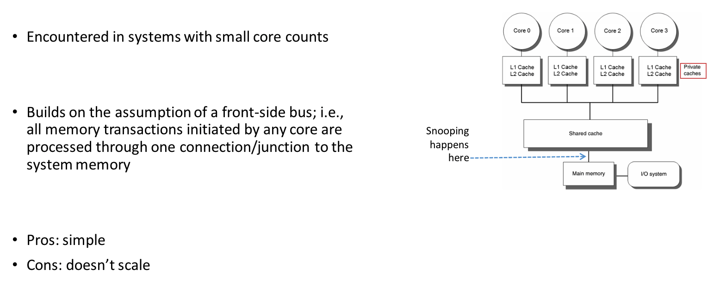
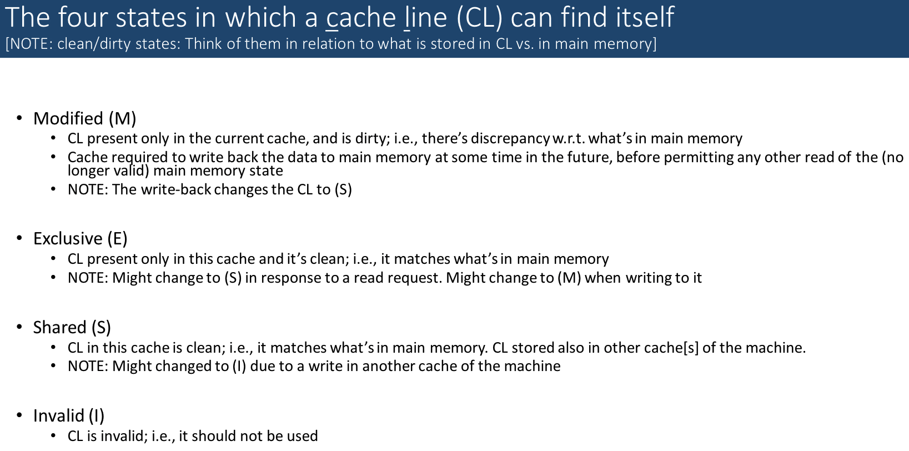

# Lecture 23: OpenMP NUMA Aspects. Caching and OpenMP.

## Lecture Summary

* Last time
  * Wrap up synchronization
  * OpenMP rules of thumb
  * Parallel computing with OpenMP: NUMA aspects
* Today
  * Parallel computing, multi-core: how caches come into play
  * Critical thinking, and similar tricks for speeding up your code

## Caches in a Multi-Core Setup

* Consistency vs. Coherence
  * Consistency establishes a set of rules that governs the collective actions of the threads relative to the entire system memory
    * Think of it this way: there are at least two memory entries that come up in the discussion
  * Coherence regards expected behavior that one memory location must display relative to transactions carried out by multiple threads running on multiple cores
    * Think of it this way: there is exactly one memory entry that comes up in the discussion
* Two established approaches for enforcing cache coherence
  * Directory-based: Directory acts as a filter through which any change to cache must pass. When an entry is changed, the directory either updates or invalidates the other caches with that entry
  * Snooping-based
    * Example: MESI protocol
      * 4 states: modified, exclusive, shared, invalid
* Assume each cache line can only exist in one of 3 states
  * Exclusive: the only valid copy in any cache
  * Read-only: A valid copy but other caches may contain it
  * Invalid: Out of date and cannot be used
* In this simplified coherency model, 
  * A read on an invalid or absent cache line will be cached as read-only or exclusive
  * A write on a line not in an exclusive state will cause all other copies to be marked invalid and the written line to be marked exclusive

### False Sharing

* Each cache line is typically 64 bytes long and can store, for instance, 8 doubles or 16 ints. As soon as one entry in a cache line is changed, all the other values in cache line get dirty.
* False sharing happens when two threads are both writing into different locations within the same cache line
* Symptoms: Poor performance, high numbers of cache misses, unexpected load imbalance

## Critical Thinking

* This module brings together knowledge about
  * Compilers and how they work
  * Memory aspects: Pointers, hierarchy, latencies, bandwidths
  * Instruction Level Parallelism \(pipelining, jump instructions, branch prediction, wide registers, etc.\)

