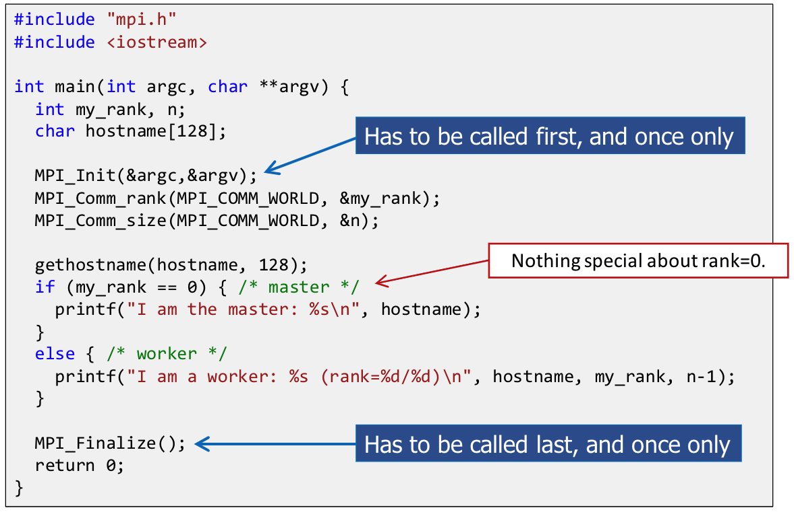
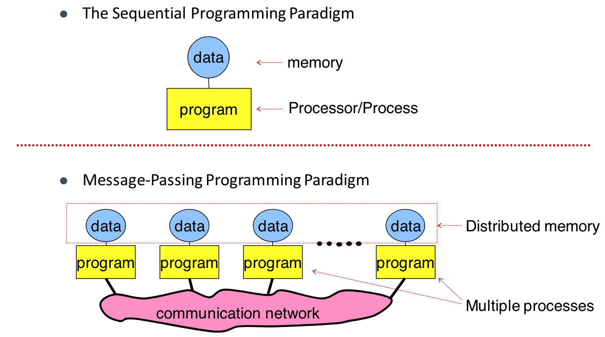
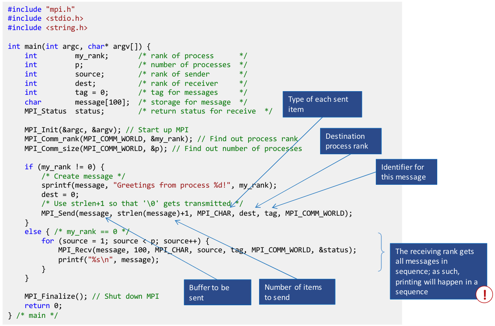
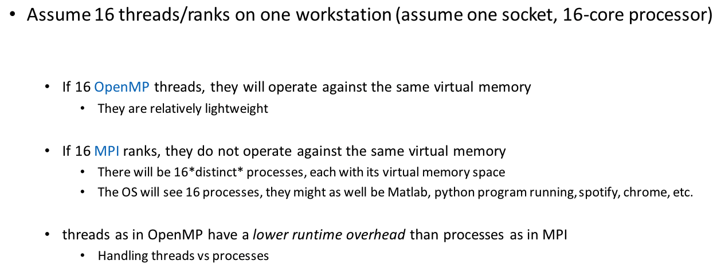
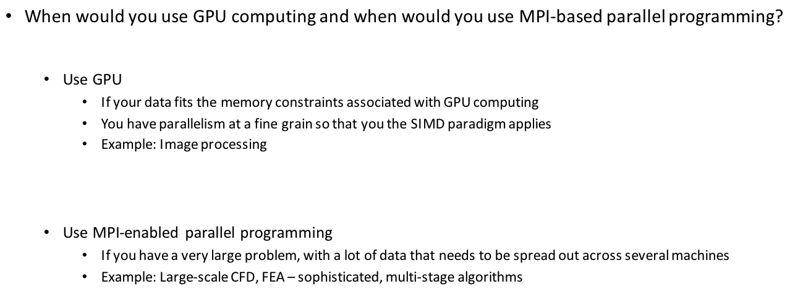
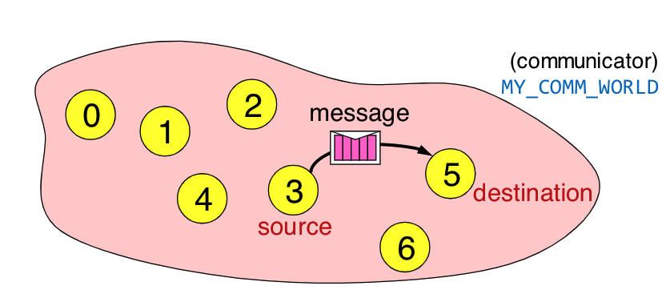

# Lecture 26: MPI Parallel Programming General Introduction. Point-to-Point Communication.

## Lecture Summary

* Last time
  * Wrapped up “Critical thinking” segment. Went through a case study, saw more than 100X speed up
    * No function-call blockers; loop unrolling & re-association; dropped in the wide-register vectorization
  * Started discussion about parallel computing via message passing \(multi-process parallel computing\)
    * Covered the hardware aspects related to HPC
* Today
  * HPC via MPI: discuss the basic ideas/paradigms
  * MPI point-to-point communication

## MPI

### Introduction to message passing and MPI

* CUDA: A kernel \(a small snippet of code\) is run by all threads spawned via an execution configuration
* OpenMP: All threads execute an omp parallel region, work sharing
* MPI: The entire code is executed in parallel by all processses

* MPI does branching based on the process rank
  * Very similar to GPU computing, where one thread does work based on its thread index
  * Very similar to OpenMP function omp\_get\_thread\_num\(\)
* Each MPI process has its own program counter and virtual address space
  * The variables of each program have the same name but live in different virtual memories and assume different values
* MPI can be used whenever it is possible for processes to exchange messages:
  * Distributed memory systems
  * Network of workstations
  * One workstation with many cores
    * Data is passed through the main memory instead of a network
    * Different ranks share the same physical memory, but they are each tied to separate virtual memory spaces

### Point-to-Point \(P2P\) Communication

* P2P: Simplest form of message passing communication
* One process sends a message to another process \(MPI\__Send, MPI\__Recv\)
* `int MPI_Send(void *buf, int count, MPI_Datatype datatype, int dst, int tag, MPI_Comm comm)`
  * buf: starting point of the message with count elements, each described with datatype
  * dst: rank of the destination process within the comm communicator
  * tag: used to distinguish between different messages
* `int MPI_Send(void buf, int count, MPI_Datatype datatype, int dest, int tag, MPI_Comm comm, MPI_Status status)`
  * Envelope information is returned in an MPI\_Status object
* A custom communicator can be created using `MPI_Comm_create(MPI_COMM_WORLD, new_group, &MY_COMM_WORLD);`
* MPI data types and their C counterparts: see table below
* The order of messages is preserved, i.e. messages do not overtake each other
* Receiver can wildcard to received from any source/tag: MPI\_ANY\_SOURCE/MPI\_ANY\_TAG
* For a communication to succeed:
  * Sender must specify a valid destination rank
  * Receiver must specify a valid source rank
  * The communicator must be the same
  * Tags must match
  * Message data types must match
  * Receiver's buffer must be large enough
* MPI\_Send and MPI\_Recv are blocking: when a process sends, it does not stop until another process receives
* Eager mode vs. Rendezvous mode
  * Eager mode: Small messages, the content of the buffer is picked up right away by the MPI runtime
  * Rendezvous mode: Large amount of data, the sender function waits for the receiver to post a receive before the runtime facilitates the sending of the actual data of the message

