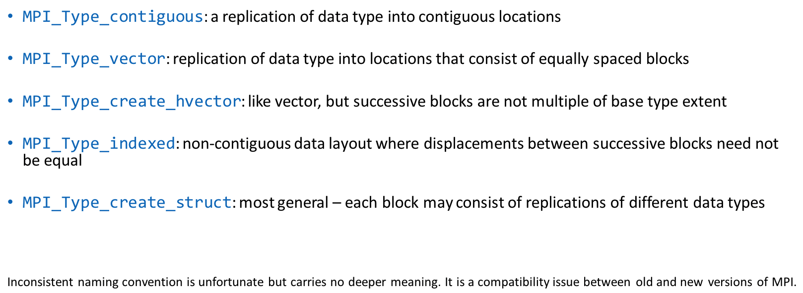
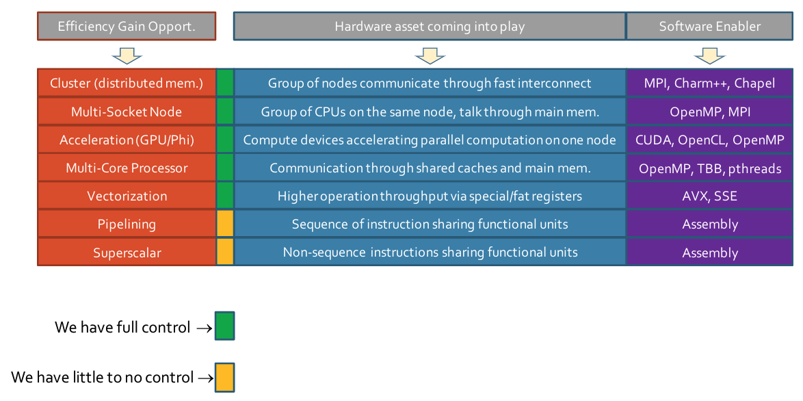
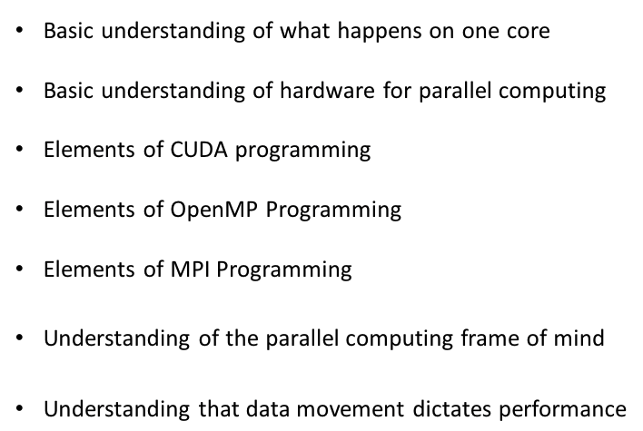

# Lecture 28: MPI Parallel Programming: MPI Collectives. Overview of topics covered in the class.

## Lecture Summary

* Last time
  * Wrap up p2p communication
  * Collective communication: Synchronizations, communications, operations
* Today
  * Collective communication: Operations, data types
  * Talk about the final exam. [Past exam](https://uwmadison.app.box.com/s/vkwsrao6og5ocyno7u491n03kybhzdyn)

## MPI Derived Types \(did not have time to cover in class\)

* Previously we sent/received a contiguous buffer of identical elements of predefined data types
* Now we want to send non-homogenous elements \(structure\) or chunks that are not contiguous in memory
* MPI Datatypes
  * Primitive datatypes: MPI\_CHAR, MPI\_FLOAT, MPI\_INTEGER, etc.
  * Derived datatypes: Can be constructed by four methods \(contiguous, vector, indexed, struct\)
* Typemaps
  * Used to describe an MPI derived type
  * Specifies a sequence of primitive data types, and a sequence of integers that represent the byte displacements, measured from the beginning of the buffer
    * Typemap = {\(type0, disp0\), ..., \(typen, dispn\)}
* Extent: distance, in bytes, from beginning to end of type
  * E.g., {\(double,0\),\(char,8\)} has extent 16
* Type signature: The sequence of primitive data types
  * E.g., for a data type with typemap {\(double,0\), \(int,8\), \(char, 12\)}, its signature is {double, int, char}

## Takeaways from ME 759

* Know your hardware
* Moving data around is expensive in energy and time
* Seek solution approaches that expose concurrency/parallelism in your problem
* Use the tools of the trade to work like a pro and then get paid like a pro
  * Debuggers, profilers, CMake, memory checkers, compiler flags, git, etc.
  * Do HPC

This has been such a fun ride.

