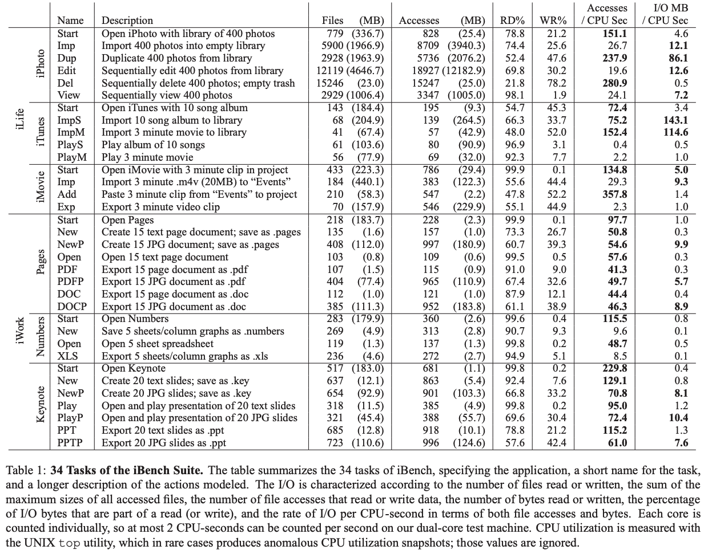
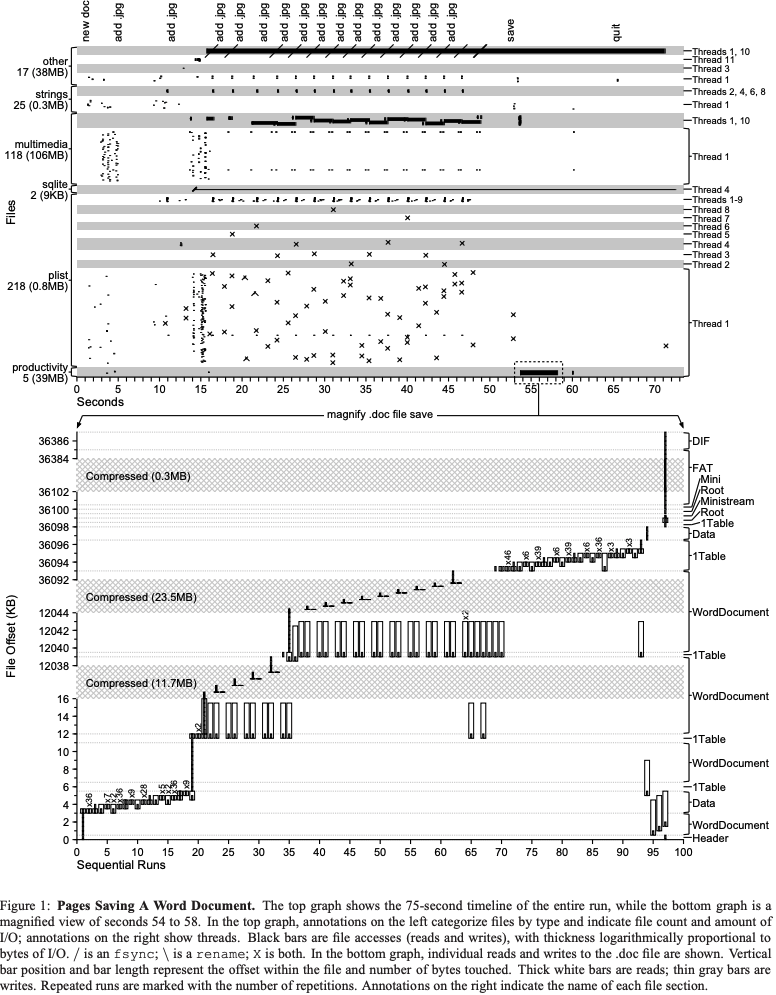
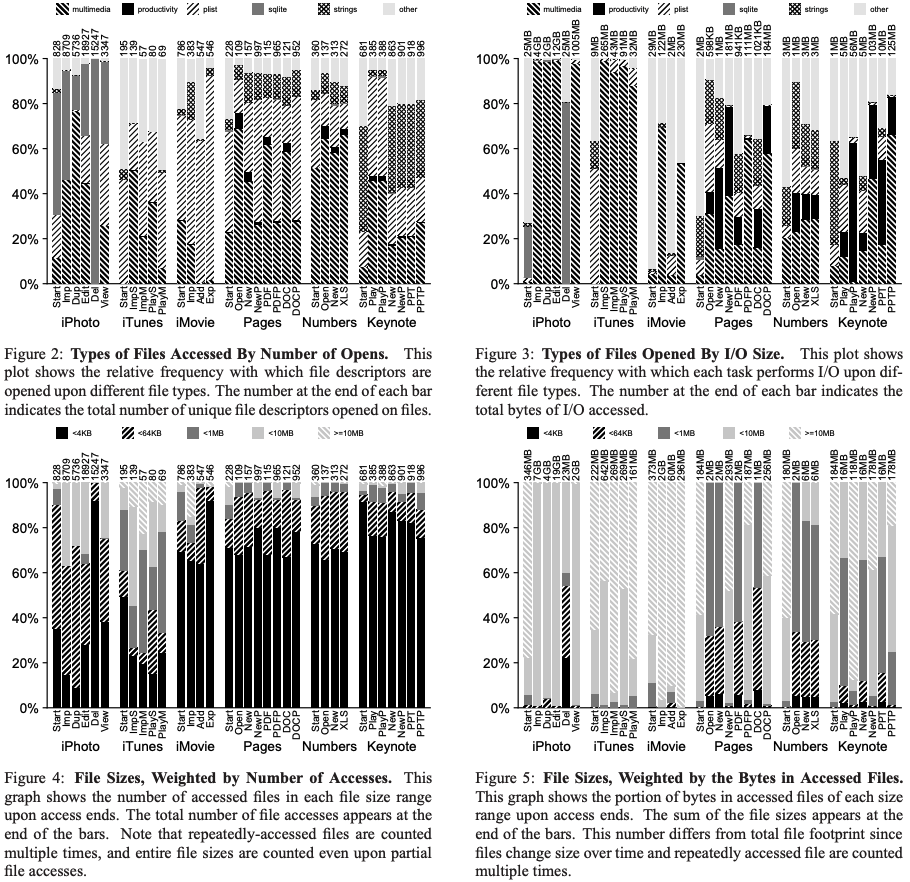
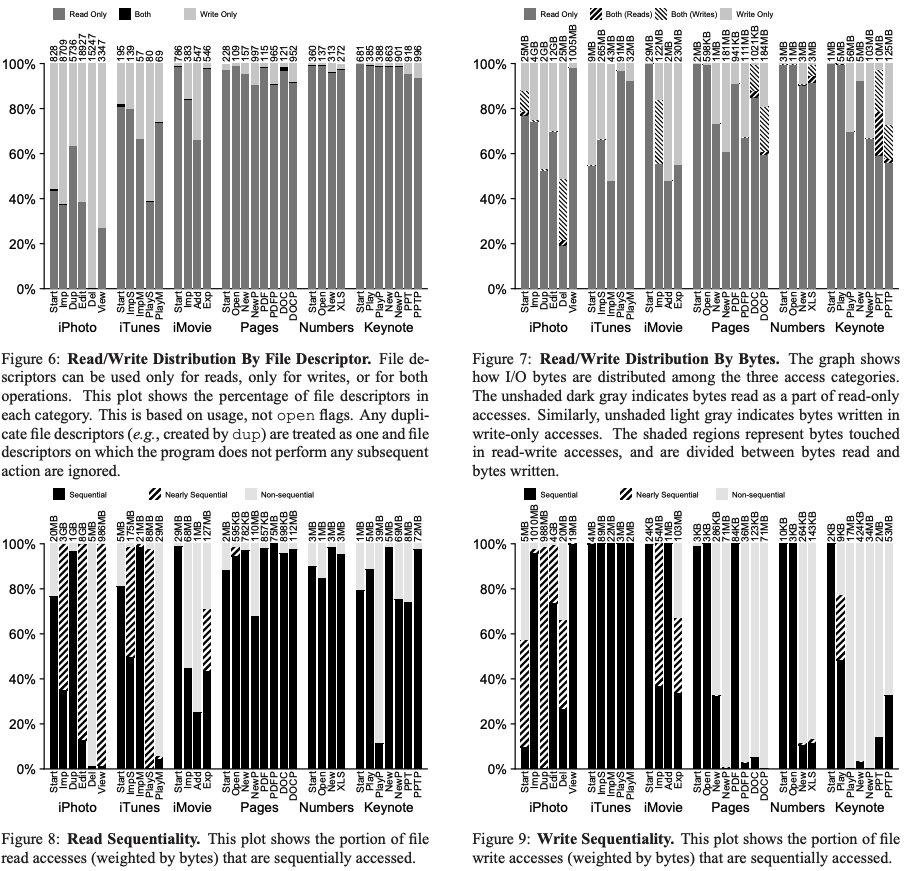
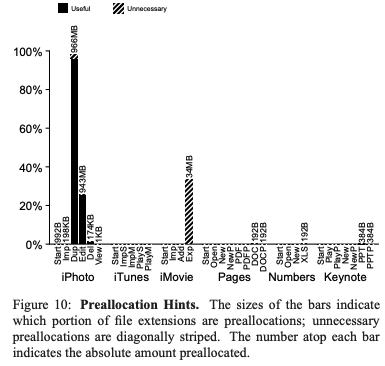
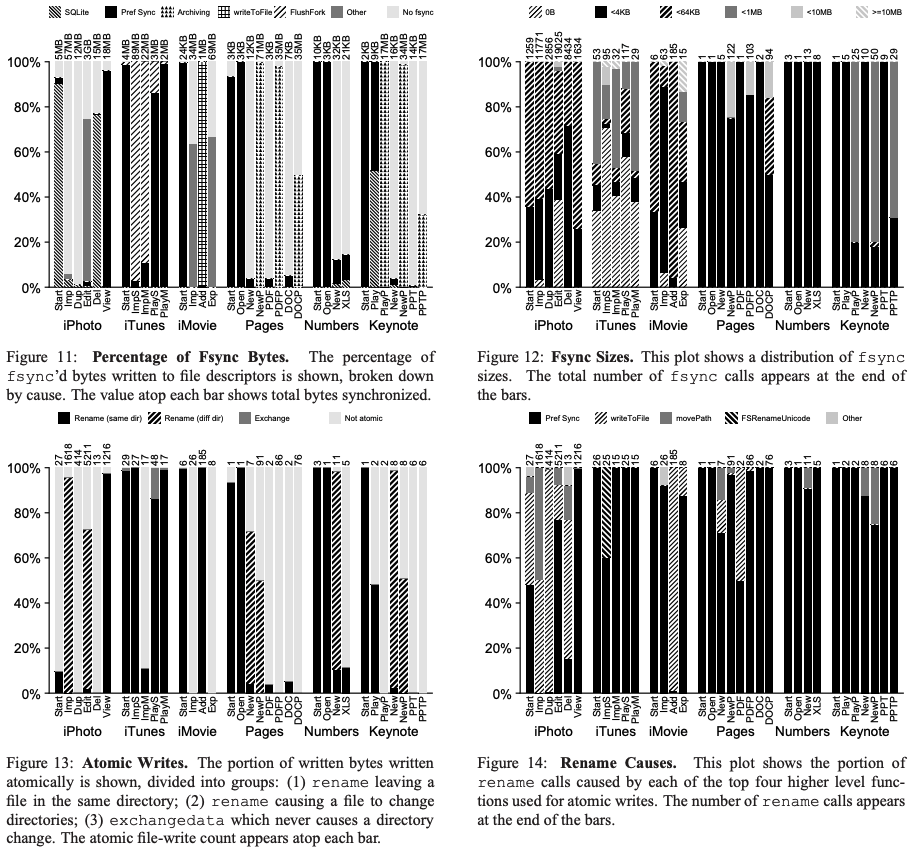
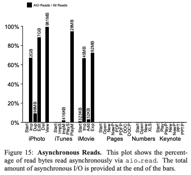
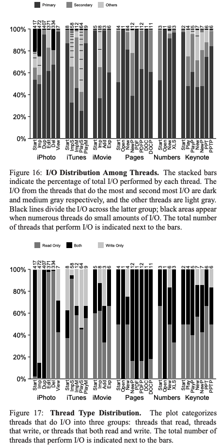

# A File is Not a File: Understanding the I/O Behavior of Apple Desktop Applications

## One-line Summary

The I/O patterns for home-user applications are studied.

## Paper Structure Outline

1. Introduction
2. Case Study
3. iBench Task Suite
   1. Representative
   2. Easy to Use
4. Analysis of iBench Tasks
   1. Nature of Files
      1. File Types
      2. File Sizes
   2. Access Patterns
      1. File Accesses
      2. Sequentiality
      3. Preallocation
   3. Transactional Properties
      1. Durability
      2. Atomic Writes
   4. Threads and Asynchronicity
5. Related Work
6. Discussion and Conclusions

## Background & Motivation

Previously, the design and implementation of file and storage systems have been inspired by workload studies. Nowadays, most file system users use home-user applications, thus an application study of typical I/O behavior of modern home-user applications is necessary.

## Design and Implementation

The authors presented a collection of applications, the iBench task suite. The applications consist of two Apple software suites: iWork \(Pages, Numbers, Keynote\) and iLife \(iPhoto, iTunes, iMovie\). 34 typical tasks \(importing songs, editing movies, etc.\) are analyzed.

An instrumentation framework built upon the DTrace tracing system is presented. DTrace monitors system calls made by each traced application and allows people to examine stack traces, in-kernel functions such as page-ins and page-outs, and other details required to ensure accuracy and completeness.

## Evaluation

The following main conclusions are drawn:

* **A file is not a file**: The files that appear to users are in actuality small file systems containing many sub-files. For example, a Microsoft .doc file is actually a FAT file system containing pieces of the document.
* **Sequential access is not sequential** \(Fig. 8 & 9\): Pure sequential access is rare.
* Auxiliary files dominate: Most files are helper files that applications use to provide a rich GUI, support multiple languages, and record history and metadata.
* **Writes are often forced** \(Fig. 11 & 12\): Most written data is explicitly forced to disk by the application. The implication is that frequent fsyncs reduces the benefits of buffering writes in memory.
* **Renaming is popular** \(Fig. 13\): Atomic operations, in particular `rename()`, is often used to present a consistent view of files to users. The implication is that traditional file locality does not work: placing a file on disk based on its parent directory does not work as expected when the file is first created in a temporary location and then renamed.
* **Multiple threads perform I/O** \(Fig. 1\): Threads are required to perform long-latency operations in the background to keep the GUI responsive.
* **Frameworks influence I/O**: Modern libraries put more code between applications and the underlying file system, as compared with traditional UNIX-style applications that invoke system calls directly.

## Links

* [Paper PDF](https://research.cs.wisc.edu/wind/Publications/ibench-sosp11.pdf)
* [34 traces from the iBench task suite open-sourced by ADSL](https://research.cs.wisc.edu/adsl/Traces/ibench/)
* Thanks to Jiaxin Lin, a fellow classmate, for her paper reading notes!

