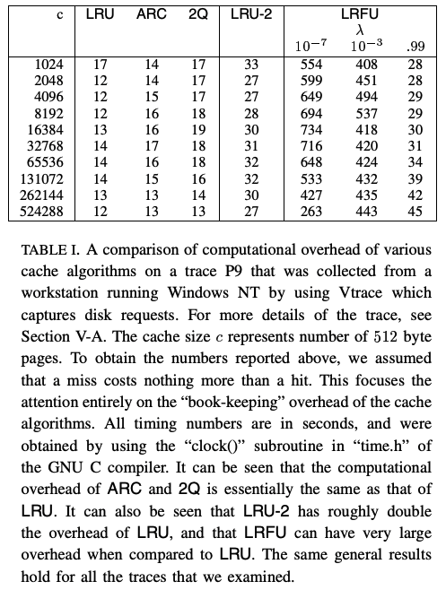
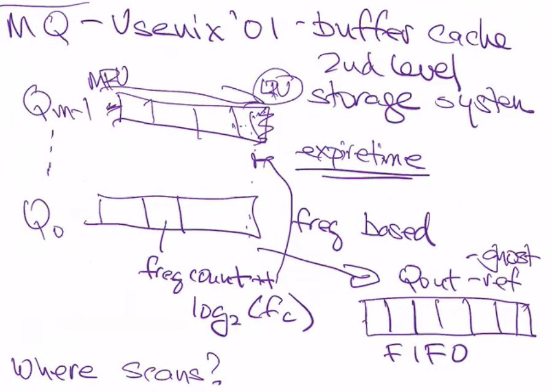
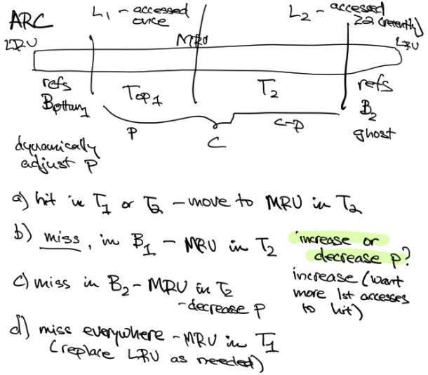
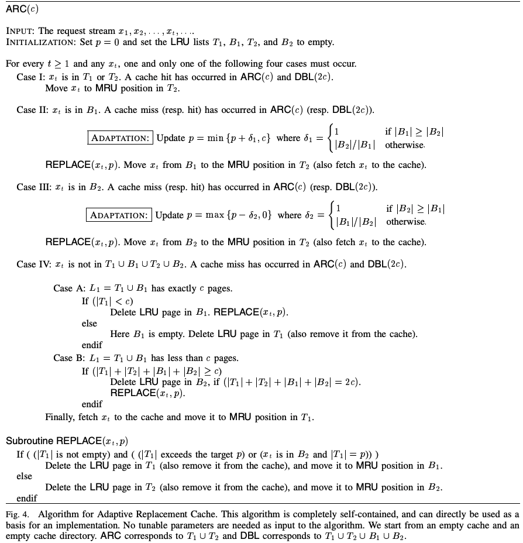

# ARC: A Self-Tuning, Low Overhead Replacement Cache

## One-line Summary

ARC is a new cache management policy.

## Paper Structure Outline

1. Introduction
   1. The Problem
   2. Our Contributions
   3. A Brief Outline of the Paper
2. Prior Work: A Brief Review
   1. Offline Optimal
   2. Recency
   3. Frequency
   4. Recency and Frequency
   5. Temporal Distance Distribution
   6. Caching using Multiple Experts
   7. Ghost Caches
   8. Summary
3. A Class of Replacement Policies
   1. Double Cache and a Replacement Policy
   2. A New Class of Policies
   3. LRU
4. Adaptive Replacement Cache
   1. Fixed Replacement Cache
   2. The Policy
   3. Learning
   4. Scan-Resistant
   5. Extra History
5. Experimental Results
   1. Traces
   2. OLTP
   3. Two Traces: P8 and P12
   4. ARC and 2Q
   5. ARC and MQ
   6. ARC and LRU
   7. ARC is Self-Tuning and Empirically Universal
   8. A Closer Examination of Adaptation in ARC
6. Conclusions

## Background & Motivation

The goals/metrics of this work are:

* High hit rate
* Low overhead
  * computational & space
  * locking overhead \(high concurrency\)
* Scan resistant: A large file does not blow out the cache
* No parameters to tune \(self-tuning\)
* Online algorithm: Handles any workload; Changes dynamically
* Balance between recency & frequency
* Empirically universal: Performs as well as fixed replacement policies

Some assumptions are:

* The replacement policy \(selecting the page to page out\) is investigated
* No prefetching \(assume all demand paging\)
* Only look at read policy \(no write\)
* The cache receives a continuous stream of requests for pages

## Existing Algorithms

### Offline Optimal

* Replaces the furthest page in the future
* Upper bound on the achievable hit ratio by any online policy

### LRU

* Replaces the least recently used page
* Not scan resistant
* High concurrency \(lock overhead\)

### LFU

* Replaces the least frequently used page
* High implementation complexity
* Does not adapt to changes in access patterns \(pages with previous high frequency counts may no longer be useful\)

### LRU-k \(LRU-2 in paper, most common\)

* Track time of last 2 accesses of each page
* Replaces the page with the least recent penultimate reference
* Expensive algorithm \(for maintaining a priority queue\)

### [2Q](http://www.vldb.org/conf/1994/P439.PDF) \(VLDB '94, used in PostgreSQL\)

* Keeps three working sets: Current working set, previous working set, and the long term working set.
* Scan resistant
* Easy to implement
* Takes into account both recency and frequency
* 2Q has some sizing parameters \(K\_in and K\_out\)

### MQ \(Multiple queues, USENIX '01\)

* Focused on a replacement algorithm for buffer caches \(second level on the storage system, below the traditional OS buffer cache\) 
* Put items in m LRU queues according to their frequency. Q\_i contains pages that have been seen at least 2^i times but no more than 2^\(i+1\)-1 times recently
* An expiration time is associated with every item
* Maintains Q\_out: Ghost cache, contains references instead of actual data
* Not robust under a wider range of workloads
* Higher overhead than LRU, ARC, 2Q \(need to check time stamps of pages on every request\)

## Design and Implementation

ARC is:

* Parameter-less
* Self-tuning
* Simple to implement
* Scan resistant
* Considers both recency and frequency

Two LRU lists are maintained: L1 contains pages accessed once recently \(recency\), partitioned into a top portion T1 and a bottom portion B1. Only T1 is in cache. L2 contains pages accessed at least twice recently \(frequency\), partitioned into a top portion T2 and a bottom portion B2. Only T2 is in cache. The middle line between the two lists can be shifted.

* Hit in T1 or T2: MRU to T2
* Miss in B1: MRU to T2, increase p, move T1
* Miss in B2: MRU of T2, decrease p
* Miss everywhere \(not in B1/B2\): MRU in T1, replace some LRU \(complicated\)

## New Vocabulary

* Demand paging: A disk page is copied into physical memory only if an attempt is made to access it and that page is not already in memory.

## Links

* [Paper PDF](https://www.usenix.org/legacy/events/fast03/tech/full_papers/megiddo/megiddo.pdf)
* [Presentation slides by the authors @ University of Houston](http://www2.cs.uh.edu/~paris/6360/PowerPoint/ARC.ppt)
* Thanks to Jane Chen for the paper review notes!

