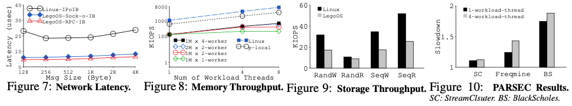

# LegoOS: A Disseminated, Distributed OS for Hardware Resource Disaggregation

## One-line Summary

The traditional monolithic server model in datacenters is having issues in resource utilization, elasticity, heterogeneity, and failure handling. LegoOS breaks down traditional OS functionalities into hardware components like Lego bricks and connects them with fast networks.

## Paper Structure Outline

1. Introduction
2. Disaggregate Hardware Resource
   1. Limitations of Monolithic Servers
   2. Hardware Resource Disaggregation
   3. OSes for Resource Disaggregation
3. The Splitkernel OS architecture
4. LegoOS Design
   1. Abstraction and Usage Model
   2. Hardware Architecture
   3. Process Management
      1. Process Management and Scheduling
      2. ExCache Management
      3. Supporting Linux Syscall Interface
   4. Memory Management
      1. Memory Space Management
      2. Optimization on Memory Accesses
   5. Storage Management
   6. Global Resource Management
   7. Reliability and Failure Handling
5. LegoOS Implementation
   1. Hardware Emulation
   2. Network Stack
   3. Processor Monitor
   4. Memory Monitor
   5. Storage Monitor
   6. Experience and Discussion
6. Evaluation
   1. Micro- and Macro-benchmark Results
   2. Application Performance
   3. Failure Analysis
7. Related Work
8. Discussion and Conclusion

## Background & Motivation

In datacenters, the monolithic server model has been used for decades. It's facing some limitations:

1. **Inefficient resource utilization**: With a server being the physical boundary of resource allocation, under-utilization occurs. See the figure below for an example.
2. **Poor hardware elasticity**: It's difficult to add/move/remove/reconfigure hardware components after they have been installed in a monolithic server.
3. **Coarse failure domain**: When a hardware component in a monolithic server fails, the whole server goes down.
4. **Bad support for heterogeneity**: As the monolithic server model tightly couples hardware devices with each other and with a motherboard, it is very difficult to make new hardware devices \(GPU, TPU, DPU, NVM, NVMe-based SSDs, etc.\) work with existing servers.

To break the server-centric monolithic server model, the authors suggested a hardware resource disaggregation architecture.

## Splitkernel

## LegoOS Design

LegoOS' design targets three types of hardware components: processor, memory, and storage. We call them pComponent, mComponent, and sComponent.

### Hardware Architecture

1. **Separating process and memory functionalities**: All hardware memory functionalities \(page tables, TLBs, MMU\) are moved to mComponents. Only caches are left at the pComponent side. "With a clean separation of process and memory hardware units, the allocation and manage- ment of memory can be completely transparent to pCom- ponents. Each mComponent can choose its own memory allocation technique and virtual to physical memory ad- dress mappings \(e.g., segmentation\)."
2. **Processor virtual caches**: As all memory functionalities are moved to mComponents, pComponents will only see virtual addresses. To resolve this, LegoOS organizes all levels of pComponent caches as virtual caches. With virtual caches comes two potential problems: synonyms and homonyms. LegoOS resolves synonyms by not allowing writable inter-process memory sharing, and it resolves homonyms by storing an address space ID \(ASID\) with each cache line, and differentiate a virtual address in different address spaces using ASIDs.
3. **Separating memory for performance and for capacity**

### Process Management

> Let a thread run to the end with no scheduling or kernel preemption except when a pComponent has to schedule more threads than its cores. \(Because LegoOS does not push for perfect core utilization when scheduling individual threads and instead aims to minimize scheduling and context switch performance overheads.\)

LegoOS also process monitor configures and amnages ExCache. Finally, LegoOS supports Linux ABIs for backward compatibility and easy adoption of LegoOS.

### Memory Management

* Virtual memory space management: A two-level approach to manage distributed virtual memory spaces.
  * Higher level: Split each virtual memory ad- dress space into coarse-grained, fix-sized virtual regions, or vRegions \(e.g., of 1 GB\).
  * Lower level: Stores user process virtual memory area \(vma\) information, such as virtual address ranges and permissions, in vma trees.
* Physical memory space management: Each mComponent can choose their own way of physical memory allocation and own mechanism of virtual-to-physical memory address mapping.

### Storage Management

> LegoOS implements core storage functionalities at sComponents. To cleanly separate storage functionalities, LegoOS uses a stateless storage server design, where each I/O request to the storage server contains all the information needed to fulfill this request, e.g., full path name, absolute file offset, similar to the server design in NFS v2.

### Global Resource Management

LegoOS uses a two-level resource management mechanism:

* Higher level: Three global resource managers for process, memory, and storage resources are used. They perform coarse-grained global resource allocation and load balancing.
* Lower level: Each monitor can employ its own policies and mechanisms to manage its local resources.

## LegoOS Implementation

LegoOS supports 113 syscalls, 15 pseudo-files, and 10 vectored syscall opcodes. These Linux interfaces are sufficient to run many unmodified datacenter applications.

## Evaluation

## New Vocabulary

* Monolithic server: A single server that contains all the hardware resources \(typically a processor, some main memory, and a disk or an SSD\) that are needed to run a user program.
* SLOC: Abbreviation for "Source Lines of Code".
* ABI: [Application Binary Interface](https://stackoverflow.com/a/2456882).
* [Synonyms & Homonyms](http://www.inf.ed.ac.uk/teaching/courses/car/Notes/2016-17/lecture09-virtual_memory.pdf): Synonyms happens when a physical address maps to multiple virtual addresses \(and thus multiple virtual cache lines\) as a re- sult of memory sharing across processes, and the update of one virtual cache line will not reflect to other lines that share the data. The homonym problem happens when two address spaces use the same virtual address for their own different data.
* Cache lines: A cache line is the unit of data transfer between the cache and main memory.

## Links

* [Paper PDF](https://www.usenix.org/system/files/osdi18-shan.pdf)
* [Presentation Video at OSDI '18](https://www.youtube.com/watch?v=GX74Q2-ZOQE)
* [Presentation Video at USENIX ATC '19](https://www.youtube.com/watch?v=KJqYHuL59_s)
* [Presentation Slides](https://www.usenix.org/sites/default/files/conference/protected-files/osdi18_slides_shan.pdf)
* [LegoOS on GitHub](https://github.com/WukLab/LegoOS)
* Thanks to Yuhao Zhang for the review notes!

