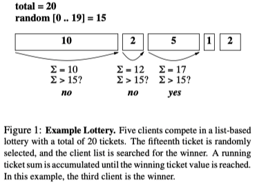
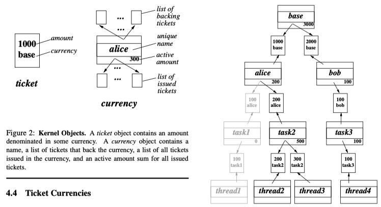
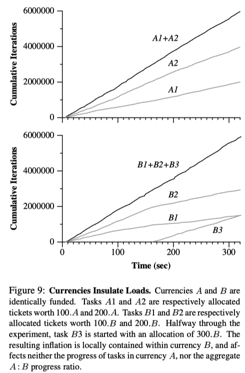
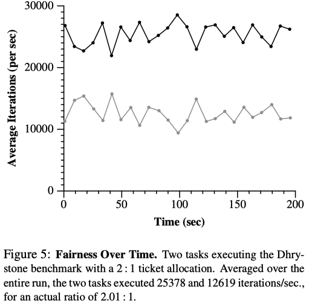

# Lottery Scheduling: Flexible Proportional-Share Resource Management

## One-line Summary

Multiple clients hold various number of tickets. A winning ticket is randomly selected, and the client who holds the ticket wins.

## Paper Structure Outline

1. Introduction
2. Lottery Scheduling
   1. Resource Rights
   2. Lotteries
3. Modular Resource Management
   1. Ticket Transfers
   2. Ticket Inflation
   3. Ticket Currencies
   4. Compensation Tickets
4. Implementation
   1. Random Numbers
   2. Lotteries
   3. Mach Kernel Interface
   4. Ticket Currencies
   5. Compensation Tickets
   6. Ticket Transfers
   7. User Interface
5. Experiments
   1. Fairness
   2. Flexible Control
   3. Client-Server Computation
   4. Multimedia Applications
   5. Load Insulation
   6. System Overhead
6. Managing Diverse Resources
   1. Synchronization Resources
   2. Space-Shared Resources
   3. Multiple Resources
7. Related Work
8. Conclusions

## Background & Motivation

Existing schedulers do not have accurate control over computational service rates, are poorly understood, and are difficult to control. Current systems are limited due to the assumptions and overheads associated with existing fair share schedulers. In this work, the authors present lottery scheduling, a randomized scheduler that implements proportional-share resource management. It also provides good support for modular resource management. The idea of a lottery scheduling mechanism is really abstract and can be applied to many problem areas.

## Design and Implementation

How lottery scheduling works on a high level is really intuitive. The interesting stuff is some of the low-level, modular mechanisms listed below:

### Ticket Currencies

Currencies provides abstraction barriers across logical truct boundaries.

### Ticket Transfers

This is basically transferring tickets from one client to another client. It is useful when a client blocks due to some dependency. Some other examples are (1) when another process is doing work on another's behalf (2) when waiting for another process (holding locks).

### Ticket Inflation

It is an alternative to explicit ticket transfers. This sounds like a bad idea because some clients can monopolize a resource by creating a large number of lottery tickets, but it is extremely useful among mutually trusting clients as inflation and deflation allows resource allocations to be adjusted without explicit communication.

### Compensation Tickets

If a client only consumes a fraction f of its allocated resources, it can be granted a compensation ticket that inflates its value by 1/f until the client starts its next quantum. Without compensation tickets, a client that does not utilize all of its allocated quantum may receive less than its entitled share of the processor. As an example, compensation tickets can be used when a process is blocked for a short period of time.

## Evaluation

Some interesting graphs:

## Links

* [Paper PDF](https://www.usenix.org/legacy/publications/library/proceedings/osdi/full_papers/waldspurger.pdf)
* [Lottery and Stride Scheduling on YouTube](https://youtu.be/qAx4IxrOoAM) by CS4414 @ U of Virginia
