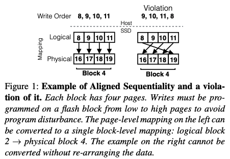
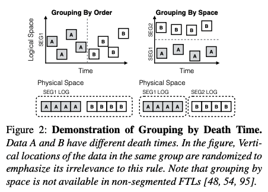
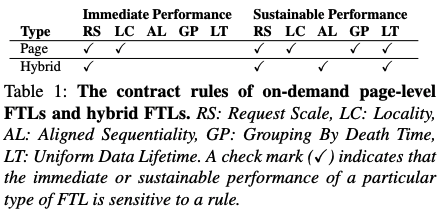
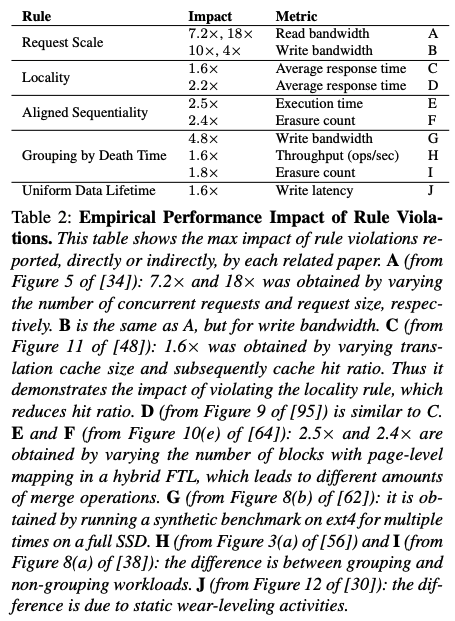

# The Unwritten Contract of Solid State Drives

## One-line Summary

The authors analyze some SSD behaviors and provide insights into some "unwritten contracts" clients of SSDs should follow for high performance.

## Paper Structure Outline

1. Introduction
2. Background
3. Unwritten Contract
   1. Request Scale
   2. Locality
   3. Aligned Sequentiality
   4. Grouping by Death Time
   5. Uniform Data Lifetime
   6. Discussion
4. Methodology
5. The Contractors
   1. Request Scale
   2. Locality
   3. Aligned Sequentiality
   4. Grouping by Death Time
   5. Uniform Data Lifetime
   6. Discussion
6. Related Work
7. Conclusions

## Background & Motivation

The SSD performance is improving and thus the storage stack is shifting from the HDD era to the SSD era. However, if we misuse SSDs, performance degradation & fluctuation and early end of device life will occur.  The authors look into the right way to achieve high performance with SSDs. For HDDs, the unwritten contracts include:

* Sequential accesses are best
* Nearby accesses are more efficient than farther ones

In this work, the authors present five rules for SSDs.

## The Five Rules

### Request Scale \(RS\)

Clients should issue large requests or multiple concurrent, outstanding small requests to get more throughput and benefit from the internal parallelism \(multiple channels\) of SSDs. A small request scale leads to low resource utilization. On violation, the low internal parallelism leads to 18x less read bandwidth and 10x less write bandwidth.

### Locality \(LC\)

Clients should access with locality \(temporal and/or spatial\). Possible benefits include reduced translation cache misses, reduced translation cache reads/writes, reduced data cache misses, and reduced write-amp from flash garbage collection. On violation, the performance impact is 2.2x average response time.

### Aligned Sequentiality \(AL\)

Clients should start writing at the aligned beginning of a block boundary and write files sequentially using large write requests. For an FTL that can do hybrid block mapping, this requires fewer entries in the translation table. In hybrid FTLs, there are both page-level mapping and block-level mapping. Page-level is flexible but takes more space, and block-level is less flexible but takes less space.

### Grouping by Death Time \(GP\)

To prevent garbage collection \(and thus data movement\), all data in an erase block should be discarded at the same time. On violation, the performance penalty and write amplification leads to 4.8x less write bandwidth, 1.6x less throughput, and 1.8x less block erasure count.

### Uniform Lifetime \(LT\)

Clients of SSDs should create data with similar lifetimes. Uneven lifetime leads to uneven wearout, and FTLs may perform wear-leveling which incurs data movements. On violation, the performance penalty and write amplification leads to 1.6x less write latency.

## Evaluation

WiscSim, the first SSD simulator that supports NCQ, and WiscSee, a discrete-event SSD simulator, are used to study and understand system performance for every FS/app pair. Applications studied include LevelDB, RocksDB, SQLite \(rollback + write-ahead-logging mode\), and the Varmail benchmark. File systems studied include ext4, XFS, and F2FS \(designed for SSDs\).

### Observations

The following are observed:

1. Log structure increases the scale of write size for applications, as expected.
2. The scale of read requests is often low.
3. SSD-conscious optimizations have room for improvements.
4. Frequent data barriers in applications limit request scale.
5. Linux buffered I/O implementation limits request scale.
6. Frequent data barriers in file systems limit request scale.
7. File system log structuring fragments application data structures.
8. Delaying and merging slow non-data operations could boost immediate performance.
9. SSDs demand aggressive and accurate prefetching.
10. Aggressively reusing space improves locality.
11. Legacy policies could break locality.
12. Log structuring is not always log-structured.
13. Log structuring can spread data widely across a device and thus reduce locality.
14. Application log structuring does not guarantee alignment.
15. Log-structured file systems may not be as sequential as commonly expected.
16. Sequential + sequential 6= sequential.
17. Application log structuring does not reduce garbage collection.
18. Applications often separate data of different death time and file systems mix them.
19. All file systems typically have shorter tails with segmented FTLs than they have with non-segmented FTLs, suggesting that FTLs should always be segmented.
20. All file systems fail to group data from different directories to prevent them from being mixed in the SSD.
21. F2FS sacrifices too much sustainable performance for immediate performance.
22. Application and file system data lifetimes differ significantly.
23. All file systems have allocation biases.
24. In-place-update file systems preserve data lifetime of applications.

### Conclusions

1. Being friendly to one rule is not enough: the SSD contract is multi-dimensional.
2. Although not perfect, traditional file systems still perform well upon SSDs.
3. The complex interactions between applications, file systems, and FTLs demand tooling for analysis.
4. Myths spread if the unwritten contract is not clarified.

## New Vocabulary

* FTL: Flash Translation Layer

## Links

* [Paper PDF](https://dl.acm.org/doi/pdf/10.1145/3064176.3064187)
* [Review notes by Mark Callaghan](http://smalldatum.blogspot.com/2020/10/comments-on-unwritten-contract-of-solid.html)



