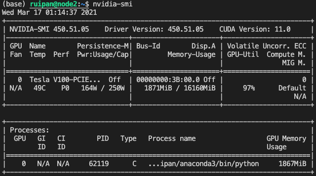

# An Incomplete Guide to GPU Profiling

## Introduction

I suffered a lot when I first started doing fine-grained GPU profiling, mainly with setting up the environment and choosing the right tool to use. With this article, I hope to help my future self and those of you who are new to GPU computing by providing some pointers.

For simplicity, this article only covers this environment: {Ubuntu 18.04, CUDA driver 450.51.05, CUDA 11.0, 1 NVIDIA GV100 GPU}.

This article is part of my background research for my final project for ME/CS 759.

## Setting it up

First and foremost, you need an NVIDIA graphic card, either on your own computer, on a private cluster, or rented from web services like Azure, Google Collab, and AWS. On a completely unrelated sidenote: If you are renting GPUs, do not forget to turn off the experiments after you are done. In case you are billed a few thousands of dollars for an idle GPU, shoot an email to the customer service -- I heard they are pretty lenient for the first time around.

The installation of NVIDIA drivers and CUDA are mainly handled by other people in your lab/some cluster managers. Here is [an awesome, up-to-date article on the installations](https://gist.github.com/wangruohui/df039f0dc434d6486f5d4d098aa52d07). Occasionally, all hell may break loose in this part \(e.g., [CUDA version mismatch shown by nvcc and nvidia-smi](https://stackoverflow.com/questions/53422407/different-cuda-versions-shown-by-nvcc-and-nvidia-smi)\). If you run into these kinds of situations, try to ask for help.

The `nvidia-smi` utility is installed in the NVIDIA driver installation step.

## nvidia-smi / NVML

The NVIDIA System Management Interface \(`nvidia-smi`\) is a command line utility that provides easy management and monitoring of NVIDIA GPU devices.

Two pro tips regarding `nvidia-smi`:

* `watch -d -n 0.1 nvidia-smi` allows for real-time eyeballing of the GPU statistics. This command runs [watch](https://linux.die.net/man/1/watch) repeatedly, updating every 0.1s and highlighting the differences between successive updates.
* query mode, output to csv

`gpustat` is a nice wrapper around `nvidia-smi`:

* It looks fancier but is also tidy
* It is open-sourced on GitHub [here](https://github.com/wookayin/gpustat), maintained mainly by Jongwook Choi, a Ph.D. student at Michigan

`nvidia-smi` is based on top of NVIDIA Management Library \(NVML\). NVML is a C-based API for monitoring and managing various states of the NVIDIA GPU devices. I don't have much experience with NVML, but I do know that [pynvml](https://github.com/gpuopenanalytics/pynvml) is an easy-to-use wrapper that provides a Python interface to NVML. A list of available queries can be found [here](https://github.com/gpuopenanalytics/pynvml/blob/master/help_query_gpu.txt).

## Nsight Systems

## Nsight Compute

## NVIDIA Visual Profiler \(nvprof & nvvp\)

## dlprof

## References

* [Ch. 13: GPU Profiling and Tools \| Parallel and High Performance Computing, Manning Publications](https://livebook.manning.com/book/parallel-and-high-performance-computing/chapter-13/v-9/)
* [CUDA Toolkit](https://developer.nvidia.com/cuda-toolkit)
* [Install NVIDIA Driver and CUDA on Ubuntu/CentOS/Fedora Linux OS](https://gist.github.com/wangruohui/df039f0dc434d6486f5d4d098aa52d07)
* [Nsight Compute User Guide](https://docs.nvidia.com/nsight-compute/NsightCompute/index.html)
* [Nsight Systems User Guide](https://docs.nvidia.com/nsight-systems/UserGuide/)
* [NVIDIA Management Library \(NVML\)](https://developer.nvidia.com/nvidia-management-library-nvml)
* [NVIDIA System Management Interface \(nvidia-smi\)](https://developer.nvidia.com/nvidia-system-management-interface)
* [NVIDIA Visual Profiler \(nvvp & nvprof\) User Guide](https://docs.nvidia.com/cuda/profiler-users-guide/index.html)
* 

