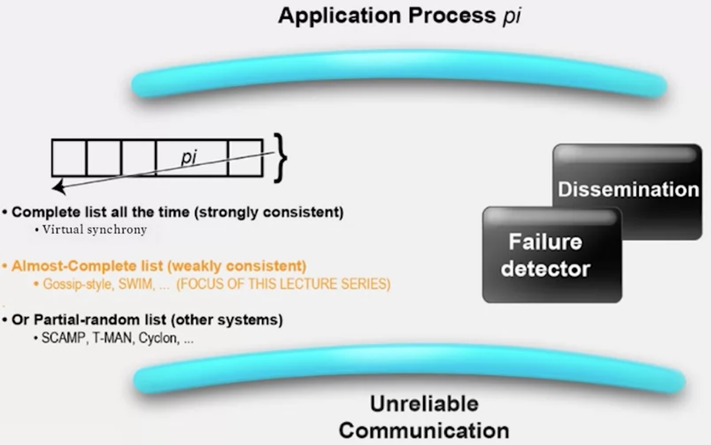

# 1.2 Gossip, Membership, and Grids

## Lesson 1: Gossip

### Multicast Problem

* In computer networking, multicast is group communication where data transmission is addressed to a group of destination computers simultaneously
* Multicast can be one-to-many or many-to-many distribution
* The difference between multicast and broadcast is that in broadcast, the packet is delivered to all the hosts connected to the network, whereas in multicast, the packet is delivered to intended recipients only.
* The multicast protocol typically sits at the application layer \(i.e., does not deal with the underlying network\)
* Challenges
  * **Fault-Tolerance**
    * Nodes may crash
    * Packets may be dropped
  * **Scalability**
    * Tens of thousands of nodes
* Simplest implementation: Centralized
  * The sender sends in a loop UDP/TCP packets
  * Problems
    * Not fault-tolerant: Sender may fail. Say it fails halfway through, only half of the receivers get the message
    * High overhead: Not scalable -&gt; high O\(N\) latency
* Solution: Tree-Based implementation
  * Pro: For a good \(balanced\) tree, the height is O\(log\(N\)\) -&gt; better latency
  * Con: High set up and maintenance costs
* Tree-Based multicast protocols
  * Build spanning trees to disseminate multicasts
  * Use ACKs or NAKs to repair multicasts not received
  * SRM: Scalable Reliable Multicast
    * Uses NAKs
    * Uses random delays \(before sending out repair request\) and exponential backoff \(if sending out multiple NAKs, doubles the wait time every time they wait\) to avoid NAK storms
  * RMTP: Reliable Multicast Transport Protocol
    * Uses ACKs
    * ACKs are only sent to designated receivers, which then re-transmit missing multicasts
* Studies show that despite these countermeasures, these protocols still suffer from O\(N\) ACK/NAK overheads, which motivated the development of gossip/epidemic protocols

### Gossip Protocols

* There are two "hyperparameters": t and b. Say we set t to be 5 seconds and b \(fan-out\) to be 2 nodes. In the following examples, we consider only 1 multicast message and only 1 sender.
* Periodically \(every t seconds\), a sender picks b random targets and sends them the multicast/gossip message. We can use UDP to transmit the messages as the gossip protocol itself is very reliable.
* Once a node receives its gossip, it is said to be "infected" and becomes a sender. 
* The gossip protocol is not synchronized across nodes: each node uses its local clock to send messages in rounds. When doing analyses, we typically assume them to be synchronized, though.
* Those above described the "push" gossip: once you have a multicast message, you start gossiping about it.
  * There is also a "pull" gossip that periodically polls randomly selected processes for new multicast messages that haven't been received. 
  * Another variant is the push-pull model. In this model, when sending out a pull query, the sender also includes some gossip messages it received recently.
* Multiple messages -&gt; push a random subset/recently-received ones/high-priority ones

### Gossip Analysis

* The simple push protocol:
  * Is lightweight in large groups
  * Spreads a multicast quickly
  * Is highly fault-tolerant
* Analyze using Epidemiology
  * Population: \(n+1\) nodes
  * The contact rate between any individual pair is ß
  * At any time, each individual is either uninfected \(x\) or infected \(y\)
  * x\_0 = n, y\_0 = 1. At all times, x + y = n + 1
* Model as continuous time process. Do some math, and the conclusion is that when t becomes very large \(as time progresses\), x goes to 0, and y goes to n + 1. I.e., eventually, everyone receives the gossip. We can also show that the gossip protocol is fast: it converges within a logarithmic number of rounds.
* Recap
  * Lightweight: Each node transmits no more than cblog\(n\) gossip messages
  * Low latency: Converges within clog\(n\) rounds
  * Reliability: All but 1/\(n^\(cb-2\)\) nodes receive the multicast
* While log\(n\) is not constant, it grows very slowly pragmatically \(e.g., using base = 2, log\(1000\) ~= 10, log\(all IPv4 addresses\) = 32\).
* Packet loss: with 50% packet loss, analyze with b /= 2. To achieve the same reliability as 0% loss rate, take twice as many rounds
* Node failure: with 50% nodes failing, analyze with n /= 2 and b /= 2. Same as above
* Fault tolerance: with failures, it is possible \(but improbable\) that the epidemic dies out quickly. If it happens, it happens early, but as gossips spread very fast, it is very difficult to kill a gossip after a few rounds \(just like pandemics like COVID-19/rumors on the internet!\)
* In all forms of a gossip, it takes O\(log\(n\)\) rounds before n/2 nodes get the gossip \(because the fastest structure for a message to spread is a spanning tree\). Thereafter, pull gossip is faster than push gossip. The second half of pull gossip finishes in time O\(log\(log\(n\)\)\). Some more math is involved here...
* Gossip protocols are not topology-aware -&gt; core switches may get overloaded \(O\(n\)\). In this example, there are two subnets/racks. If nodes select targets randomly, half of the gossips will go through the router. The fix is to have gossips prefer nodes in the local subnet using a higher probability and vice versa. E.g., in subnet i with n\_i nodes, pick gossip target in the subnet with probability \(1 - 1/n\_i\). With this fix, the router load becomes O\(1\), and the dissemination time is still O\(log\(n\)\).

### Gossip Implementations

* Some implementations
* Example: NNTP Inter-Server Protocol

## Lesson 2: Membership

### What is Group Membership List?

* In data centers, failures are the norm, not the exception. For example, if the rate of failure of one machine \(OS/disk/motherboard/network, etc.\) is once every 10 years, a DC with 12000 servers has a mean time to failure \(MTTF\) of ~7.2 hours!
* Thus, we need a mechanism to detect failures. Preferably, a failure detector program distributedly, and automatically detects failures and reports to your workstation.

* Two sub-protocols are needed by a membership protocol:
  * A failure detector
  * A mechanism to disseminate information about joins, leaves, and failures of processes

### Failure Detectors

* Two correctness properties for failure detectors:
  * **Completeness**: Each failure is detected \(eventually by one other non-faulty process\)
  * **Accuracy**: There is no mistaken detection
  * In reality, in lossy networks, it is impossible to achieve both 100% completeness and 100% accuracy. Otherwise, we can solve consensus \(TODO: figure out what this is\). In real life, failure detectors guarantee completeness while only guaranteeing partial/probabilistic accuracy.
* Two desirable properties:
  * **Speed**: Time until some process first detects a failure
  * **Scale**: Equal load on each member, network message load
* We want to satisfy all the above properties in spite of arbitrary, simultaneous process failures
* A very simple failure detection protocol, **centralized heartbeating**:
  * Heartbeats sent periodically
  * If a heartbeat is not received from process p within timeout, mark p as failed
  * All processes send heartbeats to one central process
  * Cons
    * The central process may fail
    * The central process may be overloaded in a large process group
* A variant: **ring heartbeating**
  * Cons
    * Unpredictable on simultaneous multiple failures: If both neighbors of a process p fail, before the neighbors are repaired, p may fail undetected
* A third variant: **all-to-all heartbeating**
  * Pros
    * Equal load per member
    * Guarantees completeness \(as long as there is at least one non-faulty process in the group\)
  * Cons
    * If there is one straggler process that receives packets at a longer delay than others, it may mark all other processes as failed, leading to a low accuracy/high false-positive rate
    * How to improve the robustness is covered in the next lecture

### Gossip-Style Membership

* Gossip-style heartbeating: a more robust \(better accuracy properties\) variant of all-to-all heartbeating
  * Each node maintains a membership list with each entry being \[node address, hearbeat counter, local time\]
  * Nodes periodically gossip their membership list
  * On receipt, the local membership list is updated
    * Those entries with a higher/newer heartbeat counter is updated. The new time is the current, local time at recepient nodes
  * When an entry is last updated/heartbeat has not increased more than T\_fail seconds ago, it is marked as failed
  * After T\_cleanup seconds, the member is deleted from the list
  * Without this two-stage cleanup mechanism, a failed node has its entry deleted right after it is detected as failed. However, other processes may not have detected the failure/deleted the entry, and it may be added back in a gossip.
* Analysis: tradeoff between false positive rate, detection time, and bandwidth
  * A single heartbeat takes O\(log\(N\)\) time to propagate
  * If bandwidth allowed per node is O\(N\), N heartbeats takes O\(log\(N\)\) time to propagate
  * If bandwidth allowed per node is O\(1\) \(only a few sampled entries of the membership list\), N heartbeats takes O\(Nlog\(N\)\) time to propagate \(inversely proportional\).
  * If the gossip period T\_gossip is decreased:
    * We have a higher bandwidth/send out gossips much quicker
    * We can have a shorter time for the failure detection time T\_fail and T\_cleanup
    * As a result, we have a higher false positive rate, as non-faulty nodes \(that are mistakenly detected\) are given slightly shorter time for their heartbeat to make it across

### Which is the best failure detector?

* Metrics of comparisons
  * Completeness: we want it always guaranteed
  * Speed: denote the time to first detection of a failure to be T seconds
  * \(In\)Accuracy: denote as PM\(T\), probability of mistake in time T. In other words, this is the probability that a mistaken detection will be made in T time units.
  * Given the above requirements, we will compare the network message load, N\*L, across protocols
* All-to-all heartbeating
  * The load is linear per node: L = N / T \(N heartbeats sent out every T time units\)
* Gossip-based all-to-all heartbeating
  * Gossip period is every tg unit seconds, where O\(N\) gossip messages are sent
  * T = log\(N\) \* tg \(gossip takes O\(log\(N\)\) rounds to propagate\)
  * L = N / tg = N \* log\(N\) / T
  * Higher load compared to all-to-all heartbeating: better accuracy by using more messages
* What's the theoretical optimal?
  * Optimal L is independent of N \(?!\)
  * All-to-all and gossip-based protocols are sub-optimal \(L = O\(N / T\)\)
  * Main reason: these two protocols mix up the failure detection and dissemination components. The keys to getting close to this optimal bound are:
    * Separate the two components
    * Use a non heartbeat-based failure detection component

### Another Probabilistic Failure Detector

* SWIM: Scalable Weakly-consistent Infection-style Membership protocol
  * Instead of using heartbeating, we use pinging
  * Process pi runs the protocol every T time units \(protocol period\)
  * At the beginning of a protocol, pi randomly picks a process pj and sends a ping message
  * If everything goes well, pj responds with an ACK
  * If the ACK is not heard back \(original ping/ACK is dropped\), pi tries to ping pj again using indirect paths
    * pi sends pings to K randomly selected processes, each of which sends a direct ping to pj and sends an ACK back to pi. If one ACK is received by pi, then we are good
    * Otherwise, pi marks pj as failed
    * The reason for using indirect paths is that the pi-pj path may be congested, and it might be dropping more packets than other paths. Using indirect paths bypasses the potential congestion \(spatial chance\) and gives pj a second \(temporal\) chance.

### Dissemination and suspicion

* Dissemination options
  * Multicast \(Hardware/IP\)
    * Unreliable
    * Multiple simultaneous multicasts
  * Point-to-point \(TCP/UDP\)
    * Expensive
  * Zero extra messages: Piggyback on Failure Detector messages
    * Infection-style dissemination
      * Maintain a buffer of recently joined/evicted processes
        * Piggyback from this buffer
        * Prefer recent updates
      * Buffer elements are garbage collected after a while
* Suspicion mechanism
  * False positives might be due to
    * Perturbed processes
    * Packet losses, e.g. from congestion
    * Indirect pinging may not solve the problem \(correlated message losses near pinged host\)
  * Solution: suspect a process before declaring it as failed in the group \(see state diagram below\)
  * To distinguish multiple suspicions of a process, use per-process incarnation numbers
    * Higher inc\# notifications override lower inc\#'s
    * Within an inc\#: \(Suspected, inc\#\) &gt; \(Alive, inc\#\)
    * \(Failed, inc\#\) overrides everything else

## Lesson 3: Grids

### Grid Applications

* Example: RAMS \(Rapid Atmospheric Modeling System\)
  * Compute-intensive computing \(or HPC\)
  * Can such programs be run without access to a supercomputer?
  * See picture below for a set of distributed computing resources in a grid

* Grid applications...
  * May have several GBs of intermediate data
  * May take several hours/days
  * Have four stages: Init, Stage in, Execute, Stage out, Publish \(optional\)
  * Are computationally intensive, massivelly parallel
* The core problem comes down to scheduling and resource allocations

### Grid Infrastructure

* 2-level scheduling infrastructure
  * Intra-site: for example, UW-Madison uses HTCondor protocol
    * Such protocols are responsible for:
      * Internal allocation & scheduling
      * Monitoring
      * Distribution and publishing of files
    * HTCondor:
      * Runs on a lot of workstations
      * When workstation is free, ask site's central server \(or Globus\) for tasks
      * If user hits a keystroke, the task is stopped \(either killed or asked to reschedule\)
  * Inter-site: e.g., Globus protocol
    * It is responsible for:
      * External allocation & scheduling
      * Stage in & stage out of files
    * Internal structures of different sites may be invisible to Globus
* Globus toolkit
* Grids are federated, i.e. no single entity controls the entire infrastructure
* Architectures & key concepts have a lot in common with those of clouds

