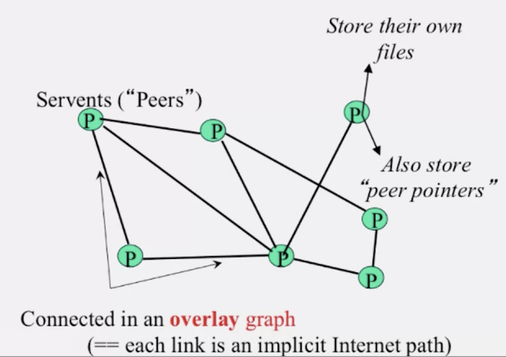
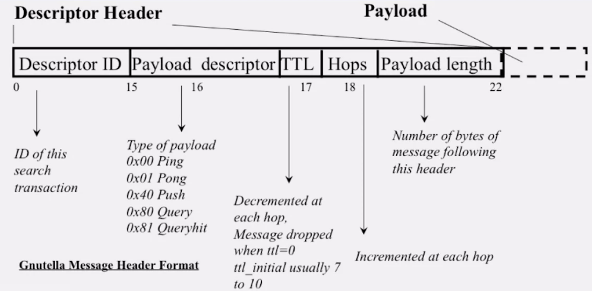
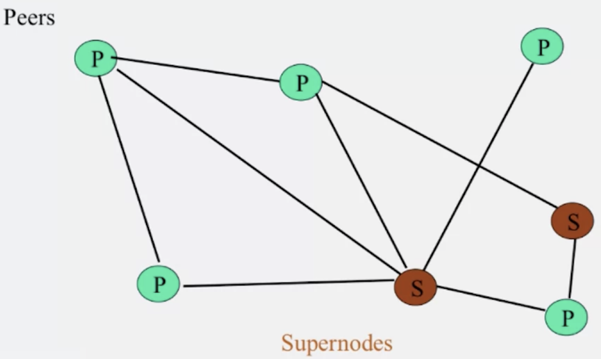
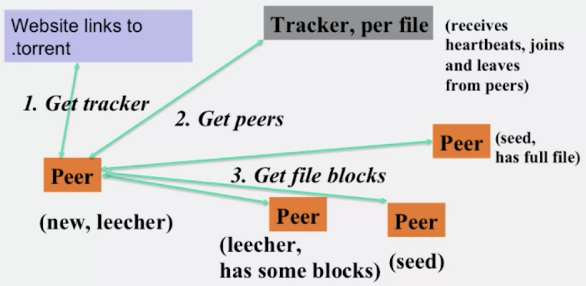
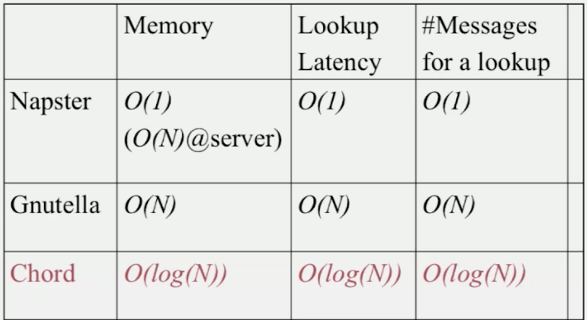
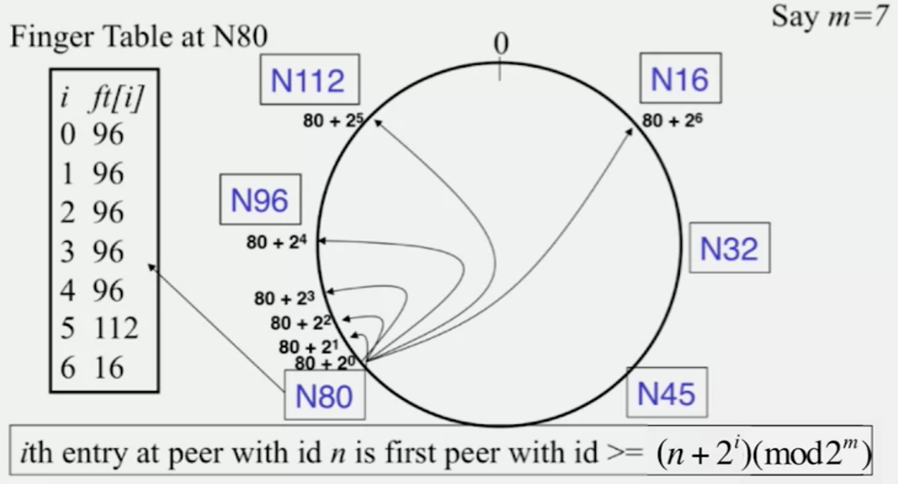
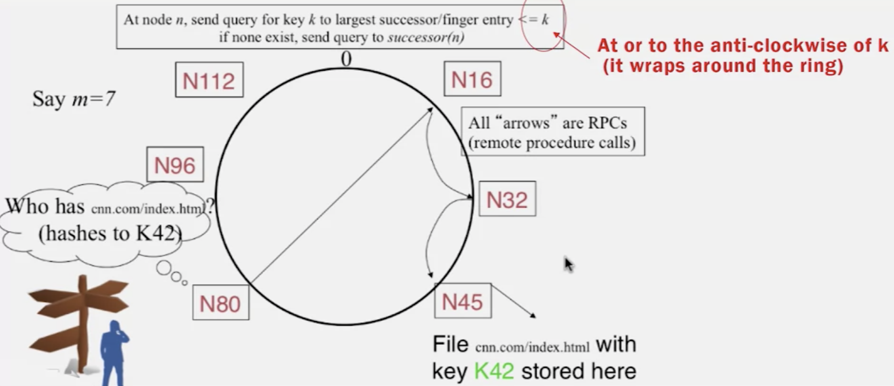
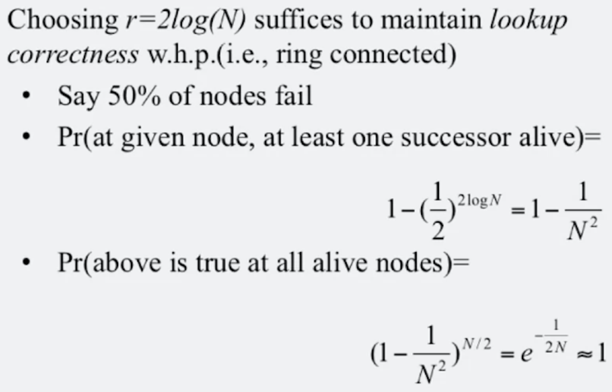
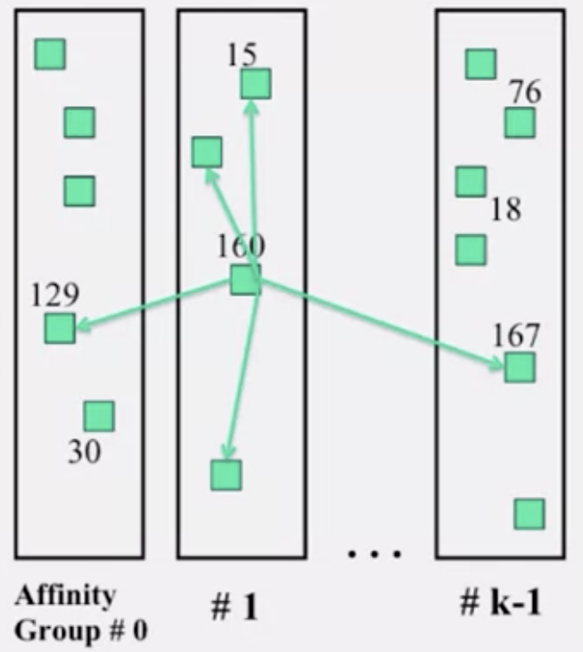
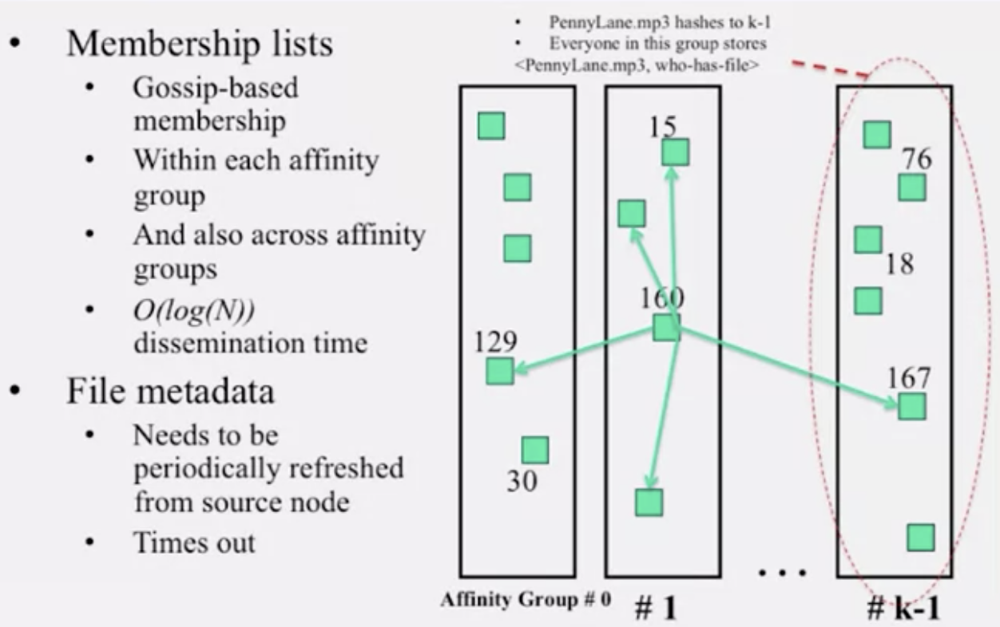

# 1.3 P2P Systems

## Lesson 1: P2P Systems

### P2P Systems Introduction

* Why study P2P systems?
  * P2P systems are the first distributed systems that seriously focused on scalability \(w.r.t \#nodes\)
  * P2P techniques abound in cloud computing systems. E.g., key-value stores use Chord p2p hashing \(consistent hashing\)

### Napster

* When users upload files, the files are stored at client machines \("peers"\)
* The Napster servers store directory information \(a list of <filename, ip\_addr, port\_num>\)
* Napster search
  * Client sends server keywords to search with
  * Server searches \(using ternary tree algorithm\) and returns a list of hosts <ip\_addr, port\_num> to client
  * Client pings each host in the list to find transfer rates
  * Client fetches file from best host
* All communication uses TCP
* Joining a P2P system
  * Send an HTTP request to a well-known URL for that P2P service
  * Message routed to introducer, a well-known server that keeps track of some recently joined nodes in P2P system
  * Introducer initializes new peer's neighbor table
* Problems
  * Central servers: source of congestion/single point of failure
  * No security: plain messages and passwords
  * Indirect infringement: responsible for users' copyright violation

### Gnutella

* Different from Napster, Gnutella eliminates the servers and have clients act as servers \(servents\), such that client machines search and retrieve amongst themselves
* In the overlay graph \(overlay in the sense that it is overlayed on top of the internet\), peers being neighbors means that they know about each other's ip addr and port num, and can send them messages
* Gnutella routes different messages within the overlay

* There are five main message types in the Gnutella protocol
  * Query \(search\)
    * Queries are flooded out \(forwarded to all peers except the peer from which the Query was received\), TTL-restricted, and are forwarded only once
  * QueryHit \(response to query\)
    * A QueryHit messages contains:
      * Info about responder: <port, ip\_addr, speed>
      * Results: <fileindex, filename, fsize>
      * servent\_id: Unique identifier of responder \(a function of its ip addr\)
    * QueryHits are reverse-routed: If A sends B a Query and B got a hit, B sends to A a QueryHit
  * Push \(used to initiate file transfer\)
    * After QueryHits are received, the requestor chooses the "best" responder, and then initiates HTTP request directly to responder's ip\_addr:host
    * IRL, responders may be behind firewalls that rejects incoming connections
    * If a HTTP request fails, it routes a Push message via links in the overlay. The Push message contains ip\_addr:host at which the requestor can accept incoming connections. When the peer receives this Push message, it can generate an outgoing TCP connection \(sends GIV, receives GET\)
    * If the requestor is also behind a firewall, Gnutella gives up
      * Alternative: use a modified version of Gnutella to transfer the file via the overlay links themselves \(this might be slow\)
  * Ping \(to probe network for other peers\)
    * Peers initiate Pings periodically, and Pings are flooded out
  * Pong \(reply to ping, contains address of another peer\)
    * Pongs are routed along reverse paths
    * Pongs are used to keep neighbor lists fresh in spite of peers joining, leaving, and failing
* Problems
  * Ping/Pong constitute 50% of the traffic
    * Solutions: Multiplex, cache, and reduce frequency
  * Repeated searches with same keywords
    * Solutions: Cache query, QueryHits
  * Modem-connected hosts do not have enough bandwidth for passing Gnutella traffic
    * Solution: Use a central server to act as proxy for such peers
    * Another solution: FastTrack
  * Large number of freeloaders \(only download files, never upload files\)
    * In 2000, 70% of the users are freeloaders
  * Flooding causes excessive traffic
    * To maintain meta info about peers in order for more intelligent routing, use structures P2P systems \(e.g., Chord\)

### FastTrack and BitTorrent

#### FastTrack

* Hybrid between Napster and Gnutella, takes advantages of "healthier" participants in the system
* Like Gnutella, but designate some peers as "supernodes" 
  * A supernode stores a directory listing a subset of nearby <filename, peer pointer> \(similar to Napster servers\)
  * Supernode membership changes over time
  * Any node may become a supernode, provided it has earned enough reputation
    * E.g., reputation is affected by length of periods of connectivity and total number of uploads
  * A peer searches by contacting a nearby supernode

#### BitTorrent

* Files are split into blocks \(32KB - 256KB\)
* Download **Local Rarest First** block policy: Prefers early download of blocks that are least replicated among neighbors
* **Tit for tat** bandwidth usage: Provide blocks to neighbors that provided it the best download rates
  * Incentivizes nodes to provide good download rates
* **Choking**: Limit number of neighbors to which concurrent uploads <= a number \(5\), i.e. the best neighbors. Everyone else is choked
  * Prevents overloading of the upload bandwidth
  * Periodically \(e.g., 10s\) re-evaluate this set
  * Optimistic unchoke: Periodically \(e.g., 30s\) unchoke a random neighbor to keep the unchoked set fresh

### Chord

* [Original paper](https://pdos.csail.mit.edu/papers/chord:sigcomm01/chord_sigcomm.pdf)
* Distributed hash tables: objects = files
  * Performance concerns
    * Load balancing
    * Fault tolerance
    * Efficiency of lookups and inserts
    * Locality
  * Napster, Gnutella, and FastTrack are all DHTs
* Chord: Consistent hashing on nodes' addresses
  * SHA-1\(ip\_addr, port\) -> 160-bit string, truncated to m bits -> peer id
* Each node stores peer pointers
  * Successors
  * Finger tables
    * Used for routing queries quickly

* Consistent hashing: With K keys and N peers, each peer stores O\(K/N\) keys 
* Storing files
  * Filenames are also mapped using the same consistent hash function
  * File is stored at first peer with id greater than or equal to its key \(mod 2^m\)
* Searching files
  * Takes O\(log\(N\)\) time

### Failures in Chord

* Solution 1: Maintain multiple \(2log\(N\)\) successor entries

* Solution 2: Replicate file/key at r successors and predecessors
* Dealing with dynamic changes \(P2P systems have a high rate of churn: peers joining, leaving, and failing\)
  * Stabilization protocol is run by all nodes periodically \(talk to neighbors to update finger table\)
  * New peers may need to copy some files/keys from other nodes
  * A new peer affects O\(log\(N\)\) other finger entries in the system
    * Number of messages per peer join = O\(log\(N\) \* log\(N\)\)
  * Concurrent peer joins/leaves/failures
    * Chord peers periodically run a stabilization algorithm that checks and updates pointers and keys, which ensures non-loopiness
  * Hash can get non-uniform -> bad load balancing
    * Solution: Virtual nodes \(treat each node as multiple virtual nodes behaving independently\)

### Pastry

* Just like Chord, assigns ids to nodes using a virtual ring
* Leaf set: Each node knows its successors and predecessors
* Routing table: Instead of "n+2^i" rule in Chord, use prefix matching -> log\(N\)
  * Consider a peer with id 01110100101. It maintains a neighbor peer with an id matching each of the following prefixes: {\*, 0\*, 01\*, 011\*, ..., 0111010010\*}
    * For each prefix, among all the potential neighbors, the neighbor with the shortest RTT is selected
    * Early hops/shorter prefixes have many more candidates -> likely to be closer -> hops are short, yet overall stretch \(compared to direct Internet paths\) stays short
  * When it needs to route to a peer \(e.g., 01110111001\), it forwards to a neighbor with the largest matching prefix \(011101\*\)
* Problems
  * O\(log\(N\)\) lookup hops may be high

### Kelips

* Constant lookup cost to DHT
* Instead of virtual rings, we use k \(~= sqrt\(N\)\) affinity groups
* Each node is hashed \(mod k\) to a group
* A peer is neighbors with all other nodes in its affinity group
* Files are stored at whichever node uploaded them
  * Kelips decouples file replication/location from querying
  * Each filename hashed to a group
  * All nodes in the group replicate pointer information \(i.e., <filename, location>\)
* Lookup
  * Find affinity group
  * Go to your contact for the file affinity group
    * If fails, try another neighbor to find a contact
  * Lookup = 1 hop \(or a few under failures\)
  * Memory cost: O\(sqrt\(N\)\)
    * 1.93MB for 100K nodes, 10M files

### Summary

* Chord & Pastry & Kelips
  * Range of tradeoffs \(memory vs. lookup cost vs. background bandwidth \(in order to keep neighbors fresh\)\)
    * Chord & Pastry use O\(log\(N\)\) for both memory & lookup
    * Kelips uses more memory \(O\(N^2\)\) & background bandwidth to provide O\(1\) lookup
  * All of them have provable properties

### One of the questions I in the discussion thread

> Hi, I have a question regarding question 8 in HW 3. My reasoning is as follows. Going down, we have 3 at level 3, 9 at level 4, 27 at level 5, making a total of 39. Going up, we have 1 at level 1, 2 at level 2, 6 at level 3, making a total of 9. Adding them up, it should be 48. I would appreciate it if someone can point out the mistake in my reasoning. Thanks in advance!
>
> To provide more context, the question is:
>
> A Gnutella topology looks like a balanced ternary tree with 4 levels of nodes, i.e., peers, as shown in the picture below. Thus, there is 1 root at Level 1, which has 3 children at Level 2, which each have 3 children at Level 3, which in turn each have 3 children at Level 4 – thus, there are a total of 40 nodes. If a child of the root \(i.e., a Level 2 node in the tree\) sends a Query message with TTL=3, then what are the number of nodes receiving the Query message, not including the originating node? Enter your answer as a numeric value in the text box below. \(1 point\)

