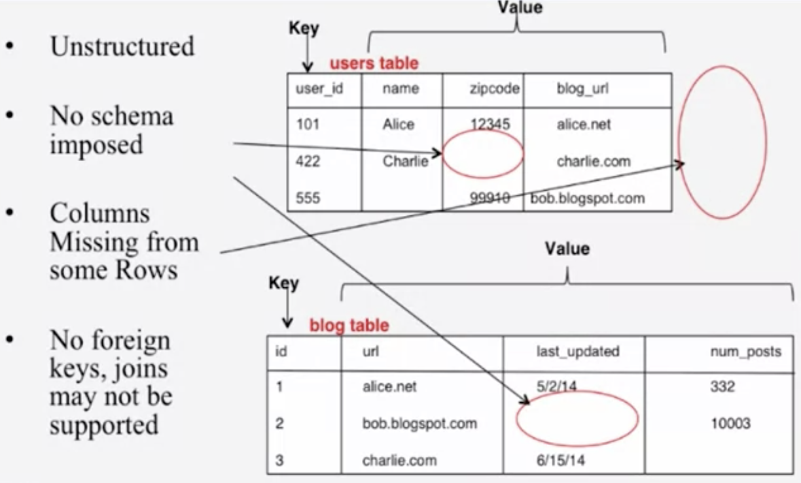
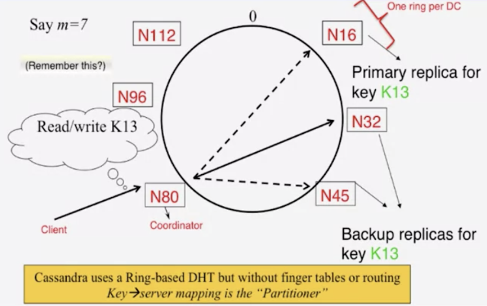
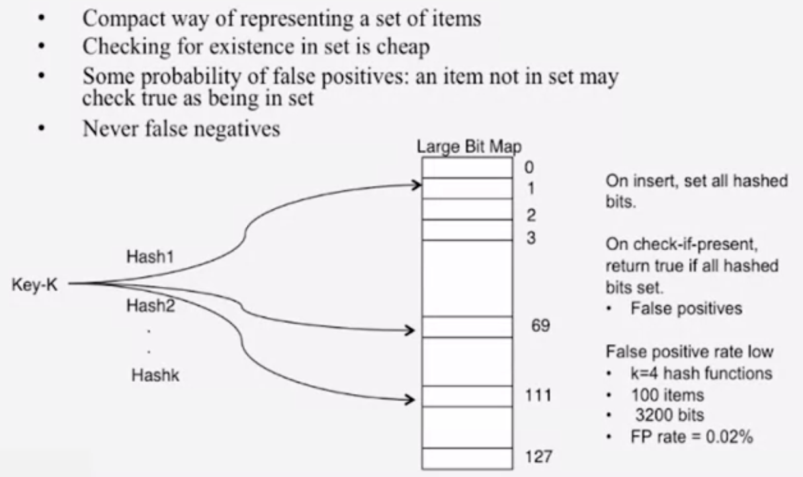

# 1.4 Key-Value Stores, Time, and Ordering

## Lesson 1: Key-Value Stores

### Why Key-Value / NoSQL?

* The Key-Value Abstraction
  * Twitter: Tweet ID -&gt; Info about tweet
  * Amazon: Item ID -&gt; Info about it
  * Chase: Account \# -&gt; Info about it
* Kind of like a distributed dictionary/DHT in P2P systems
* Kind of like a database
  * Why not use relational DBMS? Mismatch with today's workloads
    * Data: Large and unstructured
    * Lots of random reads and writes from lots of clients
    * Sometimes write-heavy, while RDBMS are often optimized for reads
    * Foreign keys rarely needed
    * Joins frequent
* Demands of today's workloads
  * Speed
  * Avoid Single Point of Failure \(SPoF\)
  * Low Total Cost of Operation \(TCO\)
  * Fewer System Administrators
  * Incremental Scalability
  * Scale out, not up
    * Scale up: Grow the cluster capacity by replacing with more powerful machines
    * Scale out: Incrementally grow the cluster capacity by adding more COTS machines \(Components Of The Shelf, sweet spot on the price curve\)
      * This is cheaper, and we can phase in/out newer/older machines over a long duration
* NoSQL: Not Only SQL
  * Necessary API operations: get\(key\) and put\(key, value\)
  * There are tables like in RDBMS systems, but they may be unstructured/may not have schemas/don't always support joins/foreign keys, but they can have index tables
  * Storage: column-oriented storage
    * RDBMS stores an entire row together \(on disk or at a server\)
    * NoSQL systems store a column \(or groups of columns\) together
      * Entries within a column are indexed and easy to locate given a key \(and vice versa\)
      * This makes ranged searches within a column faster \(as we don't need to fetch the entire database\)
        * E.g., get me all the blog\_ids from the blog table that were updated within the past month 

### Cassandra

* Data placement strategies
  * SimpleStrategy
    * RandomPartitioner: Chord-like hash partitioning
    * ByteOrderedPartitioner: Assigns ranges of keys to servers, easier for range queries
  * NetworkTopologyStrategy: For multi-DC deployments
    * Two/three replicas per DC
    * Per DC: The first replica is placed according to partitioner, then go clockwise until you hit a different rack
* Snitches: Maps IPs to racks and DCs
  * SimpleSnitch: Unaware of topology/rack
  * RackInferring: Assumes network topology by octet of server's IP address
    * 101.102.103.104 = x.&lt;DC octet&gt;.&lt;rack octet&gt;.&lt;node octet&gt;
  * PropertyFileSnitch: Uses a config file
  * EC2Snitch: EC2 region = DC, availability zone = rack
* Writes
  * Client sends write to one coordinator node in Cassandra cluster
  * Coordinator uses partitioner to send query to all replica nodes responsible for key
  * When X replicas respond, coordinator returns an acknowledgment to the client
    * X is specified by the client -- we'll come back to this later
  * Hinted Handoff mechanism: If any replica is down, the coordinator writes to all other replicas, and keeps the write locally until down replica comes back up, when it sends a copy of that write. When all replicas are down, the coordinator buffers the write locally

* When a replica nodes receives a write
  * Log it in disk commit log for failure recovery
  * Make changes to appropriate memtables, in-memory representations of multiple key-value pairs. Memtables are flushed to disk when they are full/old.
  * Data files: An SSTable \(Sorted String Table\), list of key-value pairs sorted by key
  * Index file: An SSTable of \(key, position in data SSTable\) pairs
  * Efficient search: Bloom filters!
* Bloom filters: Large bit maps
  * Checking for existence in set is cheap
  * Some probabilities of false positives \(an item not in set reported as being in there -&gt; incur a slight overhead for going into the SSTable\), but never false negatives
  * The bit map starts with all zeros. On insert, we use k hash functions to map a key to k indexes. Then, all hashed bits are set to 1 for those k indexes \(if they hadn't been set already\)

* Compaction
  * Each server periodically merges SSTables by merging updates for a key
* Delete
  * Instead of deleting right away, add a tombstone to the log, and eventually it will be deleted by the compaction process
* Reads
  * Coordinator contacts X replicas
  * When X replicas respond, the coordinator returns the latest-timestamped value from those X replicas
  * The coordinator also fetches values from other replicas
    * This checks consistency in the background, initiating a read repair if any two values are different
    * This mechanism seeks to eventually bring all replicas up-to-date
  * A row may span across multiple SSTables -&gt; reads need to touch multiple SSTables -&gt; reads are slower than writes
* Membership
  * Any server could be the coordinator -&gt; every server needs to know about all the servers in the cluster, and the list of servers needs to be updated as servers join/leave/fail
  * Cassandra uses gossip-style membership
* Suspicion mechanism: Sets timeouts on a server-by-server basis
* Reads/writes are orders of magnitudes faster than MySQL. But what did we lose?

### The Mystery of X-The Cap Theorem

### The Consistency Spectrum

### HBase

## Lesson 2: Time and Ordering

### Introduction and Basics

### Cristian's Algorithm

### NTP

### Lamport Timestamps

### Vector Clocks

