# 4.1 Spark, Hortonworks, HDFS, CAP

## Spark

### Apache Spark

* Motivation: Traditional MapReduce & classical parallel runtimes cannot solve iterative algorithms efficiently
  * Hadoop: Repeated data access to HDFS, no optimizations to data caching & data transfers
  * MPI: No natural support for fault tolerance; programming interface is complicated
* Apache Spark: Extend the MapReduce model to better support two common classes of analytics apps:
  * Iterative algorithms \(ML, graphs\)
  * Interactive data mining
* Why are current frameworks not working?
  * Most cluster programming models use acyclic data flow \(from stable storage to stable storage\)
  * Acyclic data flow is inefficient for apps that repeatedly reuse a working set of data
* Solution: **Resilient Distributed Datasets \(RDDs\)**
  * Advantages
    * Allow apps to keep working sets in memory for efficient reuse
    * Retains the attractive properties of MapReduce \(fault tolerance, data locality, scalability\)
    * Supports a wide range of applications
  * Properties
    * Immutable, partitioned collections of objects
    * Created through parallel transformations \(map, filter, groupBy, join\) on data in stable storage
    * Can be cached for efficient reuse

### Example Spark Applications

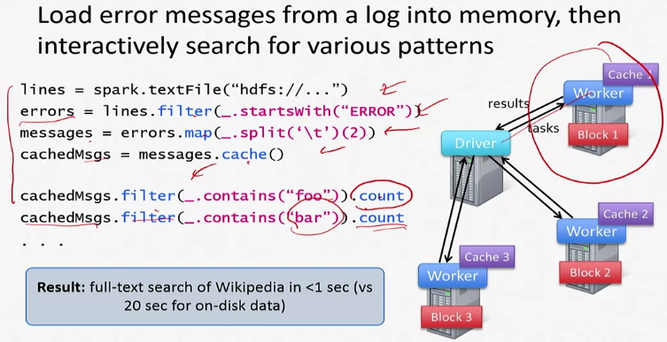

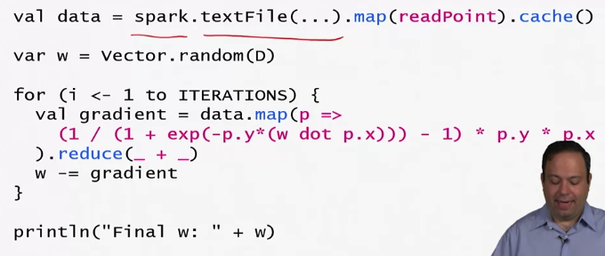

### RDD Fault Tolerance

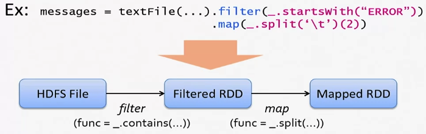

## Big Data Distros \(Distributions\)

### Hortonworks

* Connected data strategy
  * HDP: Apache Hadoop is an open-source framework for distributed storage and processing of large sets of data on commodity hardware. Hadoop enables businesses to quickly gain insight from massive amounts of structured and unstructured data
  * HDF: Real-time data collection, curation, analysis, and delivery of data to and from any device, source or system, either on-premise and in the cloud

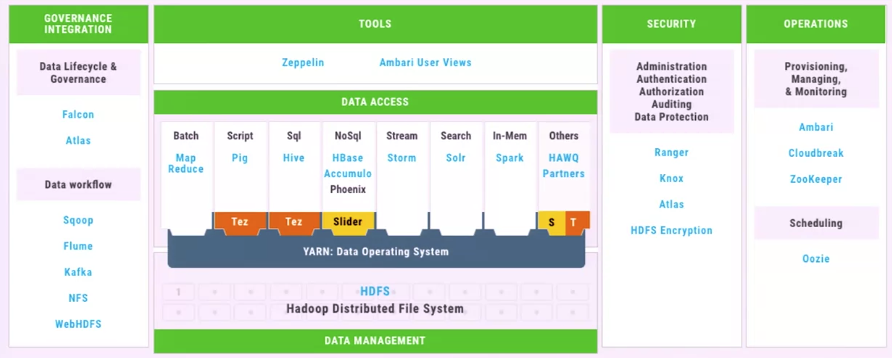

* HDP tools
  * Apache Zeppelin: Open web-based notebook that enables interactive data analytics
  * Apache Ambari: Source management platform for provisioning, managing, monitoring, and securing Apache Hadoop clusters
* HDP data access
  * YARN: Data Operating System
    * MapReduce: Batch application framework for structured and unstructured data
    * Pig: Script ETL data pipelines, research on raw data, and iterative data processing
    * Hive: Interactive SQL queries over petabytes of data in Hadoop
    * Hbase Accumulo: Non-relational/NoSQL database on top of HDFS
    * Storm \(Stream\): Distributed real-time large volumes of high-velocity data
    * Solr \(Search\): Full-text search and near real-time indexing
    * Spark: In-memory
  * Data management: HDFS
* HDF
  * Apache NiFi, Kafka, and Storm: Provide real-time dataflow management and streaming analytics

### Cloudera

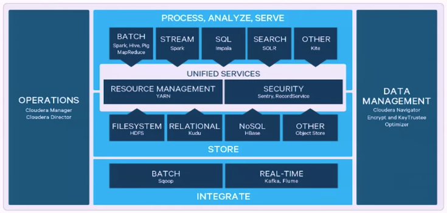

### MapR

* Platforms for big data
  * MapReduce \(Hadoop written in C/C++\)
  * NFS
  * Interactive SQL \(Drill, Hive Spark SQL, Impala\)
  * MapR-DB
  * Search \(Apache Solr\)
  * Stream Processing \(MapR Streams\)

## HDFS

### HDFS

* HDFS properties
  * Synergistic w/ Hadoop
  * Massive throughput
  * Throughput scales with attached HDs
  * Have seen very large production clusters \(Facebook, Yahoo\)
  * Doesn't even pretend to be POSIX compliant
  * Optimized for reads, sequential writes, and appends
* How can we store data persistently? Ans: Distributed File System replicates files
* Distributed File System
  * Datanode Servers
    * A file is split into contiguous chunks \(16-64MB\), each of which is replicated \(usually 2x or 3x\)
    * Sends heartbeat and BlockReport to namenode
  * Replicas are placed: one on a node in a local rack, one on a different node in the local rack, and one on a node in a different rack \(lots of back-ups\)

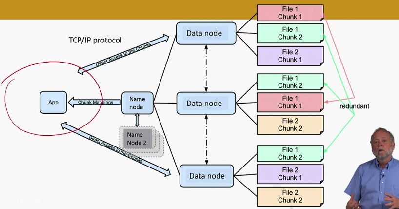

* Master node \(namenode in HDFS\) stores metadata, and might be replicated
  * Client libraries for file accesses talk to master to find datanode chunk, and then connect directly to datanode servers to access data
* Replication pipelining: Data is pipelined from datanode to the next in the background
* Staging: A client request to create a file does not reach namenode immediately. Instead, HDFS client caches the data into a temporary file -&gt; once the data size reaches a HDFS block size, the client contacts the namenode -&gt; namenode inserts the filename into its hierarchy and allocates a data block for it -&gt; namenode responds to the client with the identity of the datanode and the destinations of the replicas/datanodes for the block -&gt; client flushes from local memory

### YARN and Mesos

* Mesos: Built to be a scalable global resource manager for the entire datacenter

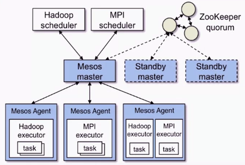

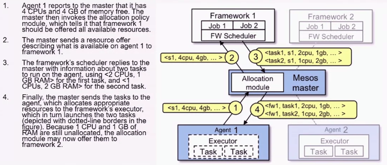

* YARN: Created out of the necessity to scale Hadoop

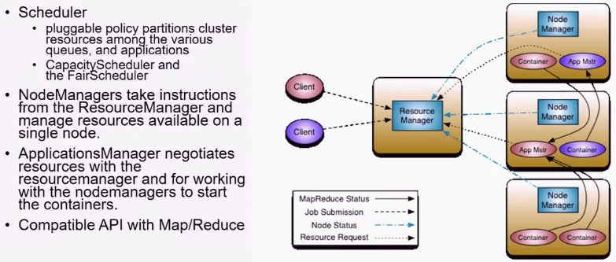

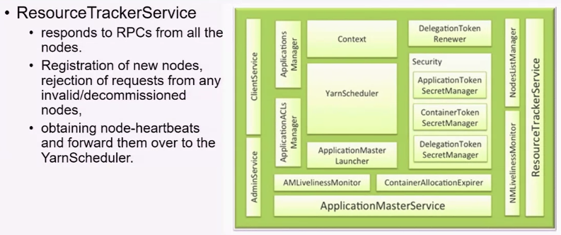

* Project myriad: Composites Mesos and YARN
  * Mesos framework and a YARN scheduler that enables Mesos to manage YARN resource requests

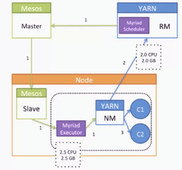

