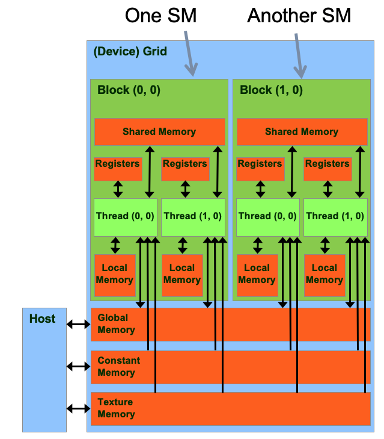
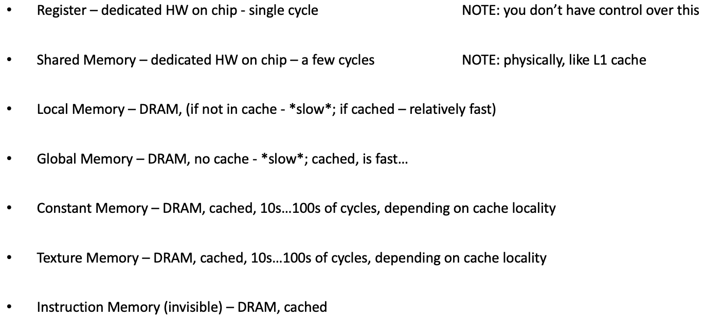
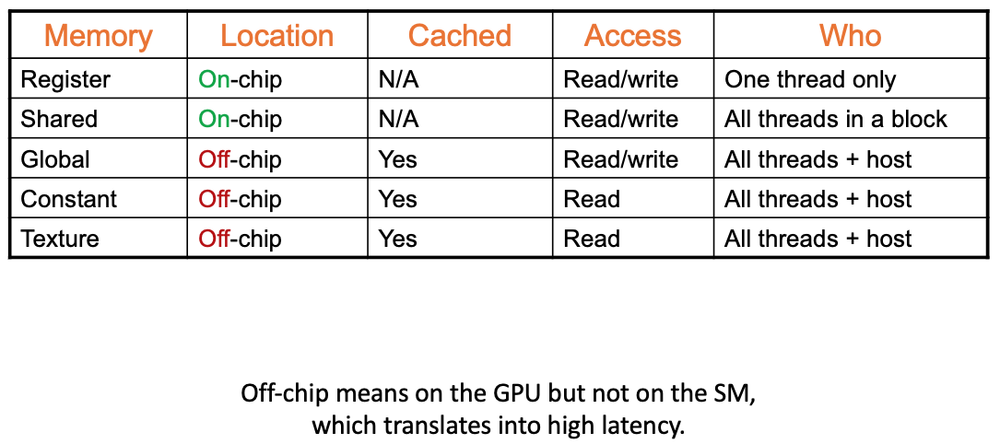
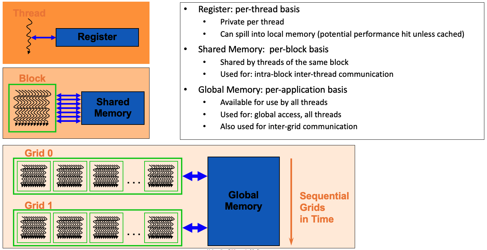
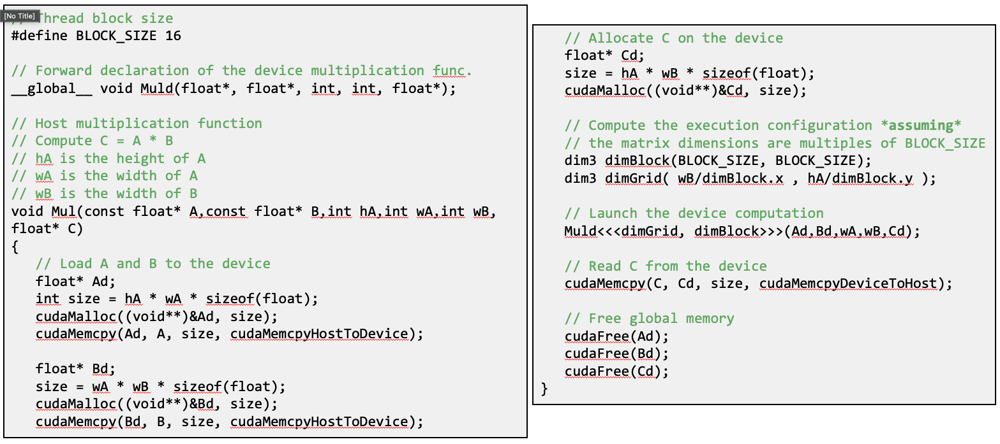
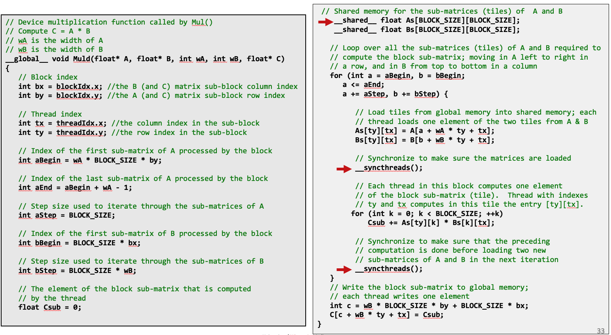

# Lecture 11: Execution Divergence. Control Flow in CUDA. Global Memory Access Patterns and

## Lecture Summary

* Last time
  * GPU Computing: Execution Scheduling
    * Block scheduler \(at the GPU level\)
    * Warp scheduler \(at the SM level\)
  * Thread Divergence
* Today
  * Aspects related to how GPU memory operations take place

## The NVIDIA GPU Memory Ecosystem

Each thread can:

* R/W per-thread registers 
* R/W per-thread local memory 
* R/W per-block shared memory 
* R/W per-grid global memory 
* Read only per-grid constant memory 
* Read only per-grid texture memory 
* Read only per-grid surface memory

Some aspects of Local Memory:

* Physically, local memory does not exist
  * In reality, data stored in local memory is placed in cache or the global memory at run time or by the compiler
* It's specific to one thread and not visible to any other thread
* Local memory has the same latency as global memory, unless cached

Different memories:

* Global memory: Main means of communicating R/W data between host and device. cudaMalloc\(\), cudaFree\(\), and cudaMemcpy\(\) operate here. Note that there are four types of cudaMemcpy transfers \({host/device} to {host/device}\), and things happen over a PCIe connection.
* Texture and Constant memories: Constants initialized by host, contents available to all threads. 

Global, texture and constant memories are accessible by host \(done at high latency, low bandwidth\).

## Case Studies: Matrix Multiplication, Revisited

Purpose:

* See an example where the use of multiple blocks of threads play a central role
* Highlight the use/role fo the shared memory
* Point out the \_\_syncthreads\(\) function call \(synchronizes all threads in a block\)

* The previous example: Low arithmetic intensity, a lot of unnecessary movements from global memory to device
* Rule of thumb: If the data that you, as a thread, use can also be used by another thread in your block, then you should consider using shared memory
* To use shared memory:
  * Partition data into data subsets \(tiles\) that each fits into shared memory
  * Handle each data subset \(tile\) with one thread block by:
    * Loading the tile from global memory into shared memory, using multiple threads to exploit memory-level parallelism
    * Performing the computation on the tile from shared memory; each thread can efficiently multi-pass over any data element of the tile

