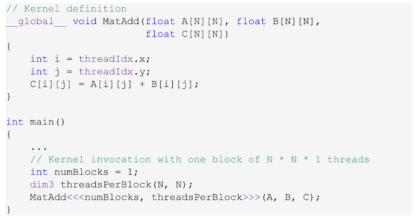
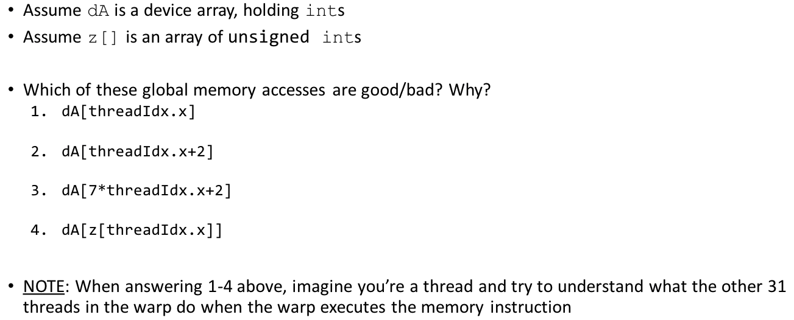
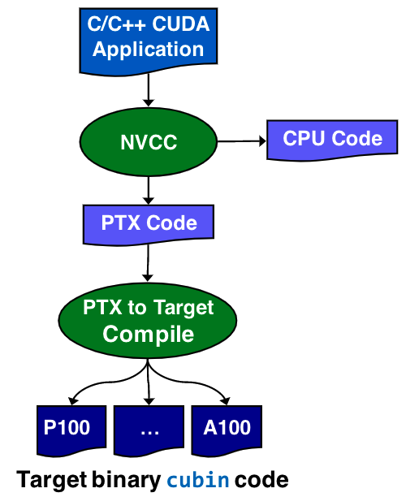
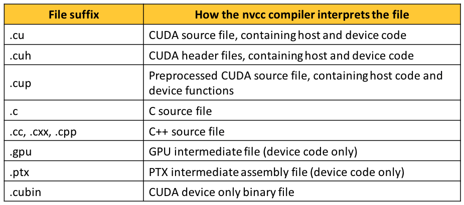

# Lecture 13: Atomic operations in CUDA.

## Lecture Summary

* Last time
  * GPU mem operations: focus on shared memory
  * GPU mem operations: focus on global memory
  * How parallel computing makes memory operations tricky
    * RAW, WAW, WAR hazards
* Today
  * Atomic operations
  * Things that determine the speed of execution of a kernel
  * Case studies: parallel reduction on the GPU 

## Example: Element-Wise Matrix Addition

As `threadIdx.x` changes faster than `threadIdx.y`, we should have `C[j][i] = A[j][i] + B[j][i]` instead of `C[i][j] = A[i][j] + B[i][j]`.

## Example: CUDA Global Memory Access

1. Good!
2. Coalesced, but not aligned
3. Misaligned, non-coalesced
4. Level of indirection

Two ways to store data in global memory:

1. Array of structures \(AoS\)
2. Structure of arrays \(SoA\)

## Atomic Operations

* Atomic memory operations is a mechanism that alleviates race conditions/access coordination problems
* The order in which concurrent atomic updates are performed is not defined
* While the order is not clear, none of the atomically performed updates will be lost
* Performance becomes poor when many threads attempt to perform atomic operations on a small number of locations
* When to use:
  * Cannot fall back on normal memory operations because of possible race conditions
  * Use for infrequent, sparse, and/or unpredictable global communication
  * Use shared memory and/or customized data structures & algorithms to avoid synchronization whenever possible
* Difference between `__syncthreads()` and an atomic operation:
  * `__syncthreads()` establishes a barrier, i.e. of synchronization
  * Atomic operations instead tie to the idea of coordination in relation to operations that involve memory transactions. Threads need not synchronize their execution, it’s only that a certain memory operation in a kernel is conducted in an atomic fashion

## Resource Management Considerations

* "Used at capacity": SM executes the max number of warps it can possibly host
* Three factors come into play:
  * threads/block
  * registers/thread
  * shMem/block
* Occupancy != Performance \(yet it's a pretty good proxy\)

## CUDA Optimization: Rules of Thumb

### High Priority

1. To get the maximum benefit from CUDA, focus first on finding ways to parallelize sequential code. Expose fine-grain parallelism
2. Minimize data transfer between the host and the device, even if it means running some kernels on the device that do not show performance gains when compared with running them on the host CPU
3. Strive to have aligned and coalesced global memory accesses. Design your implementation such that global memory accesses are coalesced for that part of the red-hot parts of the code
4. Minimize the use of global memory. Prefer shared memory access where possible \(consider tiling as a design solution\)

### Medium Priority

1. Accesses to shared memory should be designed to avoid serializing requests due to bank conflicts
2. Strive for sufficient occupancy
3. Keep the number of threads per block a multiple of 32 to avoid wasted lanes
4. Use the fast math library whenever speed is very important, and you can live with a tiny loss of accuracy
5. Avoid thread divergence

## Some More Compiler-Related Stuff

