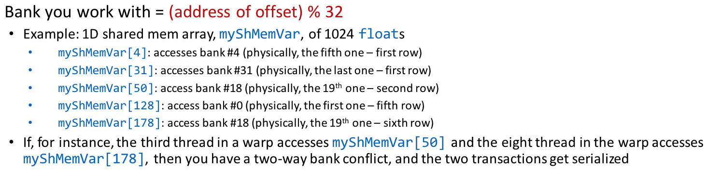
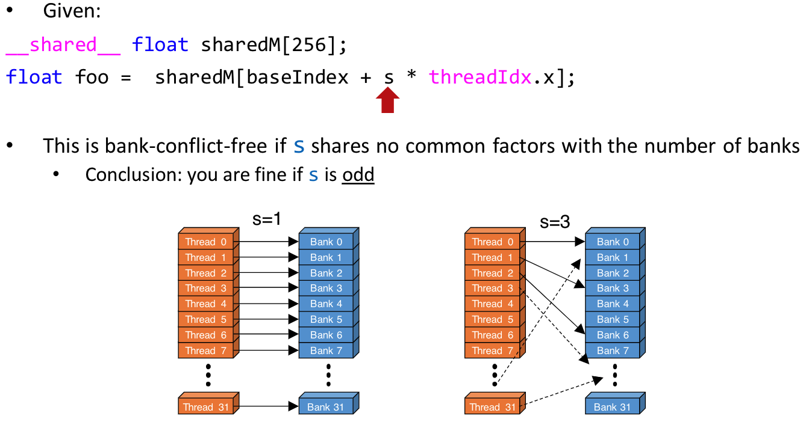
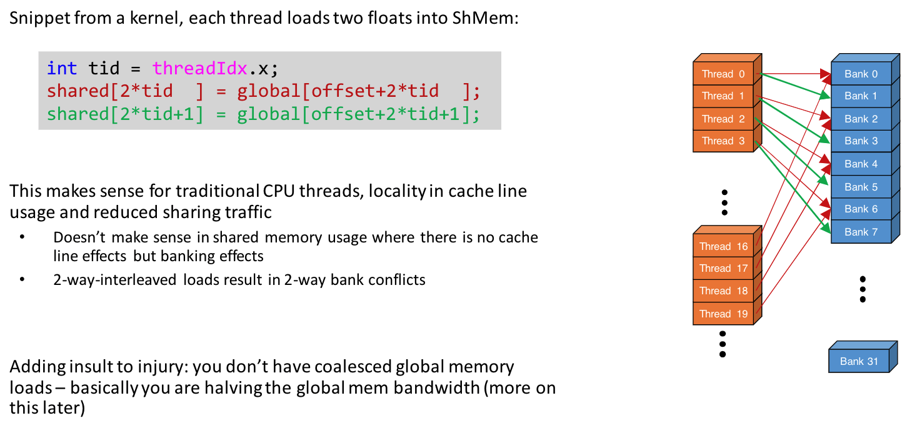
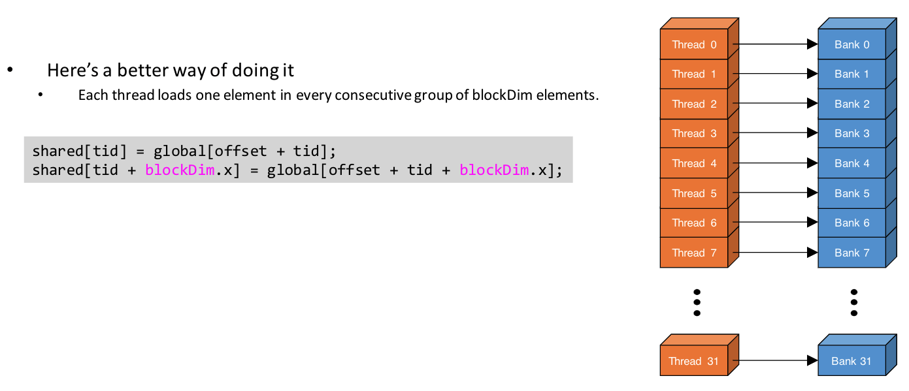
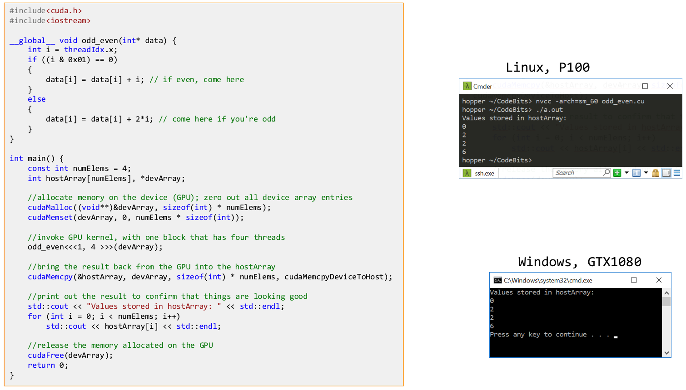
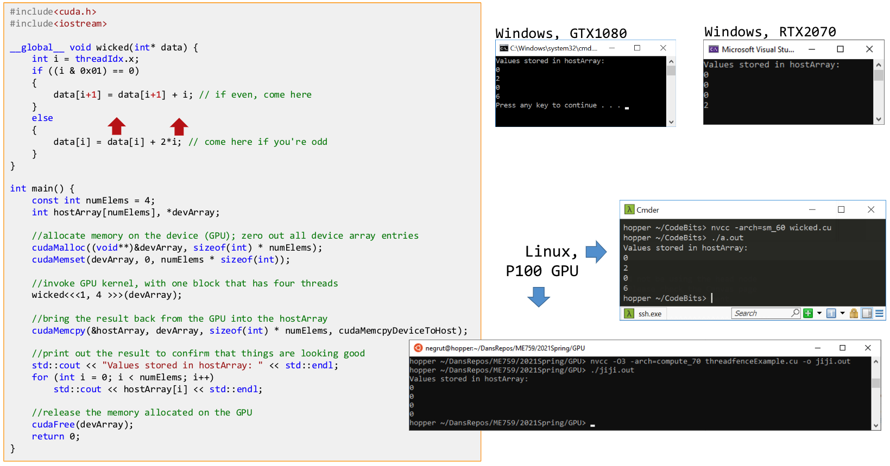
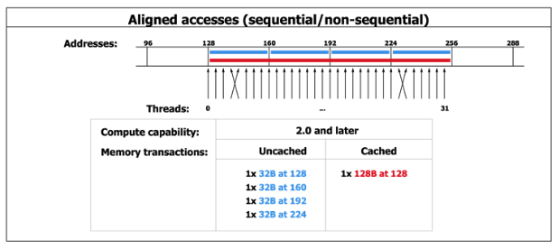
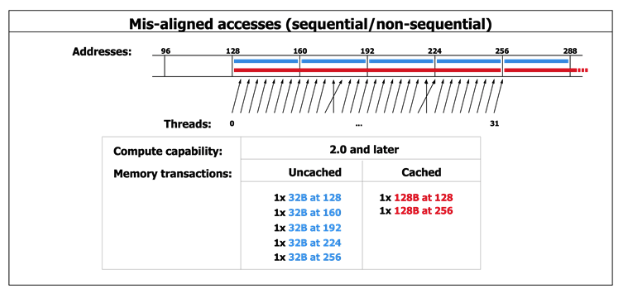

# Lecture 12: Global Memory Access Patterns and Implications.

## Lecture Summary

* Last time
  * Aspects related to how GPU memory operations take place
    * Registers, local memory, shared memory, global memory \(texture & constant memories\)
* Today
  * GPU mem operations: focus on shared memory
  * GPU mem operations: focus on global memory
  * How parallel computing makes memory operations tricky
  * Atomic operations
  * Things that determine the speed of execution of a kernel

## Banks

* Recap
  * Each SM has 32 banks
  * Each warp has 32 threads
  * At any point in time, the 32 banks are only accessed by threads in one warp
* Bank conflicts
  * No bank conflicts: Either linear addressing or random 1:1 permutation
  * Bank conflicts
    * N-way bank conflicts: a bank is accessed by N threads
    * Reading: "no conflict"
      * Broadcast: all threads in a warp access the same bank
      * Multicast: some threads in a warp access the same bank
  * For visualizations, see the slides

### Example

## Getting the results right \(broadly for parallel computing\)

### Example

### Data Hazards

* Three types of data hazards
  * RAW: Read-After-Write \(j ought to read only after the write by i occurred\)
  * WAR: Write-After-Read \(j ought to write only after the read by i occurred\)
  * WAW: Write-After-Write \(j ought to write only after the write by i occurred\)
* Moral of the story: The ordering of memory operations is important
* Types of memory consistency
  * Sequential consistency: All reads and all writes are in-order
  * Relaxed consistency: Some types of reordering are allowed
  * Weak consistency: Reads & writes arbitrarily reordered
* The `__threadfence()` family of functions: enforces that memory transactions for one thread can be seen by other threads
  * `__threadfence_block()`: Execution of the kernel by the calling thread pauses until all global and shared memory outstanding writes are visible to all threads in block
  * `__threadfence()`: Execution of kernel by a calling thread ensures all global and shared memory outstanding writes are visible to all threads in block AND all other threads in flight for global data
  * Not about synchronization, but about memory transaction
  * For an example, see the slides
* The volatile qualifier
  * If a variable located in global or shared memory is declared as volatile, the compiler assumes that its value can be changed or used at any time by another thread and therefore any reference to this variable compiles to an actual memory read or write instruction
  * W/o this keyword, the compiler optimizes instructions related to shared memory, and this keyword disables those optimizations
* volatile applies equally well to sequential computing
* `__threadfence()` is specific to parallel computing

## Getting the results fast \(for specifically GPU computing\)

* Issues
  * Not all global memory accesses are equally efficient \(higher priority\)
  * Not all shared memory accesses are equally efficient
* Two aspects of global memory access are relevant
  * The layout/pattern of the access
    * If threads that access global memory are neatly grouped, then we have a coalesced memory access, and this is good
    * If the threads are scattered all over the place, it impacts the effective bandwidth
  * The alignment of the data we are fetching from global memory
    * If all threads in a warp access data inside only one memory block, it's great
* Good memory accesses are coalesced and properly aligned

