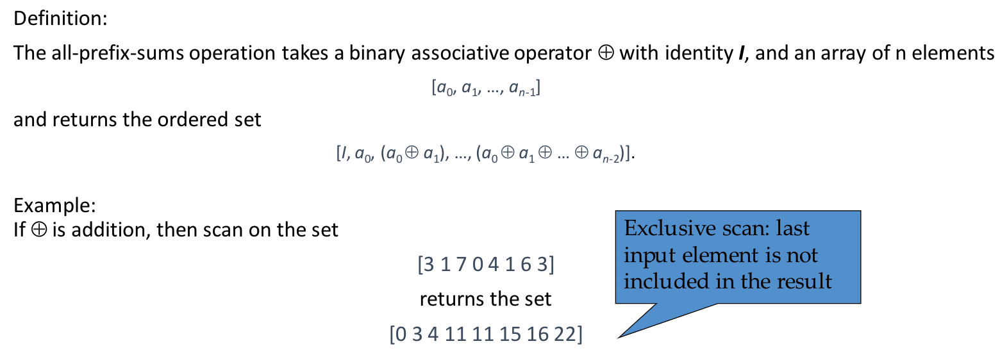
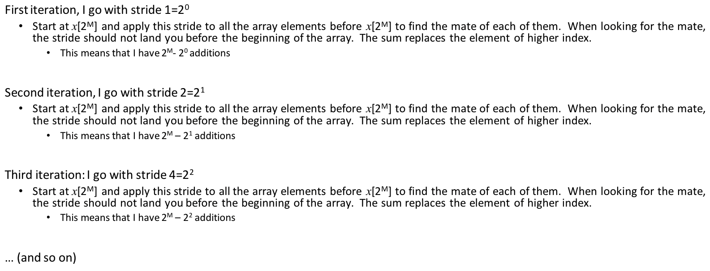
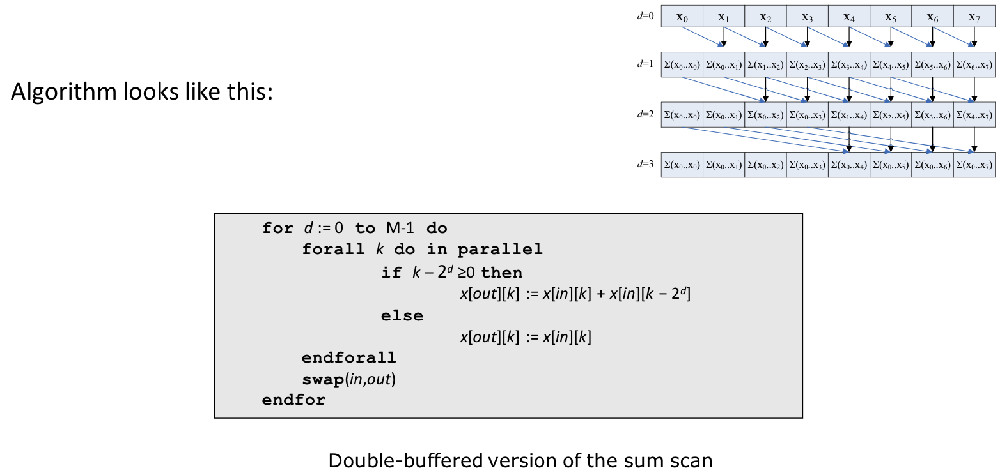
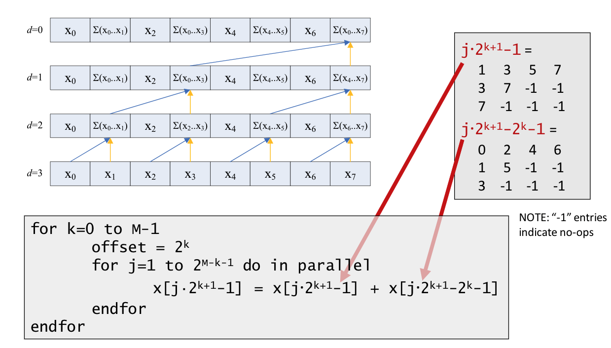
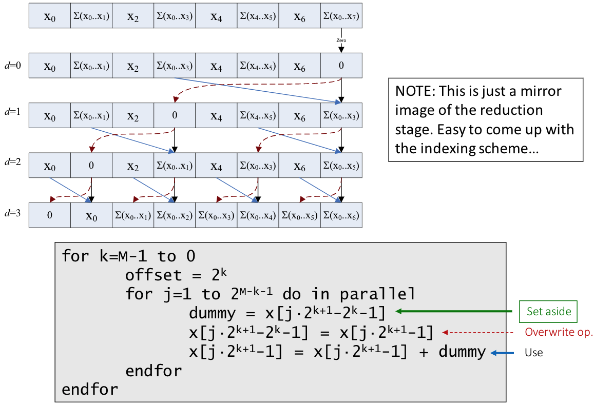
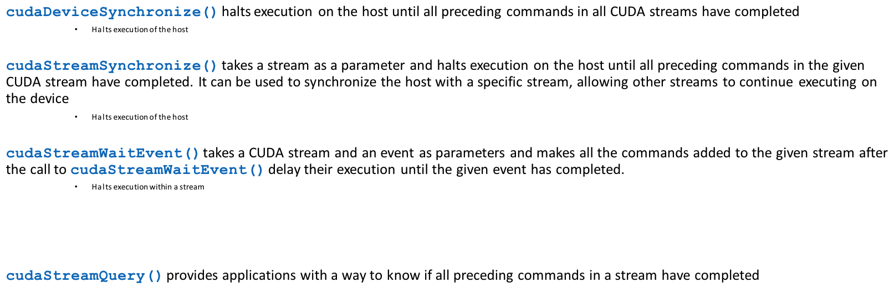

# Lecture 15: CUDA Optimization Issues. Resource Utilization Issues. Parallel Prefix Scan on the GPU.

## Lecture Summary

* Last time
  * Case studies: parallel reduction on the GPU & 1D convolution
  * Looking beyond today: some more GPU computing feature, but looking for a while into optimization features
* Today
  * One more cast study: parallel prefix scan
  * Using streams in GPU computing: increasing problem size; improving execution speeds

## Parallel Prefix Scan on the GPU

### Algo 1: Hillis & Steele \(1986\)

* Simple, but suboptimal \(O\(N\*log2\(N\)\)\)

### Algo 2: Harris-Sengupta-Owen \(2007\)

* Convoluted, but O\(N\)
* Balanced trees: A common parallel algorithm pattern
  * Upsweep from roots to the main trunk, and then down sweep from trunk to root
  * "Tree": Just a concept--the actual data structure is not used

## CUDA Streams

* A CUDA-enabled GPU has 2 engines
  * An execution engine
  * A copy engine \(which contains 2 sub-engines that can work simultaneously\)
    * A H2D copy sub-engine
    * A D2H copy sub-engine
* Async execution
  * Examples: Kernel launches, D2D mem copies, mem copies by functions with the `Async` suffix, etc
* Overlapping Host &lt;--&gt; Device data transfer with device execution
  * Issue: The device execution stack is FIFO
    * Addressed by the usage of CUDA "streams"
* Concurrency can be managed through streams
  * Concurrency means one of two things:
    * The copy and the execution engines of GPU working at the same time
    * Several different kernels being executed at the same time on the GPU
* A stream is a sequence of CUDA commands issued by the host that executes on the GPU in issue-order
  * CUDA operations in different streams may run concurrently
  * CUDA operations from different streams may be interleaved
* As soon as a CUDA function is invoked, a default stream \(stream 0\) is created
* Create using `cudaStreamCreate()`, destroy using `cudaStreamDestroy()`

