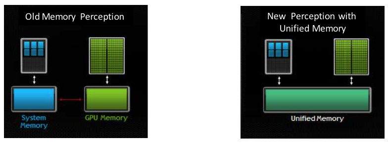

# Lecture 17: GPU Computing: Advanced Features. Unified Memory Usage.

## Lecture Summary

* Last time
  * Streams in GPU computing
  * Debugging & profiling
* Today
  * Use of unified memory in CUDA GPU Computing

## Unified Memory \(Managed Memory\) in CUDA

* cudaMemCpy
  * Available in release 1.0
  * Moves data between host and device \(over PCI-E\)
* cudaHostAlloc
  * Allocate host memory rather than malloc-ing -&gt; improve host/device data transfer speed if host memory is not pageable
  * Pros
    * Faster device &lt;--&gt; host transfer
    * Enables the use of asynchronous memory transfer and kernel execution
    * Enables mapping of the host pinned memory into the memory space of the device
  * Cons
    * Large memory impacts system performance
    * Memory allocation speed using cudaHostAlloc is low
  * `cudaError_t cudaHostAlloc(void** pHst, size_t sz, unsigned int flag);`
    * Using the flag `cudaHostAllocMapped` maps the memory allocated on the host in the memory space of the device for direct access
  * **Zero-Copy \(Z-C\)** GPU-CPU interaction
    * We no longer need an explicit CUDA runtime copy call to move data onto the GPU
    * This balloons the device memory so that it includes main memory that physically resides on the host
    * However, this requires the runtime call to cudaHostGetDevicePointer\(\). The need for this is eliminated by the Unified Virtual Addressing \(UVA\) mechanism.
* UVA: GPU and CPU share the virtual memory space. UVAS: UV Address Space.
  * CUDA runtime can identify where the data is stored based on the pointer
  * Instead of `cudaMemcpyxxx`, now we can use a generic `cudaMemcpyDefault`
* Z-C: Use pointer within device function to access host data
* UVA
  * Data access: A GPU can access data on a different GPU
  * Data transfer: Copy data in between GPUs
* UM \(Unified Memory\): Like UVA, but enabled the CPU to access GPU memory
  * UM works in conjunction with a "managed memory pool"
  * `cudaMallocManaged`replaces the need for explicit memory transfers between host and device, and cudaMalloc / cudaHostAlloc
  * Data is stored on the device but migrated where needed
  * Makes writing code easier, and will probably run faster due to locality \(for the casual programmer\)
  * Still evolving

## Review

1. cudaMemcpy
2. Z-C: Device could access memory on the host
3. UVA: Unified virtual space
4. UM: Processors can access each other's memory

