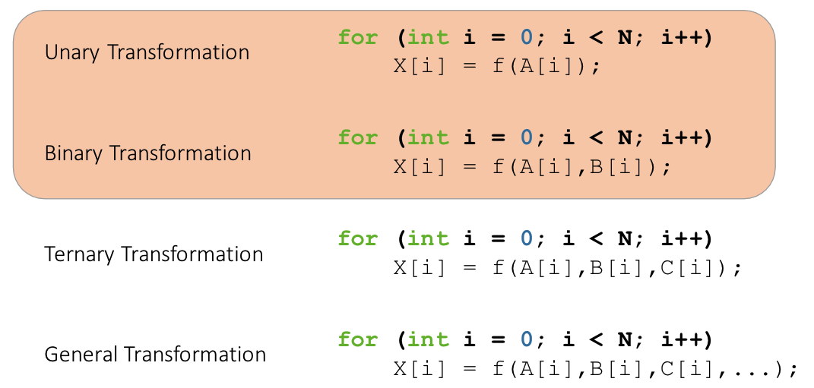

# Lecture 18: GPU Computing with thrust and cub.

## Lecture Summary

* Last time
  * A three-stop journey noted in the evolution of the CUDA memory model
    * Z-C accesses on the host; the UVA milestone; the unified memory model that allowed to use of managed memory
* Today
  * GPU computing, from a distance \(via thrust & CUB\)

## Thrust

* Motivation
  * Increase programmer productivity
  * Do not sacrifice execution speed
* What is thrust?
  * A template library for parallel computing on GPU and CPU
  * Heavy use of C++ containers
  * Provides ready-to-use algorithms

### Namespaces, containers, iterators

* To avoid name collisions, use `thrust` vs. `std` namespaces
* 2 vector containers: host\_vector and device\_vector
  * Just like those in the C++ STL
  * Manage both host & device memory
  * Auto allocation & deallocation
* Iterators: Act like pointers for vector containers
  * Can be converted to raw containers
  * Raw pointers can also be wrapped with device\_ptr

### Algorithms

* Element-wise operations
  * for\_each, transform, gather, scatter
  * Example: SAXPY, **functor** using transform
* Reductions
  * reduce, inner\_product, reduce\_by\_key
* Prefix sums \(scans\)
  * inclusive\_scan, inclusive\_scan\_by\_key
* Sorting
  * sort, stable\_sort, sort\_by\_key

### General transformations. Zipping & fusing

* **Zipping**
  * Takes in multiple distinct sequences, zips into unique sequence of tuples
* **Fusing**
  * Just like zipping, but it's for reorganizing computation \(instead of data\) for efficient thrust processing
  * Increases the arithmetic intensity

### Thrust example: Processing rainfall data

Not covered in class

## CUB

* CUB: CUDA UnBound
* [CUB is on GitHub](https://github.com/NVIDIA/cub)
* thrust is built on top of CUB
* What CUB does
  * Parallel primitives
    * Warp-wide "collective" primitives
    * Block-wide "collective" primitives
    * Device-wide primitives
  * Utilities
    * Fancy iterators
    * Thread and thread block I/O
    * PTX intrinsics
    * Device, kernel, and storage management

