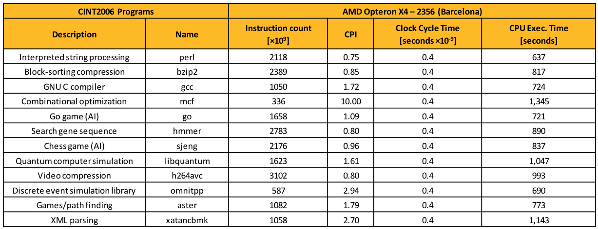
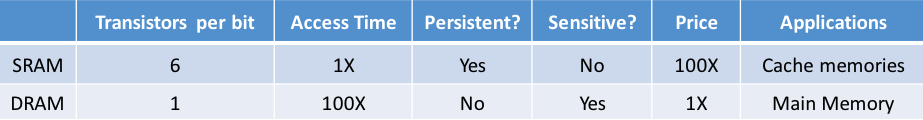
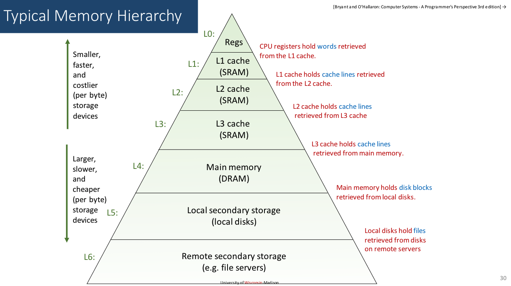
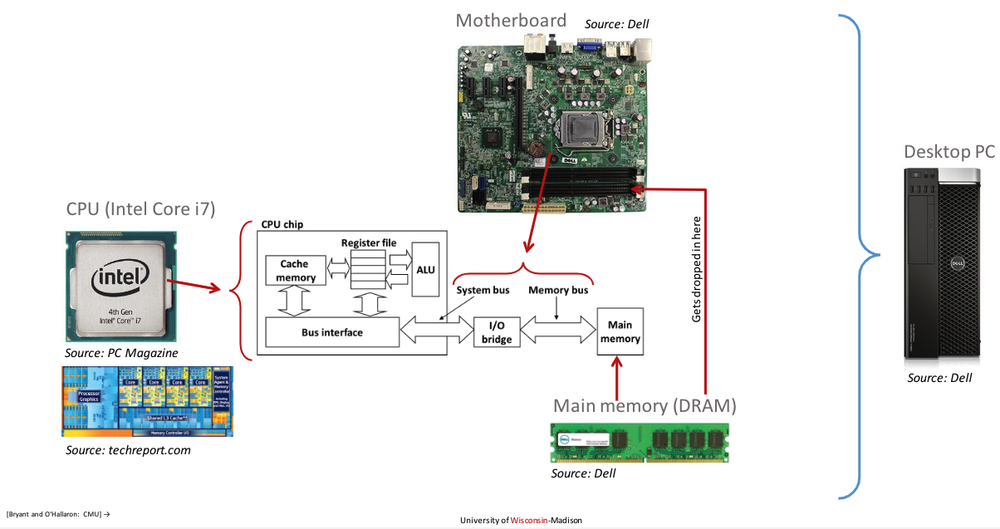
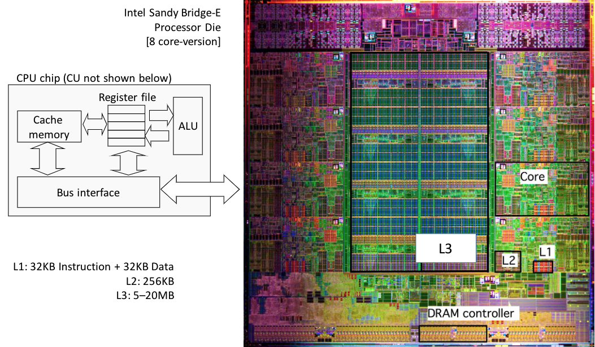

# Lecture 4: The memory hierarchy. Caches.

## Lecture Summary

* Execution times
* Memory related issues
* The memory hierarchy
* Caches

## Execution Times - Nomenclature

* Wall Clock Time: Amount of time from the beginning to the end of a program
* CPU Execution Time: Amount of time on the CPU that's dedicated to your program, requires a profiling tool to access
  * User Time: Time spent processing instructions compiled out of code generated by the user or in libraries that are directly called by user code
  * System Time: Time spent in support of the user’s program but in instructions that were not generated out of code written by the user \(e.g., OS support for opening/reading a file, throwing an exception, etc.\)
* Clock cycle: The length of the period for the processor clock \(e.g., a 1GHz processor has a clock cycle of 1 nanosecond\)
* The CPU Performance Equation: CPU Execution Time = Instruction Count \* Clock-Cycles per Instructions \(CPI\) \* Clock Cycle Time = Instruction Count \* Clock-Cycles per Instructions \(CPI\) / Clock Rate



## Memory & Cache

* SRAM \(Static Random Access Memory\): Expensive but fast \(short access time\), bulky, transistor hog, needs no refresh
* DRAM \(Dynamic ~\): Cheap but slow, information stored as a charge in a capacitor, higher capacity per unit area, needs refresh every 10-100ms, sensitive to disturbances





The memory hierarchy \(the pyramid of tradeoffs\):

* A dedicated hardware asset called MMU \(Memory Management Unit\) is used to manage the hierarchy
* Tradeoff:
  * DRAM off-chip: Main memory
  * SRAM on-chip: Cache
    * Caches have a deeper hierarchy: L1+L2+L3. L1 is faster and smaller than L2 & L3.
    * Different types of caches
      * Data caches: Feeds processor with data manipulated during execution
      * Instruction caches: Stores instructions
    * The ratio between cache size & main memory size: ~1:1000





The reason why cache works is the principle of locality: Programs tend to use data and instructions with addresses near or equal to those they have used recently.

* Temporal locality: Recently referenced items are likely to be referenced again in the near future
  * Data references: For example, in the code snippet below, the variable sum gets referenced at each iteration
  * Instruction references: The loop is cycled through repeatedly
* Spatial locality: Items with nearby addresses tend to come into use together
  * Data references: The elements in the array abc are accessed in succession \(stride-1 reference pattern\)
  * Instruction references: The instructions are referenced in sequence

```text
sum = 0;
for (i = 0; i < n; i++)
    sum += abc[i];
return sum;
```

### Case study: Adding the entries in an N-dimensional matrix \(not covered in class\)

Take-home message: Well-written programs leverage data/instruction locality \(which brings cache into the play\) for better performance

