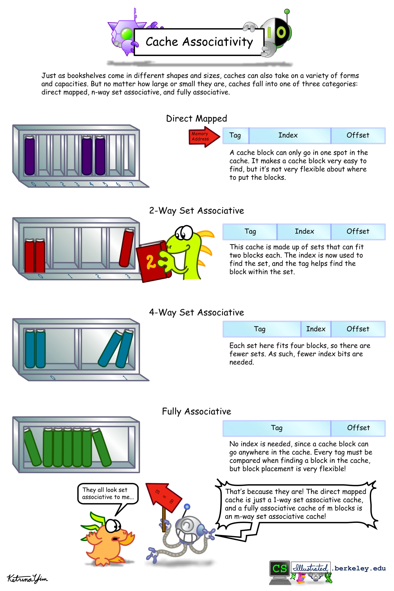

# Lecture 5: Caches, wrap up. Virtual Memory.

## Lecture Summary

* Wrap up Cache
* Virtual Memory

## Caches

Types of cache misses, ranged by the amount of delay caused:

* Cache read miss from instruction cache
* Cache read miss from data cache
* Cache write miss to data cache

Reasons for cache misses:

* Cold \(compulsory\) miss: Cache is empty
* Capacity miss: Not enough space
* Conflict miss: Enough space, a lot of conflicts \(and thus replacements\)

Common placement policies are:

* Fully associative \(M-way associative, if M blocks in total\)
* K-way associative: Each set fits K blocks
* Direct mapped \(1-way associative\)

[Here are some comic illustrations for understanding cache basics, cache misses, and cache associativity. Source: CS Illustrated from Berkeley.](http://csillustrated.berkeley.edu/illustrations.php)



General Cache Organization:

* B: Number of bytes in a cache line \(typically 64\)
* E: Number of cache lines/blocks that combine to make up a set \(typically 2^{0,1,2,3,4}\)
* S: Number of sets that make up the cache
* T: Total cache size
* B \* E \* S = T

### Case study: Adding the entries in an N-dimensional matrix

Accessing data with locality gives a huge speedup:

```text
int sum_array_rows(int** a){
    int i, j, sum = 0;
    
    // Option 1: Accessed with locality
    for (i = 0; i < M; i++)
        for(j = 0; j < N; j++)
            sum += a[i][j];
    
    // Option 2: Accessed w/o locality
    for (j = 0; j < N; j++)
        for (i = 0; i < M; i++)
            sum += a[i][j];

    return sum;
}
```


