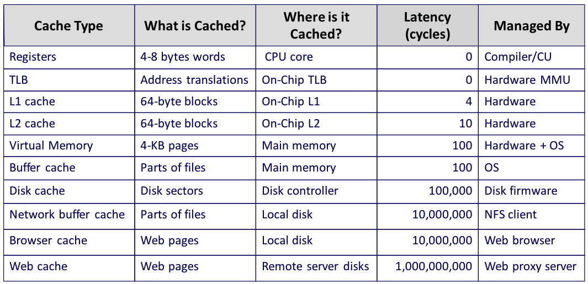
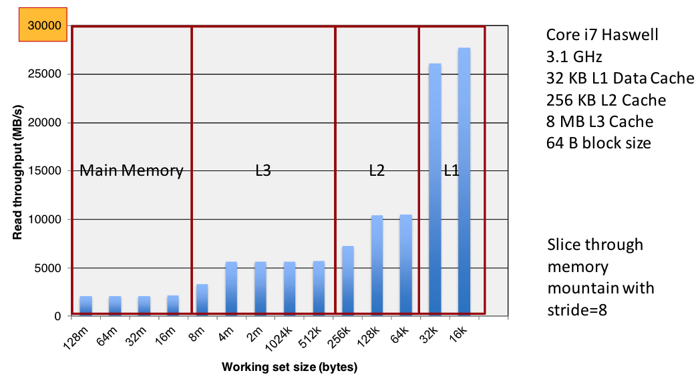
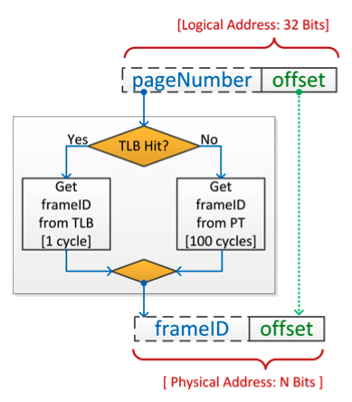
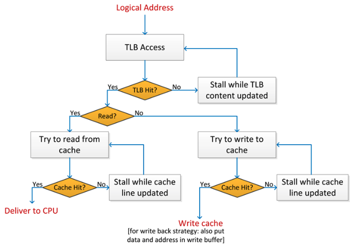

# Lecture 6: The Walls to Sequential Computing. Moore’s Law.

## Lecture Summary

* Wrap up Caches
* Virtual Memory

## Caches

* Handling a write-hit
  * Write-through
  * Write-back
* Handling a write-miss
  * Write-allocate
  * No-write-allocate
* Typical combos in practice
  * Write-back + Write-allocate \(more common\)
  * Write-through + No-write-allocate

Miss rate is more important than the hit rate: 97% hit rate is ~2 times worse than 99% hit rate

## Case Study: Rearranging Loops to Improve Spatial Locality

## Virtual Memory

Why memory virtualization?

* Ease of use \(running programs that require more memory than physically available\) 
* Isolation \(running multiple programs simultaneously\)
* Protection

* A page of virtual memory corresponds to a frame of physical memory
* Page table enables the translation of virtual address into physical addresses
* The page table is stored in main memory
  * If the page table is accessed for each address translation, this would be very costly
* Translation Lookaside Buffer \(TLB\): "Cache" for the addr translation process

