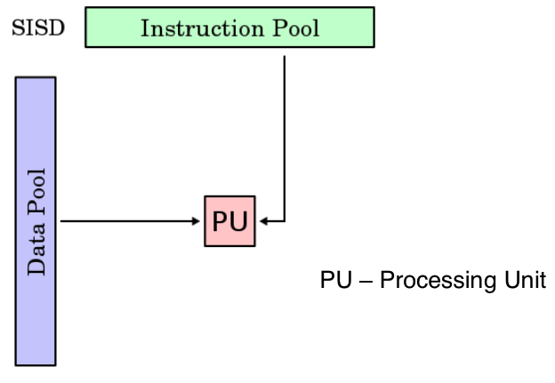
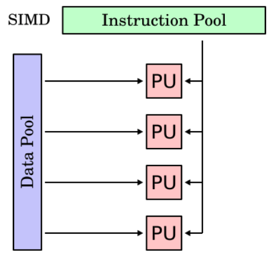
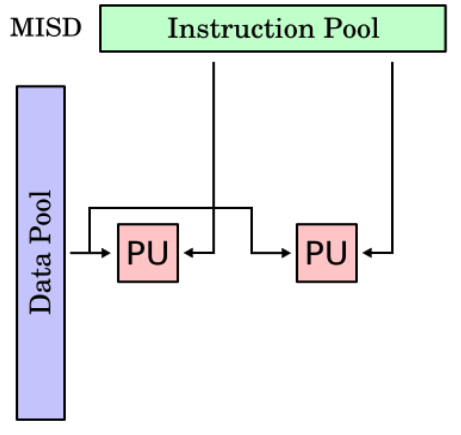
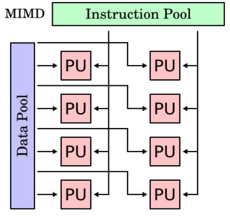
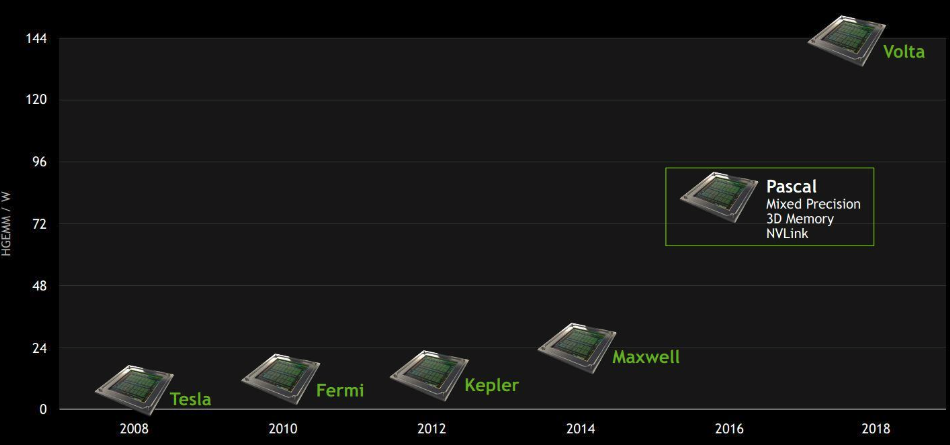
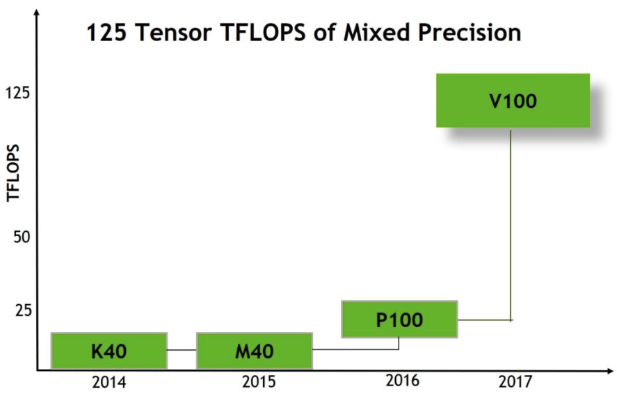
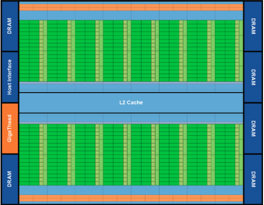
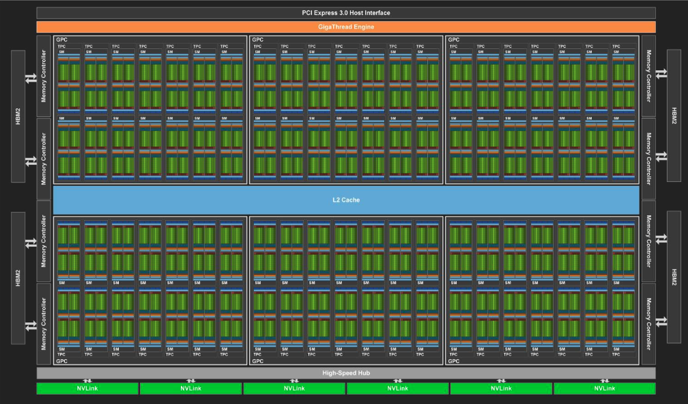
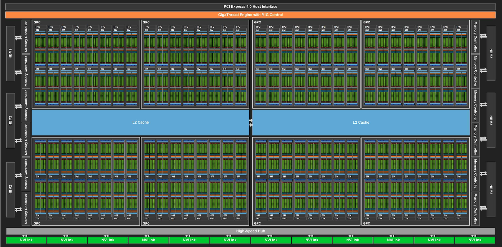
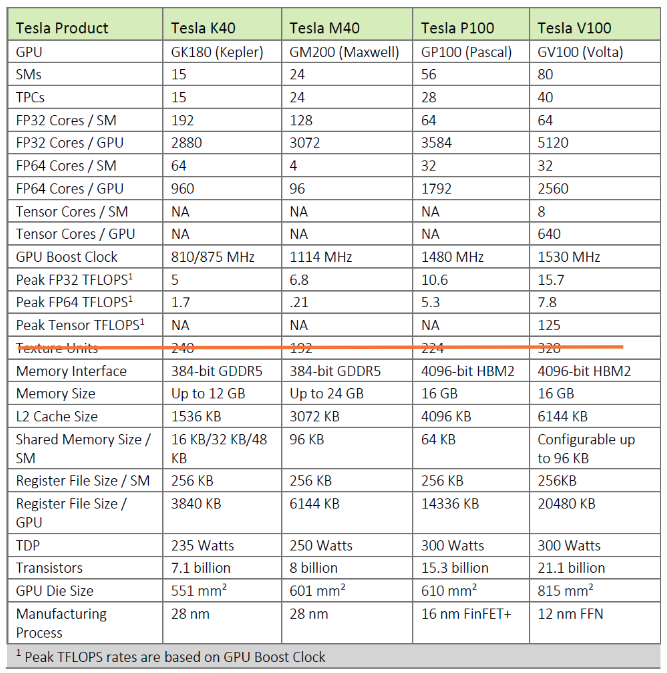

# Lecture 8: GPU Computing Intro. The CUDA Programming Model. CUDA Execution Configuration.

## Lecture Summary

* Flynn's Taxonomy
* Amdahl's Law
* Start GPU computing

## Flynn's Taxonomy

* SISD: Single Instruction/Single Data
* SIMD: Single Instruction/Multiple Data
* MISD: Multiple Instruction/Single Data
* MIMD: Multiple Instruction/Multiple Data

## Amdahl's Law \(Law of Diminishing Returns\)

The overall speedup relies on the worst-performing sections the most \(see more explanations [here](../../operating-systems/index/raid-a-case-for-redundant-arrays-of-inexpensive-disks.md#background-and-motivation)\).

## GPU Computing with CUDA

