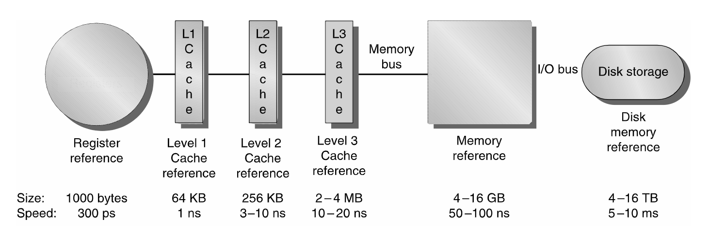
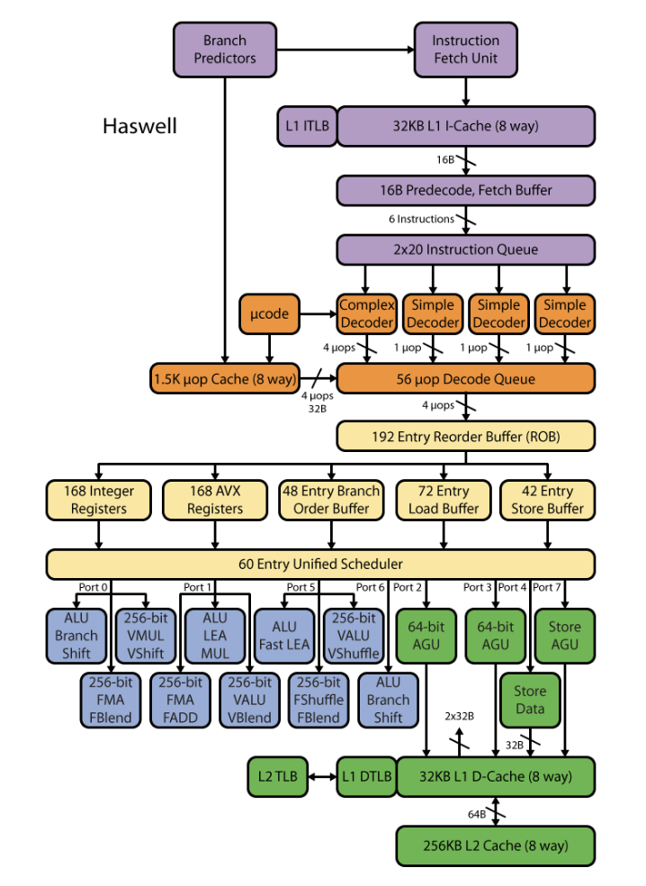
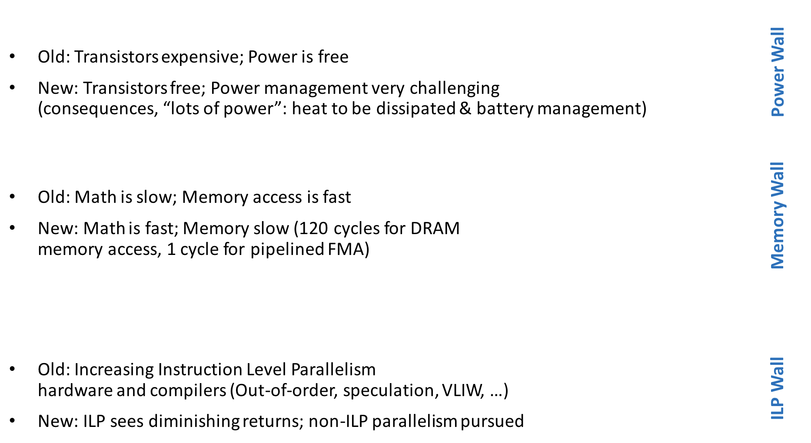
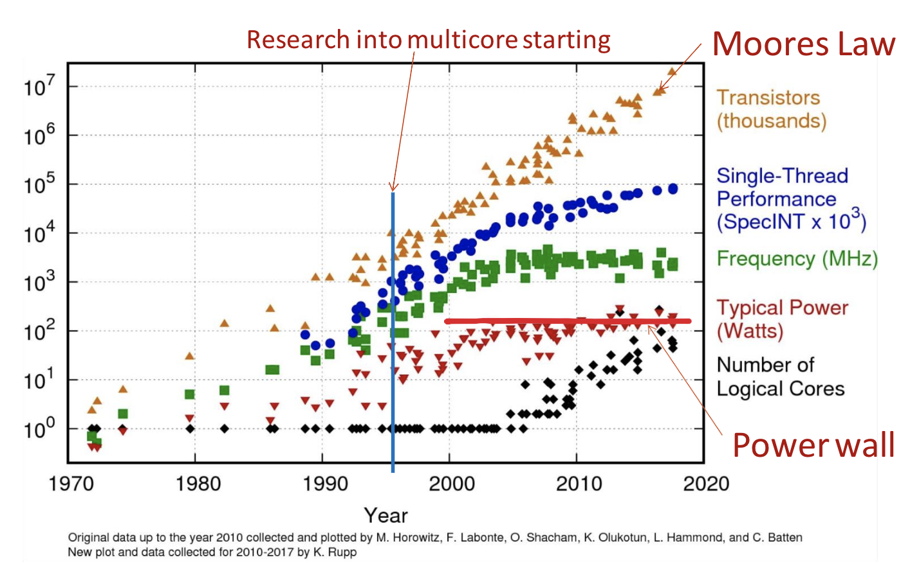

# Lecture 7: Parallel Computing.

## Lecture Summary

* Wrap up Virtual Memory
* Intuitions for Parallel Computing
* Flynn's Taxonomy
* Amdahl's Law

## Why Parallel Computing?

Sequential computing is facing these steep hills to climb:

* Memory Wall: Speed difference between CPU & memory outside the chip
* ILP Wall
* Power Wall: Latency & limited communication bandwidth beyond chip boundaries

### Memory Wall

Take-home message: Try to stay away from long and winding conversations with the main memory

### ILP Wall

Instruction pipelining; Superscalar execution; Out-of-order execution; Register renaming; Speculative execution; Branch prediction

Predicting the future comes at the cost of microarchitecture complexity and power cost

### Power Wall

Power, and not manufacturing, limits traditional general-purpose microarchitecture improvements

### Recap

## Now What?

