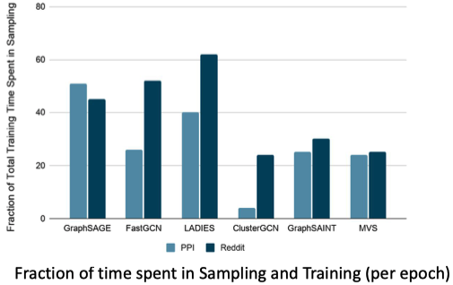

# Nextdoor: Accelerating graph sampling for graph machine learning using GPUs

## One-line Summary

In Graph Neural Network \(GNN\) training, existing approaches use CPUs to sample the graph before using GPUs to train the GNN, but sampling is a major overhead \(up to 62% of training time\). Nextdoor uses GPUs to accelerate graph sampling by up to 4x, and its main contributions are:

1. Simple abstractions & API to express diverse graph sampling algorithms
2. A new "transit parallel" approach to increase the parallelism of graph sampling
3. Optimizations \(load balancing & caching\) to improve GPU utilization

## Paper Structure Outline

1. Introduction
2. Background and Motivation
   1. Representation Learning on Graphs
   2. Requirements for GPU Performance
3. An Abstraction for Graph Sampling
4. Graph Sampling using NEXTDOOR
   1. Programming API
   2. Use Cases
5. Paradigms for Graph Sampling on GPUs
   1. Sample-Parallelism
   2. Transit-Parallelism
6. Efficient Transit Parallelism on GPUs
   1. Sampling in Individual Transit Sampling
   2. Transit-Parallel Collective Transit Sampling
   3. Unique Neighbors
   4. Graph Sampling using Multiple GPUs
   5. Integration in GNNs using Python API
   6. Advantages of NEXTDOOR's API
7. Alternative Graph Processing Systems
8. Evaluation
   1. Execution Time Breakdown
   2. Graph Sampling Performance
   3. Alternative GPU-Based Abstractions
   4. Sampling Large Graphs
   5. Sampling on Multiple GPUs
   6. End-to-End Integration in GNN Systems
9. Related Work
10. Conclusion

## Background & Motivation

### Background 1: How GNN training works

### Background 2: How to best utilize GPUs

### Motivation: Graph sampling on CPUs is a major overhead

Currently, graph sampling is done on CPUs because of the ease of implementation. Nextdoor attempts to provide both easy-to-implement and fast graph sampling.

## Design and Implementation

### Powerful abstraction/API to express sampling algorithms

### Transit parallel to increase parallelism

### Optimization techniques for GPUs \(load balancing, caching\)

## Evaluation

## Links & References

* [Paper PDF](https://marcoserafini.github.io/projects/nextdoor/nextdoor.pdf)
* Presentation video at EuroSys '21 \([Long](https://www.youtube.com/watch?v=GsffY0j6tVE&list=PLzDuHU-z7gNjuSbEYCFXZtWAl3nAdNF2f&index=19) & [Short](https://www.youtube.com/watch?v=lwB7KcMIpkQ&list=PLzDuHU-z7gNghxOWGcdLK_xWtqHjxaYTm&index=19)\)
* [Presentation slides at EuroSys '21](https://2021.eurosys.org/docs/presentations/6-Jangda%20-%20Abhinav%20Jangda.pdf)
* Graph sampling algorithms referenced in Nextdoor
  * [DeepWalk](https://arxiv.org/pdf/1403.6652.pdf)
  * [node2vec](https://arxiv.org/pdf/1607.00653.pdf)
  * [GraphSAGE](https://arxiv.org/pdf/1706.02216.pdf)
  * [FastGCN](https://arxiv.org/pdf/1801.10247.pdf)
  * [ClusterGCN](https://arxiv.org/pdf/1905.07953.pdf)
  * [LADIES](https://arxiv.org/pdf/1911.07323.pdf)

