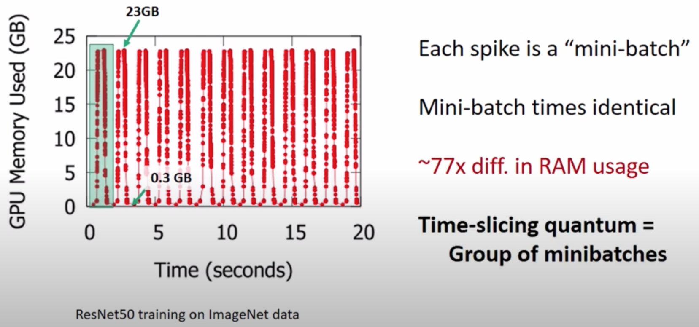

# Gandiva: Introspective Cluster Scheduling for Deep Learning

## One-line Summary

> If you understand this, you get the basic idea. But as with all complicated systems, the devil is in the details.

## Paper Structure Outline

1. Introduction
2. Background
3. DLT Job Characteristics
   1. Sensitivity to locality
   2. Sensitivity to interference
   3. Intra-job predictability
4. Design
   1. Mechanisms
   2. Scheduling Policy
      1. Reactive Mode
      2. Introspective Mode
5. Implementation
   1. Scheduler
   2. Modifications to DL toolkits
6. Evaluation
   1. Micro-benchmarks
   2. Model exploration in a multi-job
   3. Cluster experiments: time-slicing and packing
   4. Cluster experiments: time-slicing and migration
7. Related Work
8. Conclusion

## Background & Motivation

Today's DNN schedulers \(e.g., YARN, Kubernetes\) treat deep learning jobs naively \(as if they are traditional big-data jobs\): A job is scheduled on a set of GPUs exclusively, and the job holds the GPUs until completion. There are some problems:

1. High Latency \(head-of-line blocking\): Long DNN jobs have runtimes of hours and days, so we need time-slicing of jobs. However, GPUs are not efficiently virtualizable.
2. Low Efficiency \(fixed decision at the  job-placement time\): Need the ability to migrate jobs, and the sensitivity to locality varies across jobs.

## Design and Implementation

## Evaluation

## New Vocabulary

* Introspection \(反省\): The examination of one's own conscious thoughts and feelings.

## Links

* [Paper PDF](https://www.usenix.org/system/files/osdi18-xiao.pdf)
* [Presentation audio at OSDI '18](https://www.usenix.org/conference/osdi18/presentation/xiao)
* [Presentation slides at OSDI '18](https://www.usenix.org/sites/default/files/conference/protected-files/osdi18_slides_sivathanu.pdf)
* [Presentation video by Muthian Sivathanu, one of the authors and a UW-Madison alumni](https://www.youtube.com/watch?v=i4YOKOLsyFI&ab_channel=MicrosoftResearch)

