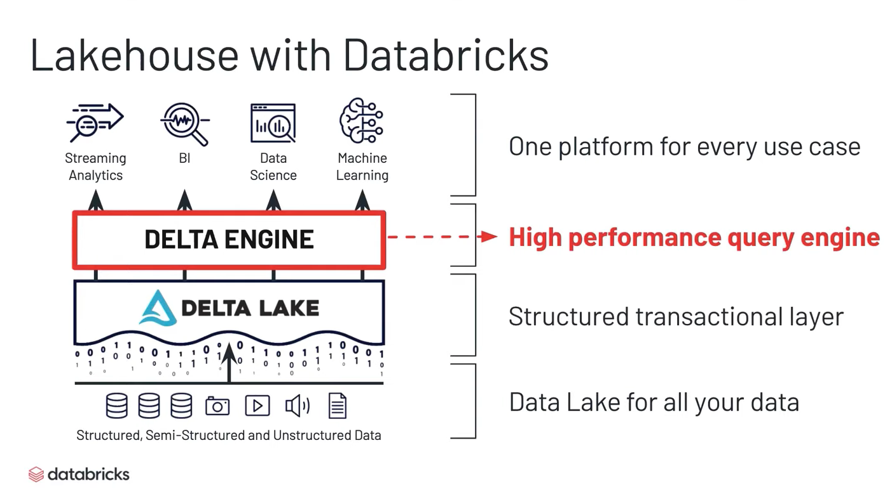
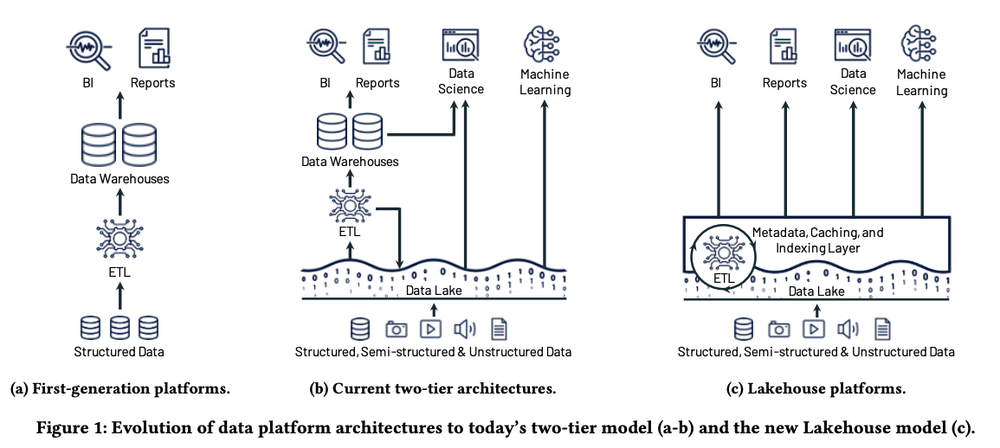

# Lakehouse: A New Generation of Open Platforms that Unify Data Warehousing and Advanced Analytics

## One-line Summary

## Paper Structure Outline

1. Introduction
2. Motivation: Data Warehousing Challenges
3. The Lakehouse Architecture
   1. Implementing a Lakehouse System
   2. Metadata Layers for Data Management
   3. SQL Performance in a Lakehouse
   4. Efficient Access for Advanced Analytics
4. Research Questions and Implications
5. Related Work
6. Conclusion

## Background & Motivation

## Design and Implementation

## Evaluation

## New Vocabulary

* 
## Links

* Paper PDF
* Presentation video at xxx
* Presentation slides at xxx
* xxx on GitHub

