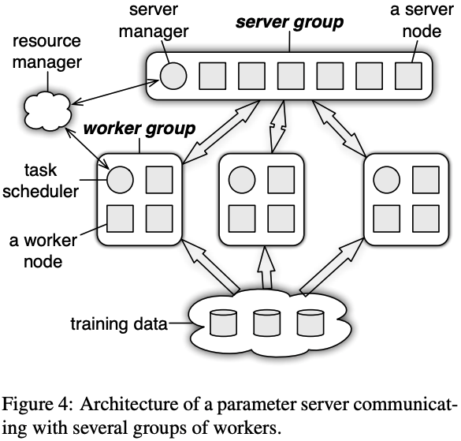
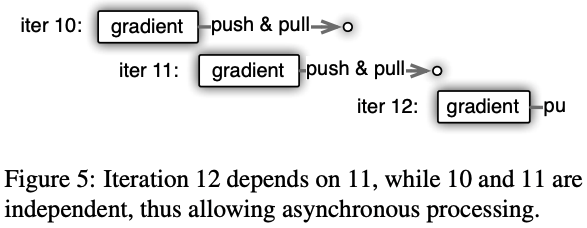
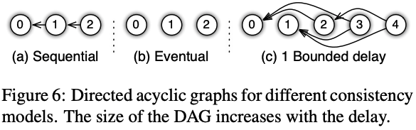

# Scaling Distributed Machine Learning with the Parameter Server

## One-line Summary

> If you understand this, you get the basic idea. But as with all complicated systems, the devil is in the details.

## Paper Structure Outline

1. Introduction
   1. Contributions
   2. Engineering Challenges
   3. Related Work 
2. Machine Learning
   1. Goals
   2. Risk Minimization
   3. Generative Models
3. Architecture
   1. \(Key, Value\) Vectors
   2. Range Push and Pull
   3. User-Defined Functions on the Server
   4. Asynchronous Tasks and Dependency
   5. Flexible Consistency
   6. User-defined Filters
4. Implementation
   1. Vector Clock
   2. Messages
   3. Consistent Hashing
   4. Replication and Consistency
   5. Server Management
   6. Worker Management
5. Evaluation
   1. Sparse Logistic Regression
   2. Latent Dirichlet Allocation
   3. Sketches
6. Summary and Discussion

## Background & Motivation

ML jobs and model sizes are getting bigger, thus we distributed the data/model across multiple worker machines. 

The parameter server model presented in this paper has five key features:

1. Efficient communication: The asynchronous communication model does not block computation
2. Flexible consistency models: 
3. Elastic Scalability: New nodes can be added w/o restarting the running framework
4. Fault Tolerance and Durability: 
5. Ease of Use:

## Design and Implementation

A server node in the server group maintains a partition of the globally shared parameters. The server manager node maintains a consistent view of the metadata \(liveness, assignment of partitions\) of the servers. Server nodes communicate with each other to replicate and/or to migrate parameters for reliability and scaling. Worker groups communicate with the server groups to pull the latest parameters, then compute the gradients locally and push them back.

The model shared among nodes can be represented as a set of \(key, value\) pairs.

An issue with async training is that inconsistency may arise. For example, in this case, iteration 11 is started before the parameters are pulled back, so it uses the old params from iter 10 and thus obtains the same gradients as iter 10. This is namely a tradeoff between system efficiency and algorithm convergence rate, and the best tradeoff depends on a variety of factors including the algorithm’s sensitivity to data inconsistency, feature correlation in training data, and capacity difference of hardware components. PS gives the algorithm designer the flexibility in defining consistency models. There are three main consistency models:

1. Sequential: 
2. Eventual:
3. Bounded Delay: 

## Evaluation

## New Vocabulary

* Sparse Logistic Regression
* Latent Dirichlet Allocation

## Links

* [Paper PDF](http://www.cs.cmu.edu/~muli/file/parameter_server_osdi14.pdf)
* [Parameter Server for Distributed Machine Learning](https://www.cs.cmu.edu/~muli/file/ps.pdf), the same work at a different venue \(NIPS '14\)
* [Presentation Video by the author at Tsinghua](https://www.youtube.com/watch?v=SHu5qHTDai8&ab_channel=ASEStreamLine)
* [Presentation Slides at OSDI '14](https://www.cs.cmu.edu/~muli/file/osdi14_talk.pdf)
* [Course notes on PS from CS 4787 @ Cornell](https://www.cs.cornell.edu/courses/cs4787/2019sp/notes/lecture22.pdf)
* [Course notes on PS from CS 294 @ Berkeley](https://bcourses.berkeley.edu/courses/1413454/files/65798745/download?verifier=kFM8TYOCEAoLPkVzJCDDr8f0oRaUZ03RYgpKlbYg&wrap=1)
* [Course notes on PS from CS 744 @ UW-Madison](http://pages.cs.wisc.edu/~shivaram/cs744-fa19-slides/cs744-paramserver-notes.pdf)
* [ps-lite on GitHub](https://github.com/dmlc/ps-lite)
* [Xiangfeng Zhu](https://xzhu27.me/)'s [paper reading notes](https://xzhu0027.gitbook.io/blog/ml-system/sys-ml-index/parameter-servers)
* [parameterserver.org by the Wayback Machine](https://web.archive.org/web/20150212084849/http://parameterserver.org/)

