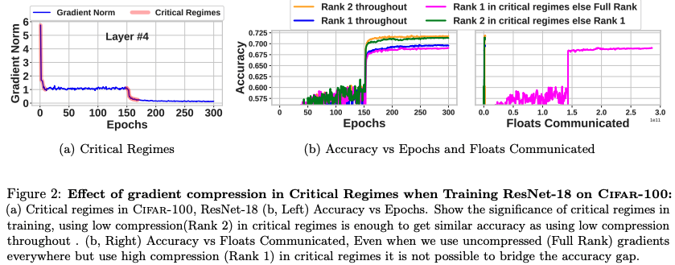
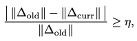
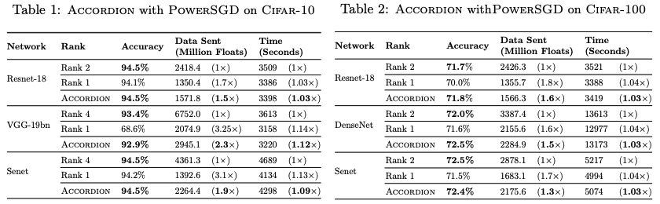
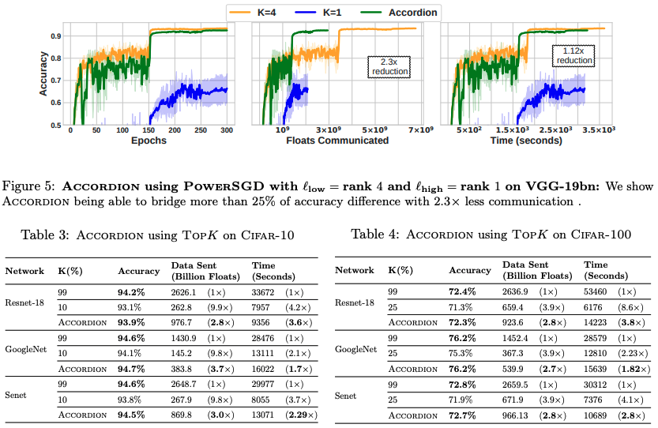
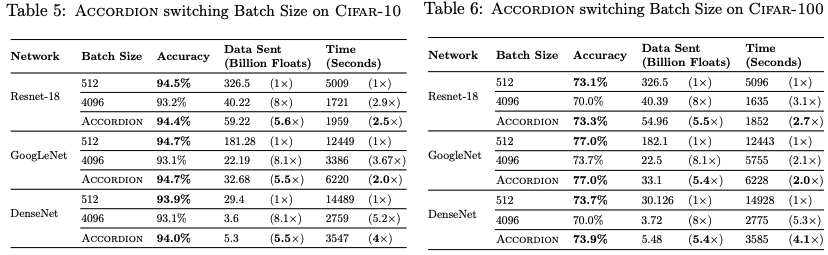

# Accordion: Adaptive Gradient Communication via Critical Learning Regime Identification

## One-line Summary

Accordion dynamically adjusts the gradient compression rate and batch size during critical regimes in training to do better compression, reduce communication, and achieve an end-to-end speedup w/o losing accuracy.

## Paper Structure Outline

1. Introduction
2. Related work
3. Distributed SGD
4. ACCORDION
   1. Adaptive communication using critical regimes
   2. ACCORDION's Design
   3. Relationship between gradient compression and adaptive batch-size
5. Experimental evaluation
   1. Experimental setup
   2. Results
   3. ACCORDION with PowerSGD
   4. ACCORDION with TopK
   5. ACCORDION with Large Batch size
   6. Comparison with Prior Work
6. Future Work and Limitations
7. Conclusion
8. Appendix
   1. Detailed Experimental Settings
   2. Connection Between Gradient Compression and Batch Size
   3. ACCORDION on Extremely Large Batch Size
   4. Results and Detailed Analysis
      1. Language Model
      2. Computer Vision Models
   5. Detailed Analysis of Batch Size Results
   6. Compression Ratio Selection of Adasparse
   7. Model Descriptions

## Background & Motivation

Current methods to alleviate gradient communication bottlenecks include:

* Lossy gradient compression \(reduce the size of data communicated\)
  * Choosing the compression ratio is a tradeoff between final accuracy & communication overhead\)
  * Can be generalized into three groups: quantization, sparsification, and low rank approximation
* Increase batch size \(reduce the frequency of per-epoch communication\)
  * This leads to degradation in final accuracy

In this work, the authors relax the "fixed communication" scheme and use adaptive schemes. The authors build on the idea of critical regimes so that avoiding gradient compression \(lowering the compression rate\) during critical regimes mitigates accuracy loss. Accordion is also able to adjust the batch size.

## Design and Implementation

In the example above, if low compression is used for the first 20 epochs and the 10 epochs after epoch 150 and high compression is used in other places, the overall communication will be close to high compression, and the accuracy will be the same as using low compression throughout \(communication is also reduced significantly\).

Critical regimes are identified by measuring the rate of change in gradient norms. This technique has a low computational and memory overhead.

For batch sizes, small batches are used only in critical regimes, and this results in performance similar to using small batches everywhere.

## Evaluation

More evaluations are available in the paper appendix. This paper has the longest appendix I've ever seen :\)

## Links

* [Paper PDF](https://arxiv.org/pdf/2010.16248.pdf)
* Presentation video at MLSys '21
* Presentation slides at MLSys '21
* xxx on GitHub

