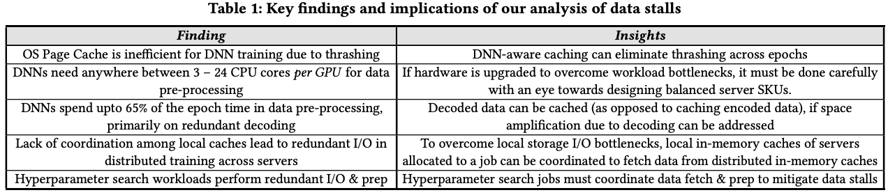
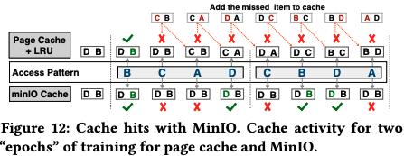
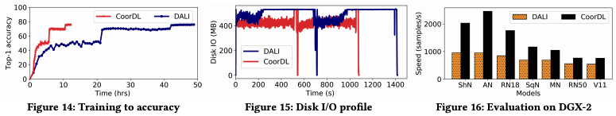

# Analyzing and Mitigating Data Stalls in DNN Training

## One-line Summary

This work investigates the data pipeline aspect of DNN training. The authors found that DNN training is dominated by prefetching and preprocessing of data \(data stalls\). A tool for measuring data stalls is built, and techniques are presented to mitigate data stalls.

## Paper Structure Outline

1. Introduction
   1. Contributions
2. Background
   1. The DNN ETL Requirements
   2. DALI: Fast Data Pipelining
3. Data Stalls in DNN Training
4. Analyzing Data Stalls
   1. Methodology
   2. Measuring Data Stalls using DS-Analyzer
   3. Data Stalls in DNN Training
      1. When dataset resides on remote storage
      2. When datasets cannot be fully cached
      3. When datasets fit in memory
      4. Data stalls exist across training frameworks
      5. Analysis of NLP models
5. DS-Analyzer: Predictive Analysis
   1. Example: Predicting Optimal Cache Size
6. Mitigating Data Stalls
   1. The MinIO Cache
   2. Partitioned MinIO Caching
   3. Coordinated Prep
   4. Tying it all together with CoorDL
7. Evaluation
   1. Single-Server Multi-GPU Training
   2. Multi-Server Distributed Training
   3. Hyperparameter Search
   4. Training to Accuracy with CoorDL
   5. Resource Utilization
   6. CoorDL on DGX-2
8. Discussion

## Background & Motivation

There are 5 stages in each iteration of an epoch:

1. A minibatch of data items is fetched from storage. 
2. The data items are pre-processed, for e.g., for image classification, data items are decompressed, and then randomly cropped, resized, and flipped.
3. The minibatch is then processed at the GPU to obtain the model’s prediction.
4. A loss function is used to determine how much the prediction deviates from the right answer. 
5. Model weights are updated using computed gradients.

Steps 3-5 constitute the actual computation, while steps 1-2 are data preparation. If the computation rate is bigger than the minimum of data prefetching rate and data preprocessing rate, a GPU waits for steps 1-2 to happen \(a data stall occurs\). More specifically, step 1 is termed a fetch stall, \(I/O bound during loading minibatch from storage\), while step 2 is termed a prep stall \(CPU bound waiting for the data items to be processed\). The following conclusions are drawn from the analysis:

* When dataset resides on remote storage \(distributed fs/object stores\): Large datasets usually fit entirely on local storage. Thus, a one-time download cost of the dataset is paid, and the benefits of local SSD is taken advantage of afterwards.
* When datasets cannot be fully cached
  * Fetch stalls are common if the dataset is not fully cached in memory
  * OS page cache is inefficient for DNN training
  * Lack of coordination among caches leads to redundant I/O in distributed training
  * Lack of coordination in HP search results in redundant I/O
* When dataset fits in memory
  * DNNs need 3-24 CPU cores per GPU for pre-processing
  * DALI is able to reduce, but not eliminate prep stalls
  * Decoding is very expensive, offloading prep to the GPU trades GPU memory usage for a speedup
  * Larger batch sizes utilize the GPU parallelism better. However, as compute gets faster, data stalls  become the bottleneck
  * Redundant pre-processing in HP search results in high prep stalls
* Data stalls exist across training frameworks \(TensorFlow, MxNet\)

## Design and Implementation

### DS-Analyzer: Perform predictive what-if analysis of data stalls

DS-Analyzer analyzes the implication of CPU, memory, and storage on the performance of a DNN and does what-if analyses. DS-Analyzer uses a differential approach and runs in three phases to measure prep stall and fetch stall:

1. Measure vanilla ingestion rate \(with no fetch or prep stalls\).
2. Measure prep stalls by training with a subset of the dataset entirely cached in memory. With this, any throughput decrease compared to \(1\) is due to prep stalls.
3. Measure fetch stalls by clearing all caches and setting max cache size to a user-given limit. The difference between \(2\) and \(3\) is due to fetch stalls.

### CoorDL: Mitigating data stalls

CoorDL is built on top of DALI and it incorporates the three following techniques:

#### MinIO: DNN-aware software caching to reduce cache misses per epoch \(benefits single-server training\)

Currently, the caching of the training dataset relies on the OS page cache. DNN training has the data access pattern of "repetitive across epochs and random within an epoch". This means that all data items in the dataset have equal probabilities of access in an epoch, so it is not important which data item is cached, but instead, it is crucial that cached items are not replaced before they are used in order to minimize I/O per epoch.

In MinIO, items, once cached, are never replaced in the DNN cache. This technique results in only capacity misses while using the page cache + LRU leads to more misses because of thrashing. MinIO is implemented in user space instead of a policy in the kernel.

#### Partitioned caching to coordinate remote MinIO caches \(benefits distributed training\)

In distributed training, the dataset is partitioned across all servers with a random partition every epoch. The authors found that on a cache miss, data transfer over commodity TCP stack is much faster than fetching from local storage. As a result, the authors present Partitioned MinIO. At the end of the first epoch, Partitioned MinIO collectively caches a part of the dataset of size equal to the sum of capacities of individual MinIO caches. Metadata about data items present in each server's cache is maintained. In the case of a local cache miss, the item is looked up in the metadata. If present, it is fetched from the respective server over TCP \(otherwise from local storage\).

#### Coordinated prep to eliminate redundant fetch & prep across jobs \(benefits hyperparameter search\)

When colocating hyperparameter search jobs, pre-processed minibatches created by one job can be reused by all other jobs. However, there is currently no coordination in data fetch & prep among these jobs, leading to stalls. In coordinated prep, each job receives a random shard of the dataset and processes it. After pre-processing the minibatches, they are exposed to all other jobs in a staging area in the memory region \(with minimal memory overhead\). Coordinated prep ensures that a minibatch is deleted once it is used exactly once by all jobs to ensure that it's not used across epochs \(leads to lower accuracy & OOM\).

## Evaluation

## Links

* [Paper PDF](https://www.cs.utexas.edu/~vijay/papers/vldb21-datastalls.pdf)
* [msr-fiddle/DS-Analyzer on GitHub](https://github.com/msr-fiddle/DS-Analyzer)
* [msr-fiddle/CoorDL on GitHub](https://github.com/msr-fiddle/CoorDL)

