# BytePS: A High Performance and Generic Framework for Distributed DNN Training

### One-liner Summary

In this paper, the authors introduced BytePS, a unified architecture for accelerating distributed DNN training in heterogeneous GPU/CPU clusters. Yes, this is the OG title of the paper, but it's so long that it does not fit in the GitBook title, so...

### Paper Structure Outline

1. Introduction
2. Background
   1. Distributed DNN Training
   2. All-reduce
   3. Parameter Server \(PS\)
3. Motivation and BytePS Architecture
   1. Motivation
   2. Architecture Overview
4. BytePS Communication Design
   1. Inter-machine Communication
      1. Communication Efficiency Analysis
   2. Intra-machine Communication
      1. PCIe-only Topology
      2. NVLink-based Topology
      3. Discussion
5. Summation Service
6. Implementation
   1. Multi-Stage Pipeline
   2. Address RDMA Performance Issues
   3. BytePS Usage
7. Evaluation
   1. Inter-machine Microbenchmarks
   2. Leverage CPU Machines
   3. Adapt to Intra-machine Topology
   4. Scalability
8. Observations and Discussion
9. Related Work
10. Conclusion

### Background & Motivation

Existing architectures \(all\_reduce and parameter server\) for distributed DNN training are insufficient.

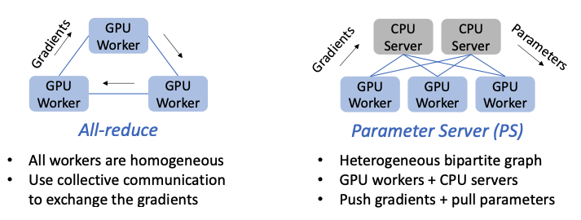

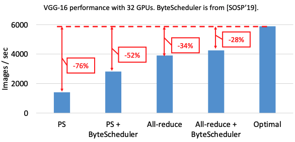

The paper analyzed three problems that led to this slowdown, and then presented a solution to each problem:

1. Sub-optimal Inter-machine Communication
2. Sub-optimal Intra-machine Communication
3. The CPU Bottleneck

#### Sub-optimal Inter-machine Communication

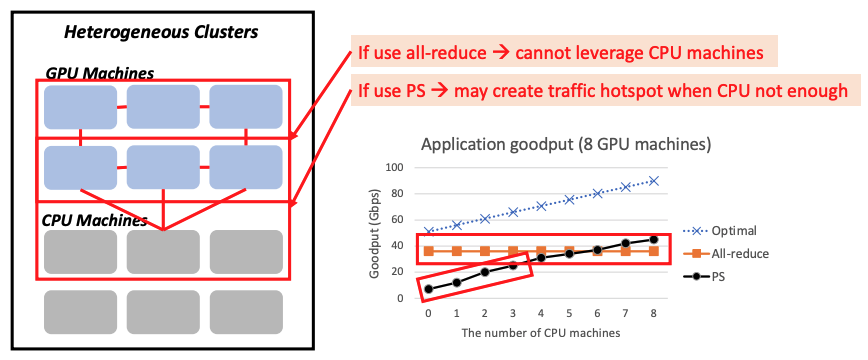

For allreduce, the CPUs are not leveraged properly as the communication is between GPUs only. For PS, if there are insufficient CPUs for servers, bottlenecks may be created. **The solution is an optimal communication strategy that unifies allreduce and PS.**

#### Sub-optimal Intra-machine Communication

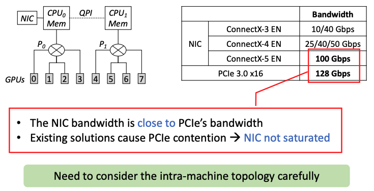

There are often multiple GPUs in a GPU machine IRL. The internal topology is also a network, which results in bottlenecks. **The solution is intra-machine optimizations that accommodate diverse intra-machine topologies.**

#### The CPU Bottleneck

In the parameter server setup, the GPU workers send the gradients to CPU servers. The CPU servers first aggregate the gradients received, and then update the parameters using the optimizer function. The problem is that CPUs might not match network rates, thus creating bottlenecks. **The solution is a summation service that moves parameter updates from CPUs to GPUs.**

### Design and Implementation

#### Sub-optimal Inter-machine Communication

PS only uses links between CPUs and GPUs and does not utilize the bandwidth between GPU machines. In the allreduce setup, the communication solely relies on inter-GPU communications, not utilizing the CPU at all. BytePS takes the best of both worlds and combines these two strategies. In the paper, the authors presented an optimal partition strategy that adjusts the proportion of CPU-GPU and GPU-GPU communications.

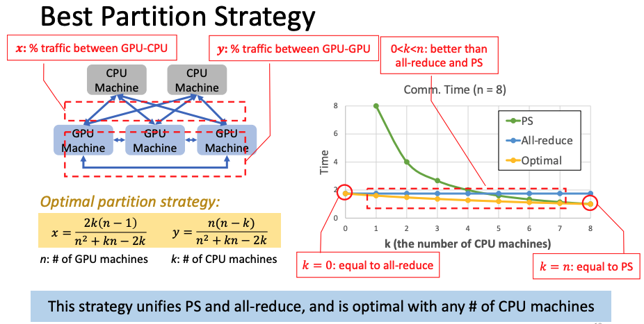

#### Sub-optimal Intra-machine Communication

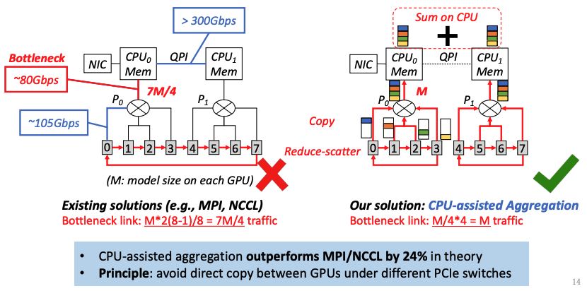

#### The CPU Bottleneck

The PS server's role can be divided into two parts: Gradient Summation & Parameter Update. Typically, forward propagation and backward propagation get placed on GPUs, while gradient summation and parameter update are placed on GPUs. The authors found that the gradient summation step is CPU-friendly, while the parameter update step is heavy. To resolve this issue, the authors presented the Summation Service, which moves the parameter update to GPUs to resolve the aforementioned bottleneck.

#### System Architecture Overview

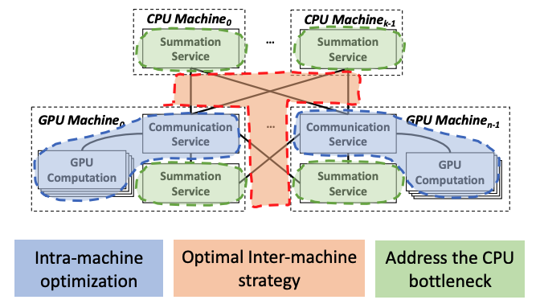

### Evaluation

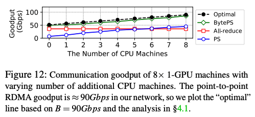

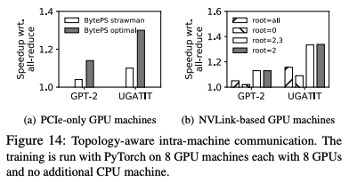

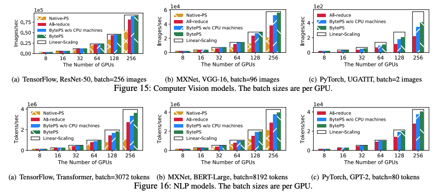

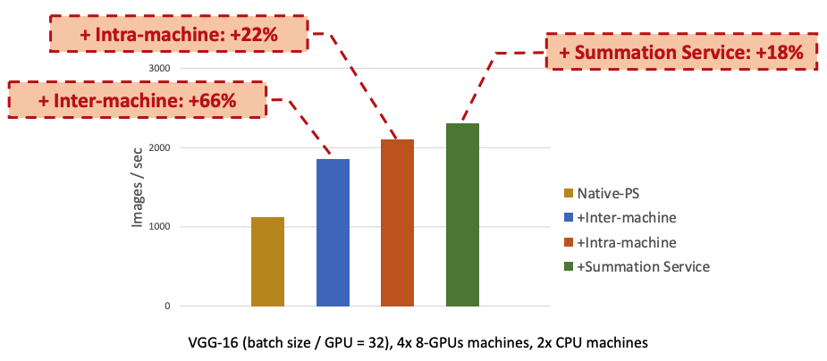

### New Vocabulary

* Network Interface Controller \(NIC\): 
* PCI Express \(PCIe\): 
* Goodput: Throughput that's good. Goodput is the rate at which **useful** data passes through a link, while throughput measures the rate at which **all** data passes through a link. For example, in a local area network \(LAN\), goodput only measures the throughput of the original data, while throughput also measures all the protocol overhead information \(packet headers, etc.\).

### Links

* [Paper PDF](https://www.usenix.org/system/files/osdi20-jiang.pdf)
* [Presentation Video at OSDI '20](https://www.youtube.com/watch?v=j8PHNglSZX8&feature=emb_logo&ab_channel=USENIX)
* [Presentation Slides PDF](https://www.usenix.org/sites/default/files/conference/protected-files/osdi20_slides_jiang.pdf)
* [BytePS on GitHub](https://github.com/bytedance/byteps)
* [The rationale for BytePS](https://github.com/bytedance/byteps/blob/master/docs/rationale.md)

