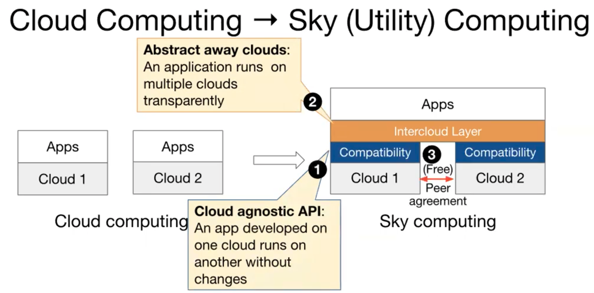
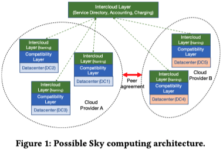
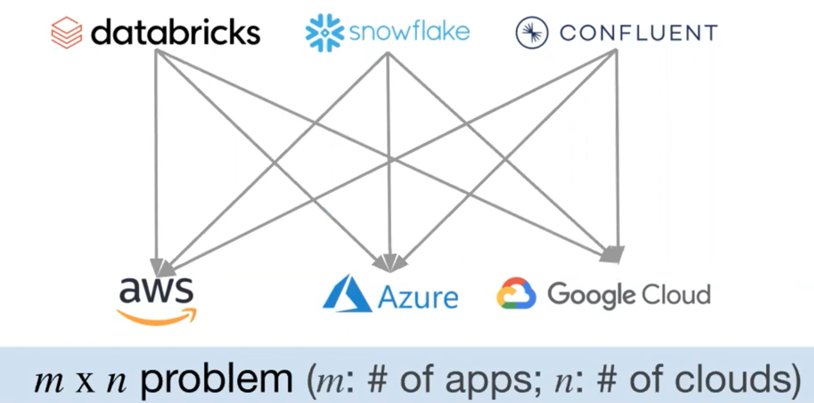
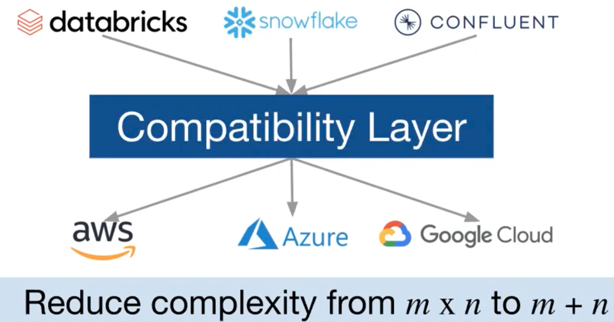

# From Cloud Computing to Sky Computing

## One-line Summary

This paper envisions sky computing, the possible future, and a more commoditized version of cloud computing, by drawing lessons from the history of the Internet. It then introduces the technical/economical barriers of fulfilling this vision of utility computing.

## Paper Structure Outline

1. Introduction
2. Historical Context
3. Lessons from the Internet
4. Compatibility Layer
5. Intercloud Layer
6. Peering Between Clouds
7. Speculations about the Future
8. Conclusion

## Background & Motivation

> Computation may someday be organized as a public utility, just as the telephone system is a public utility. We can envisage computer service companies whose subscribers are connected to them \[...\]. Each subscriber needs to pay only for the capacity that he actually uses, but he has access to all programming languages characteristic of a very large system.”    -- John McCarthy on the future of computing, 1961

Currently, from the user's point of view, many of the cloud computing services \(AWS, Microsoft, Google, etc.\) are proprietary/differentiated \(e.g., APIs for cluster management, object store, data warehouse, serverless offering\), and thus applications developed on one cloud cannot be easily migrated to another.

From the provider's point of view, business models are built around "attracting and retaining customers", which goes against the idea of offering a purely commoditized service.

The benefits of sky computing are:

* New capabilities: If one cloud in the sky provides access to new hardware \(e.g., TPU\), any app in the sky can use it
* Better security: Eliminate a single point of attack by distributing trust across multiple clouds
* Better reliability: Avoids major cloud outages
* Better performance: Aggregates all resources to use the best resources for a job
* Lower cost: Use most cost-effective cloud for a job

## Design and Implementation

To fulfill the sky computing vision, three design issues \(the Internet also faced them\) must be addressed:

* Compatibility layer: Mask low-level technical differences/heterogeneity
* Intercloud/Routing layer: Route jobs to the right cloud
* Peering layer: Allow clouds to have agreements with each other about how to exchange services

### Compatibility Layer

Similar to the IP layer, a compatibility layer abstracts away the services provided by a cloud and allows an application developed on top of this layer to run on different clouds without change. The authors conclude that this is not technically difficult, as the high-level management and service interfaces users interact with are now more than ever supported by open source software \(OSS\). The compatibility layer could be constructed out of some set of the OSS solutions. One glaring gap is the storage layer \(AWS has S3, Azure has Blob storage, etc.\), but there are currently efforts underway to provide more compatibility and fill this gap.

OSS projects for different levels of the software stack include:

* OS: Linux
* Cluster resource managers: Kubernetes, Apache Mesos
* Application packaging: Docker
* Databases: MySQL, Postgres
* Big data execution engines: Apache Spark, Apache Hadoop
* Streaming engines: Apache Flink, Apache Spark, Apache Kafka
* Distributed query engines and db: Cassandra, MongoDB, Presto, SparkSQL, Redis
* ML libraries: PyTorch, Tensorflow, MXNet, MLFlow, Horovod, Ray RLlib
* General distributed frameworks: Ray, Erlang, Akka

### Intercloud Layer

The intercloud layer should allow users to specify policies describing the tradeoff between performance, availability, and cost \(e.g., a user might specify that this is a Tensorflow job, it involves data that cannot leave Germany, and must be finished within the next two hours for under a certain cost\), but not require users to make low-level decisions. There should be few technical limitations as this \(moving jobs across clouds\) is similar to moving jobs within the same cloud across datacenters.

### Peering Layer

Under certain scenarios, instead of processing all data in the same cloud, moving data between clouds can be cost-effective. For example, although moving a 150 GB ImageNet dataset out of AWS costs $13, training ResNet50 on ImageNet on AWS costs ~$40, while training on Azure costs $20. If clouds adopt reciprocal data peering arrangements, it allows data to be moved freely between peering clouds and enables greater freedom in job movement.

### Speculations about the Future

The authors' vision is as follows. While large providers may not be incentivized to build a compatibility layer, smaller cloud providers will embrace such a layer and form a sky. Within the sky, providers may specialize in supporting one or more services. E.g., Oracle can provide a database-optimized cloud, NVIDIA can provide GPU-optimized, hardware-assisted ML services, Samsung can provide a storage-optimized cloud. In the long term, both the standalone providers and in-sky providers will exist: the standalone providers compete with each other and the sky, and the in-sky providers both compete within the sky and collectively compete with the standalone providers.

## Links

* [Paper PDF](https://sigops.org/s/conferences/hotos/2021/papers/hotos21-s02-stoica.pdf)
* [Presentation video at HotOS '21](https://www.youtube.com/watch?v=Q6MsEucsmGM&list=PLl-7Fg11LUZe_6cCrz6sVvTbE_8SEobNB)

