# Gavel: Heterogeneity-Aware Cluster Scheduling Policies for Deep Learning Workloads

## One-line Summary

Gavel is a scheduler that takes into account the performance heterogeneity of underlying accelerators \(GPUs, TPUs, etc.\) when training DNN jobs. Gavel makes existing policies heterogeneity-aware and incorporates them as optimization problems.

## Paper Structure Outline

1. Introduction
2. Background
   1. DNN Training
   2. Performance Optimizations
3. System Overview
   1. Heterogeneity-Aware Policies
   2. Round-based Scheduling Mechanism
   3. Throughput Estimator
   4. Limitations and Non-Goals
4. Scheduling Policies
   1. Max-Min Fairness as an Optimization Problem
   2. Other Policies as Optimization Problems
   3. Hierarchical Scheduling Policies
   4. Properties of Gavel's Policies
5. Scheduling Mechanism
6. Implementation
7. Evaluation
   1. Experiment Setup
   2. End-to-End Results on Physical Cluster
   3. End-to-End Results in Simulation
   4. Scalability of Heterogeneity-Aware Policies
   5. Efficacy of Scheduling Mechanism
   6. Impact of Throughput Estimation
8. Related Work and Discussion
9. Conclusion

## Background & Motivation

For a cluster scheudler, choosing the optimal accelerator types is difficult for three reasons:

1. **Performance heterogeneity**: Common deep learning training workloads show heterogeneous performance on different hardware accelerators due to architectural differences. Not being aware of this result in suboptimal allocations.
2. **Generality across policies**: Recent scheudlers like Allox and Gandiva optimize for a single scheduling objective, while in reality, clusters may take differnet \(and sophisticated\) scheduling policies.
3. **Colocation and optimization optimizations**: The performance benefits of these optimizations should be considered explicitly while optimizing for global scheduling objectives, since these optimizations are more effective when deployed in a heterogeneity-aware way.

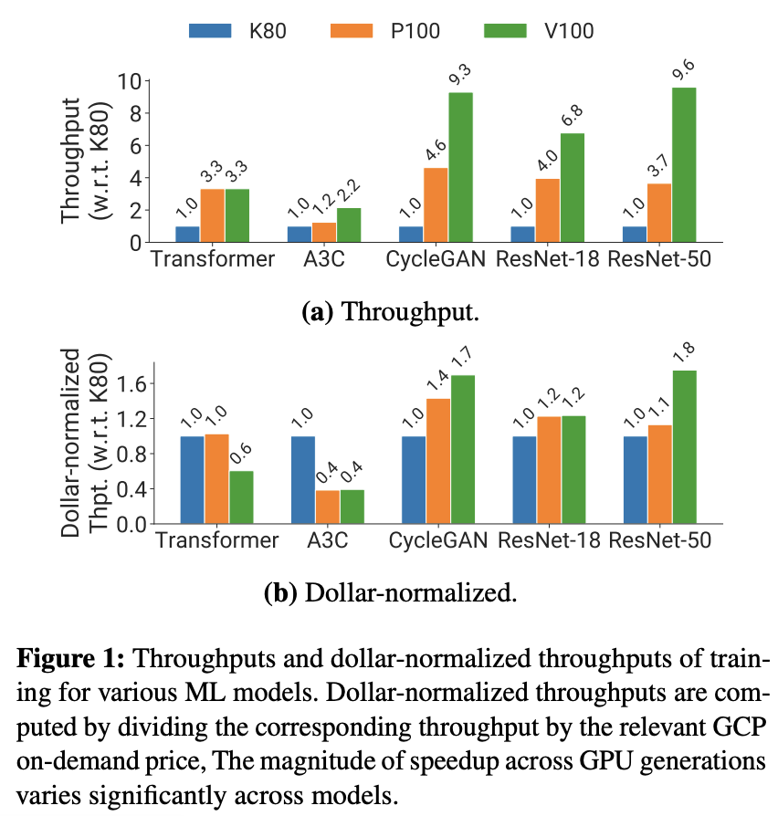

## Design and Implementation

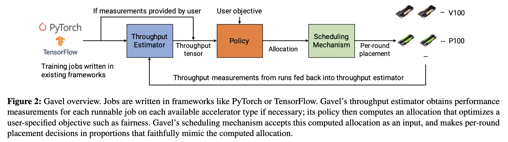

### Allocations as time fractions

Gavel expresses scheduling policies as optimization problems and produces an allocation matrix that indicates the fraction of time each job should spend on the different accelerators between allocation recomputations \(new jobs arriving, old jobs finishing, periodic recomputations, etc\). 

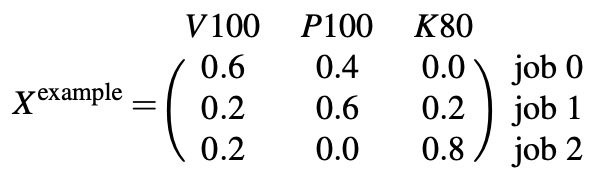

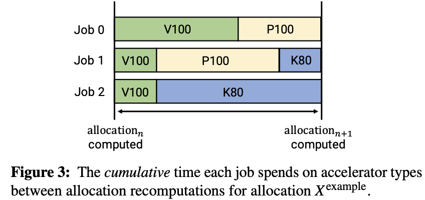

### Effective throughput

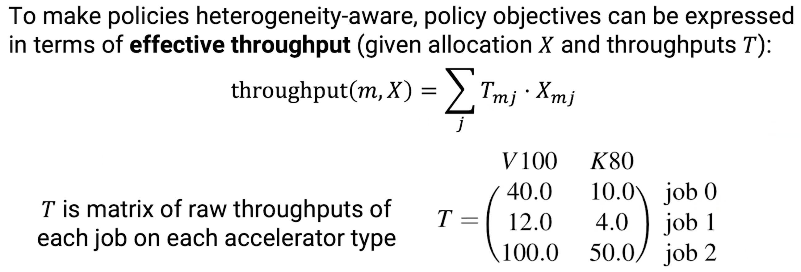

### Policies as optimization problems

Gavel converted the following policies into optimization problems and included them in the code base:

* LAS/Max-min fairness: Least Attained Service policy, used by [Tiresias](tiresias-a-gpu-cluster-manager-for-distributed-deep-learning.md)
  * LAS w/ weights
* Minimize makespan
* Finish time fairness: Used by [Themis](themis-fair-and-efficient-gpu-cluster-scheduling.md)
* FIFO
* Shortest job first \(SJF\)
* Minimize cost \(in public cloud instances\)
  * Minimize cost w/ SLOs
* Hierarchical \(multi-level policy: FIFO, fairness, etc.\)

### Realizing the optimal allocation: round-based scheduling + priorities

With the optimal allocation computed, Gavel tries to dispatch jobs while matching the optimal allocation as close as possible by using two techniques:

1. **Round-based scheduling**: Gavel allows users to set the round length \(optimal length that allows for the effective approximation is 6 minutes\). This mechanism ensures that jobs receive time on accelerator types according to the optimal allocation. 
2. **Per-job priority score**: In each round, the scheduler runs jobs in decreasing priority order. The priority for each job is computed as the target allocation divided by the number of rounds received.

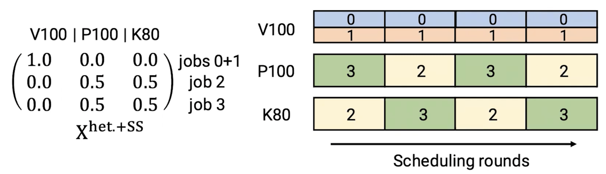

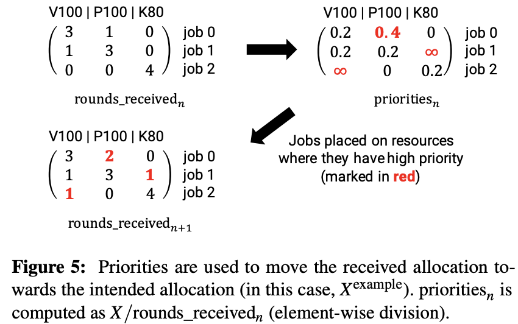

## Evaluation

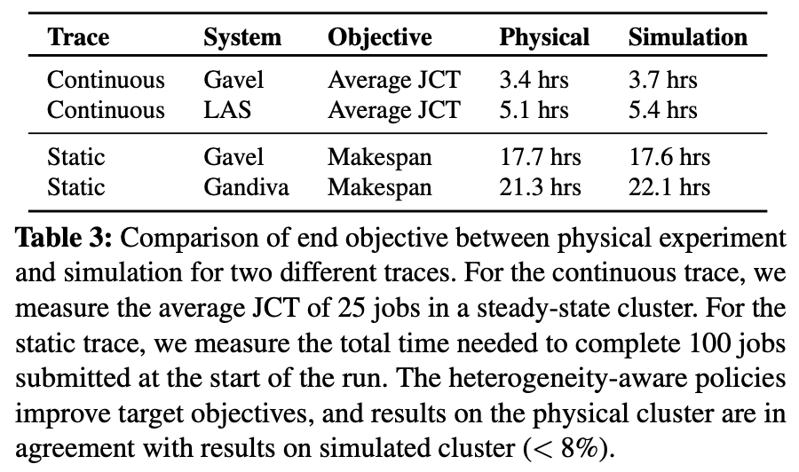

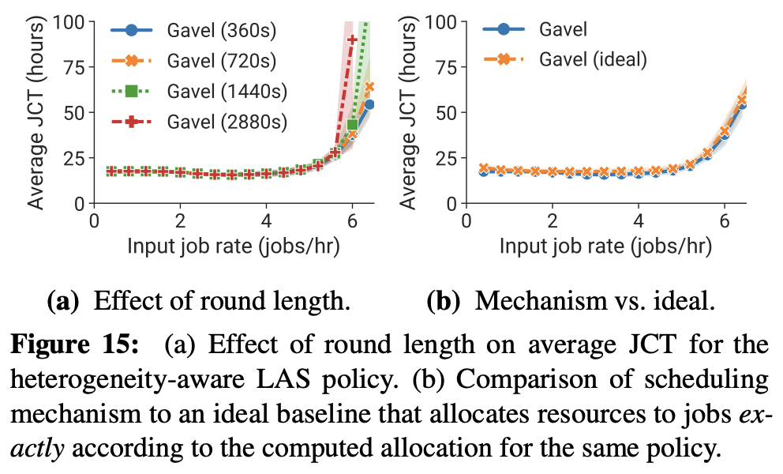

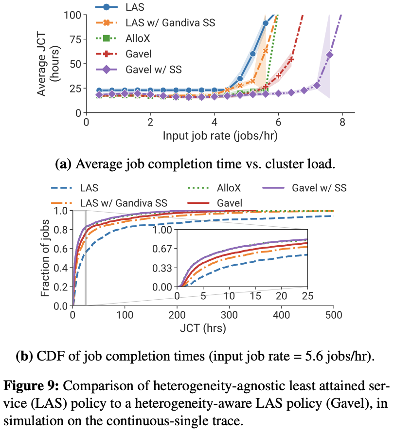

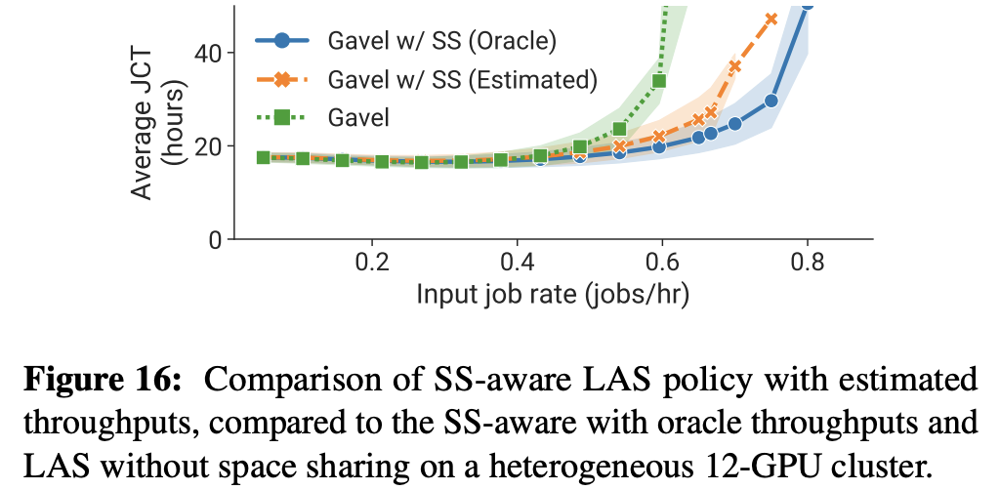

The paper also covers extensive evaluations on:

* How well the heterogeneity-aware policies improve objective metrics, both in simulation and physical experiments
* How do Gavel's policies scale
* Whether Gavel can accurately estimate the throughputs of co-located jobs when using space sharing

## Links

* [Paper PDF](https://cs.stanford.edu/~matei/papers/2020/osdi_gavel.pdf)
* [Presentation video at OSDI '20](https://www.youtube.com/watch?v=I2PsnUo6WPk)
* [Presentation slides at OSDI '20](https://www.usenix.org/sites/default/files/conference/protected-files/osdi20_slides_narayanan.pdf)
* [Gavel on GitHub](https://github.com/stanford-futuredata/gavel)

