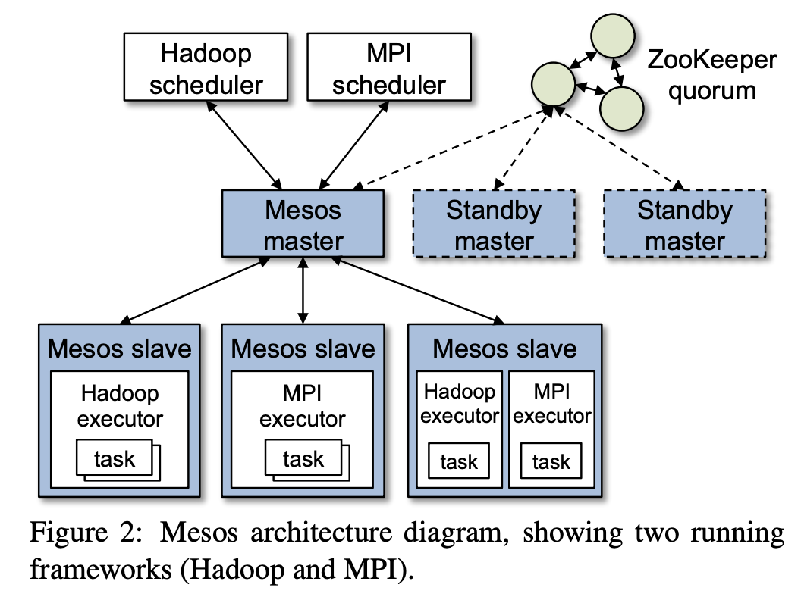
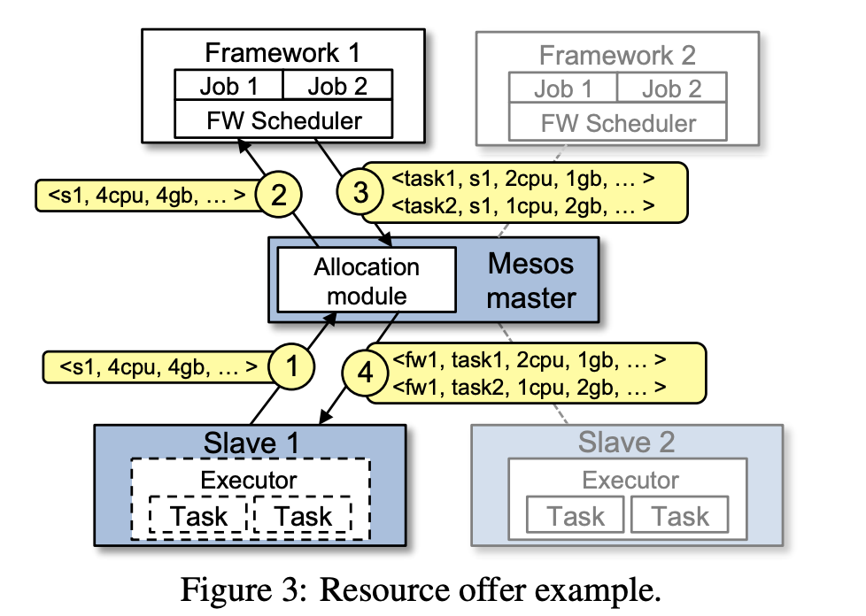
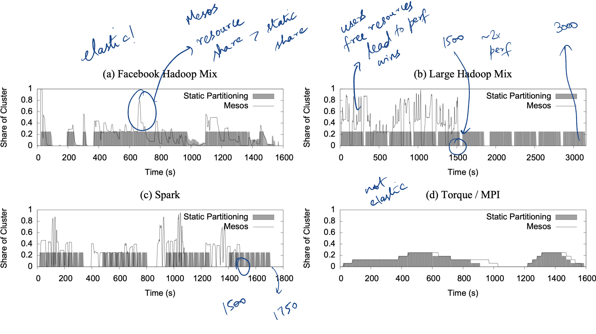

# Mesos: A Platform for Fine-Grained Resource Sharing in the Data Center

## One-line Summary

Mesos is a scheduler for sharing cluster resources between multiple services/applications. Using two-level scheduling \(application-specific schedulers\), its orchestration mechanism can provide scalable, decentralized scheduling.

## Paper Structure Outline

1. 
## Background & Motivation

* Motivation: Share resources among multiple frameworks/services
* Background: OS scheduling: time sharing
  * Mechanism: Pre-empt processes
  * Policy: Which process is chosen to run
* Background: Cluster scheduling
  * Time sharing: Context switches are more expensive
  * Space sharing: Partition resources at the same time across jobs
  * Policies: Should be aware of locality
  * Scale
  * Fault tolerance
* Background: Target environment
  * Multiple MapReduce versions
  * Mix of frameworks: MPI, Spark, MapReduce
  * Data sharing across frameworks
  * Avoid per-framework clusters \(not good for resource utilization\)

## Design and Implementation

### Architecture

* Centralized master \(& its backups\)
* Agent on every machine
* Two-level scheduling: Framework scheduler attached to Mesos
  * "Simplicity across frameworks"

### Resource offers

* Slave send heartbeats with information on available resources
* Mesos master sends resource offers to frameworks -&gt; Frameworks replies tasks & their granularity
* Constraints
  * Example of constraints
    * Soft constraints: Prefer to run the task at a particular location \(e.g. for data locality\)
    * Hard constraints: Task needs GPUs
  * Constraints in Mesos
    * Applications can reject offers
    * Optimization: Filters \(reduces the number of rejected offers\)
* Allocation
  * Assumption: Tasks are short -&gt; allocate when they finish
  * Long tasks: Revocation beyond guaranteed allocation
    * E.g., MPI has guaranteed allocation of 8 machines; currently assigned 12 machines; can take away 4 machines
* Isolation
  * Containers \(Docker/Linux cgroups\)

### Fault tolerance

* Node fails -&gt; forward the failure to Hadoop, let them decide what to do
* Master fails -&gt; recover \(soft\) state by communicating with framework schedulers/workers
* Also has a standby master
* Framework scheduler fails -&gt; Mesos doesn't handle that

### Placement preferences

* Problem: More frameworks have preferred nodes than available. Who gets the offers?
* Lottery scheduling: Offers weighted by num allocations

### Design choices & implications

* Centralized vs. Distributed
  * Framework complexity: Every framework developer needs to implement a scheduler
  * Fragmentation, starvation: Especially if a job has large resource requirements. Partial workaround: min offer size
  * Inter-dependent framework: 2 frameworks cannot be colocated \(e.g. due to security, privacy, ...\)

## Evaluations

## Links & References

* [Paper PDF](http://pages.cs.wisc.edu/~shivaram/cs744-readings/mesos.pdf)
* [CS 744 course notes](https://pages.cs.wisc.edu/~shivaram/cs744-fa21-slides/cs744-mesos-notes.pdf)

