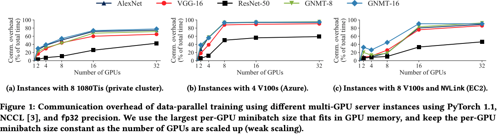
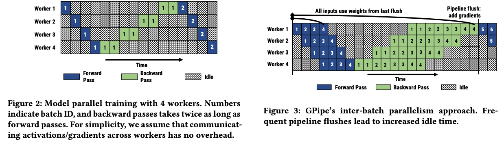
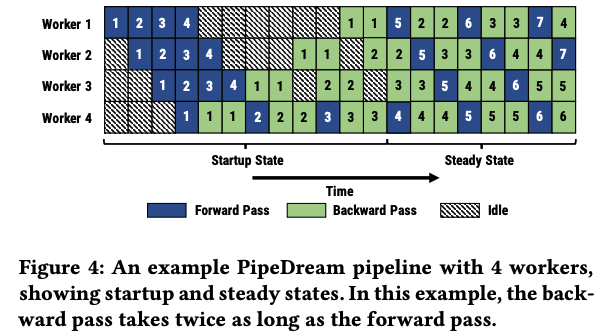
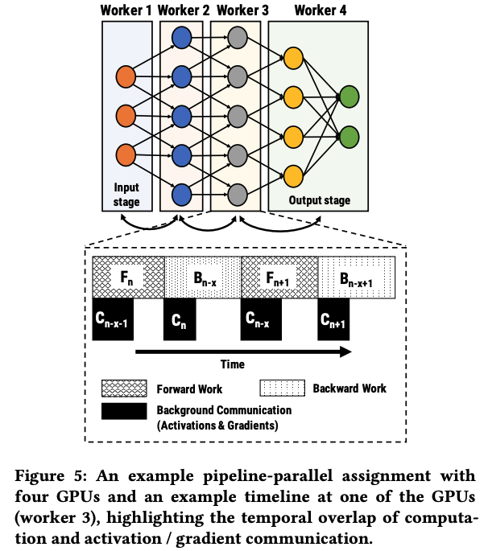
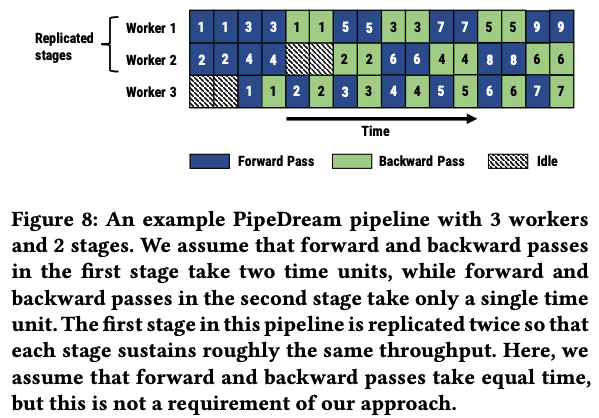
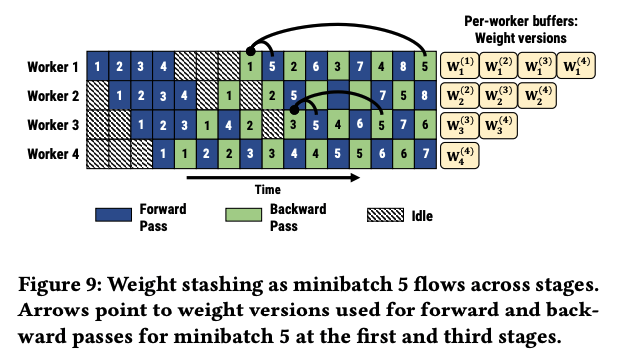
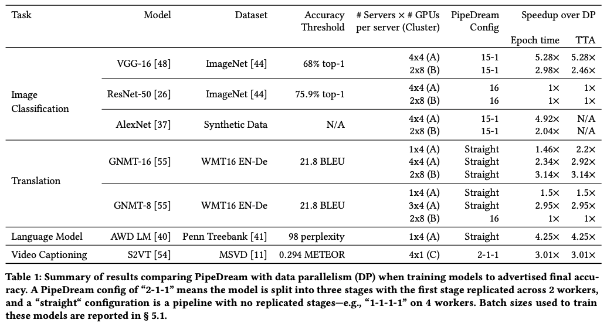
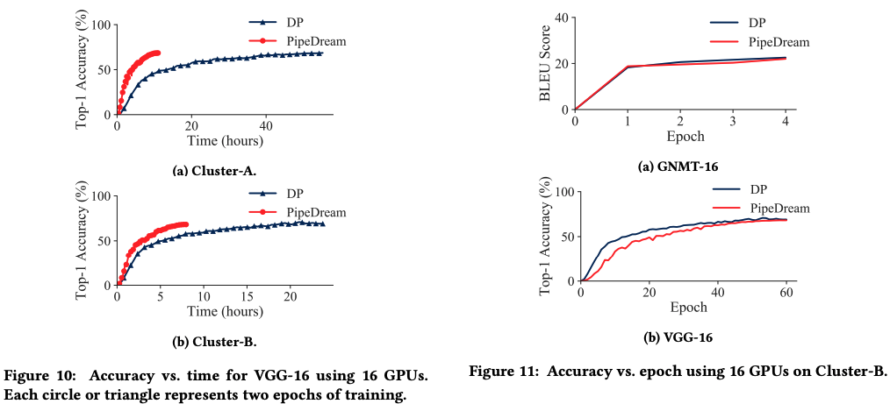

# PipeDream: Generalized Pipeline Parallelism for DNN Training

## One-line Summary

PipeDream uses pipeline parallelism to combine intra-batch parallelism with inter-batch parallelization and reduce the communication overhead in DNN training.

## Paper Structure Outline

1. Introduction
2. Background & Related Work
   1. DNN Training
3. Parallel Training in PipeDream
   1. Pipeline Parallelism
   2. Partitioning Layers Across Machines
   3. Work Scheduling
   4. Effective Learning
   5. GPU Memory Management
4. Implementation
5. Evaluation
   1. Experimental Setup
   2. PipeDream vs. Data Parallelism
   3. Value of Data Parallelism in stages
6. Conclusion

## Background & Motivation

Existing parallelization techniques \(data, model, hybrid\) use intra-batch parallelization where each iteration of the optimization algorithm is parallelized across a set of workers. In data parallelism, there exists a **high communication overhead** at a large scale, while in vanilla model parallelism, **system resources are under-utilized**.

## Design and Implementation

### Pipeline parallelism

With pipeline parallelism, multiple minibatches are injected into the pipeline one after another \(Fig. 4\).

Pipeline parallelism is superior because of 2 reasons:

1. **Pipelining communicates less**: Compared to DP where the whole model is communicated in an all-to-all fashion, PipeDream reduces the amount of inter-worker communication by only communicating intermediate inputs & outputs across consecutive layers on different workers peer-to-peer. 
2. **Pipelining overlaps computation and communication**: Asynchronous communication of intermediate results in significant overlap of communication with the computation of a subsequent minibatch \(Fig. 5\).

### Shenanigan 1: Work/model partitioning

PipeDream partitions the training of a model into stages in a pipeline. Ideally, each stage would have the same throughput rate, otherwise, there would be a load imbalance. The communication between stages should also be minimized as much as possible to improve the overall throughput. PipeDream uses an optimizer to output a balanced pipeline. To minimize the time taken by the slowest stage, PipeDream uses a partitioning algorithm that takes in:

1. Do a short profiling run of 1000 minibatches. For each layer,
   1. The total computation time across the forward & backward passes
   2. The size of the output activations & input gradients
   3. The size of weight parameters

and outputs {a partitioning of layers into stages, the number of workers for each stage, and the optimal number of in-flight minibatches to keep the training pipeline busy}.

### Shenanigan 2: Work scheduling

Each stage should decide whether to perform a forward pass or a backward pass on different minibatches. During the startup state, PipeDream admits enough minibatches to keep the pipeline full in steady state. Then, each stage alternates between a forward pass for a minibatch & a backward pass for a different minibatch \(1F1B schedule\). For a data parallel configuration, an 1F1B-RR \(round robin\) schedule is used.

### Shenanigan 3: Weight version mismatch

Naive pipelining leads to mismatch in weight versions. For example, in Fig. 4, for minibatch 5, on stage 1, the forward pass is performed after the backprop of minibatch 1, whereas the backprop is performed after the backprop of minibatches 2-4. This discrepancy results in invalid gradients and may prevent model convergence. PipeDream's workaround is to use weight stashing to store multiple versions of the weights, one for each active minibatch. Even with the extra memory footprint of stashing the weight versions, PipeDream's peak per-worker memory usage is on par with data parallelism.

## Evaluation

## Links

* [Paper PDF](https://arxiv.org/pdf/1806.03377.pdf)
* [Presentation video at DATA + AI Summit Europe](https://databricks.com/session_eu20/generalized-pipeline-parallelism-for-dnn-training)
* [Presentation video at SOSP '19](https://sosp19.rcs.uwaterloo.ca/videos/D1-S1-P1.mp4)
* [PipeDream on GitHub](https://github.com/msr-fiddle/pipedream)

