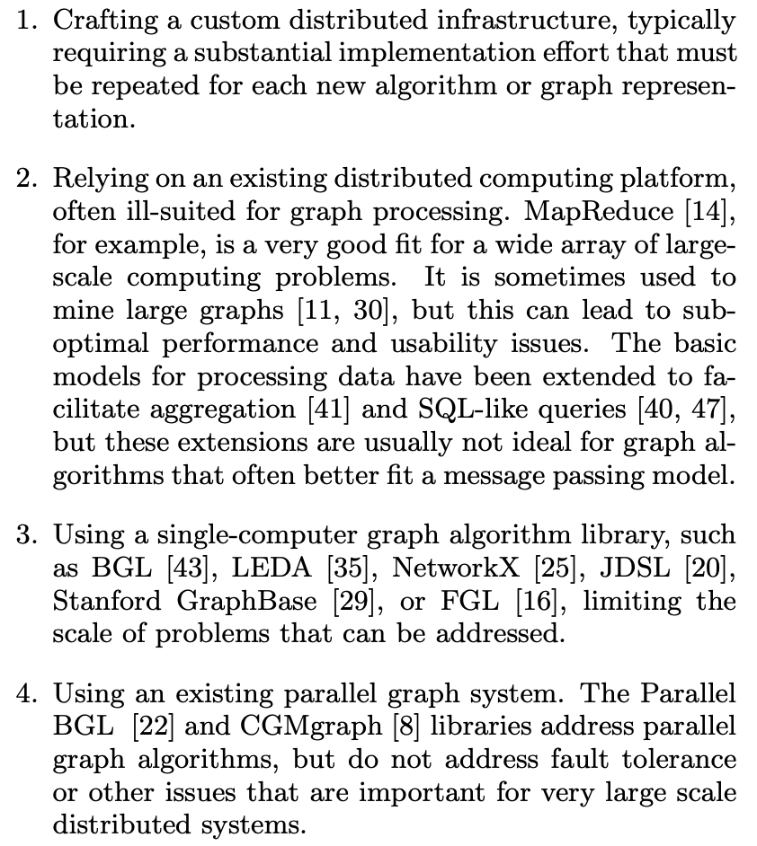
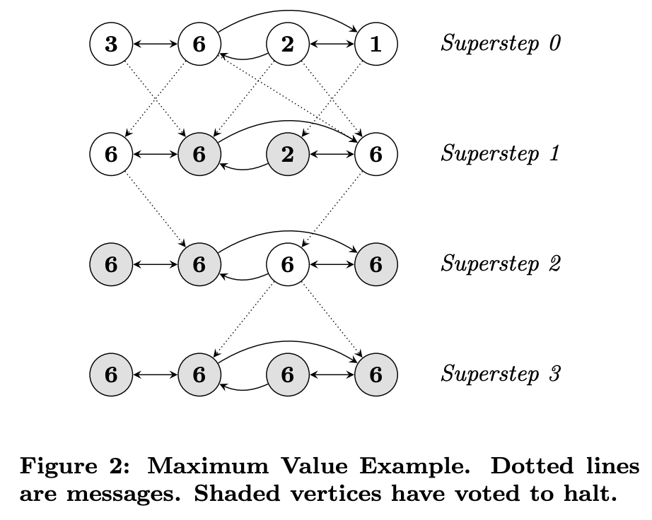
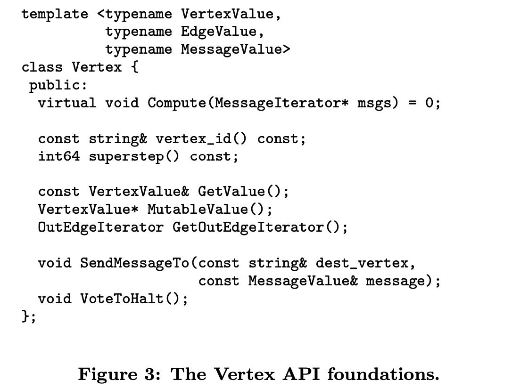
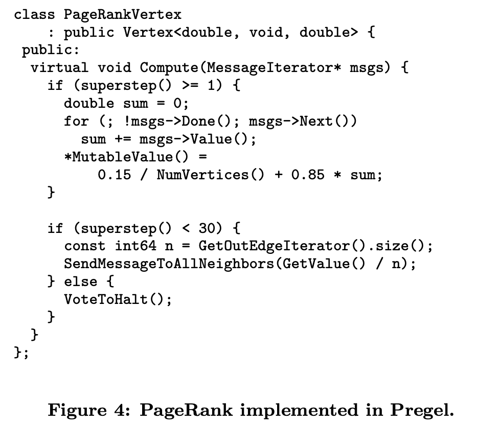
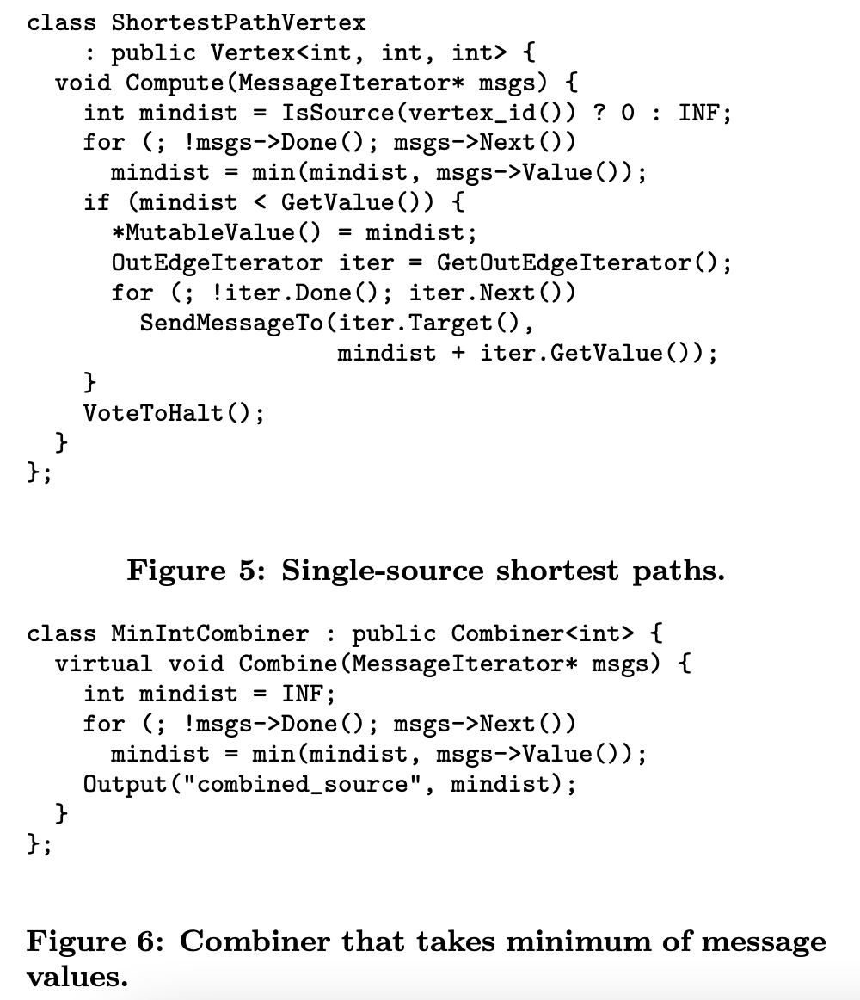
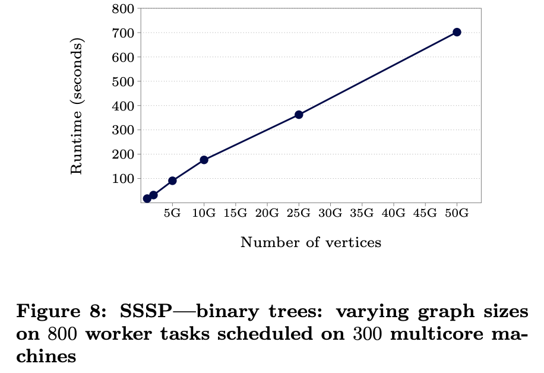
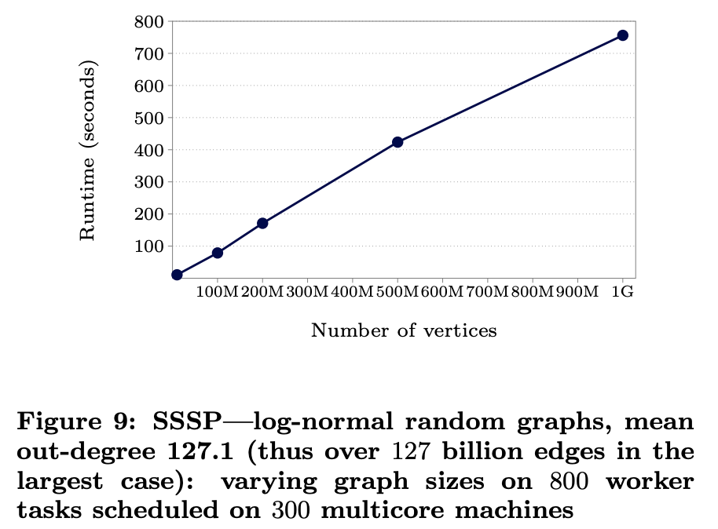

# Pregel: A System for Large-Scale Graph Processing

## One-line Summary

Pregel is a computational model/message passing abstraction that allows users to express many graph algorithms with ease. In Pregel, vertex programs run in sequences of super-steps, and the programming model is essentially "thinking like a vertex". 

## Paper Structure Outline

1. Introduction
2. Model of Computation
3. The C++ API
   1. Message Passing
   2. Combiners
   3. Aggregators
   4. Topology Mutations
   5. Input and Output
4. Implementation
   1. Basic Architecture
   2. Fault Tolerance
   3. Worker Implementation
   4. Master Implementation
   5. Aggregators
5. Applications
   1. PageRank
   2. Shortest Paths
   3. Bipartite Matching
   4. Semi-Clustering
6. Experiments
7. Related Work
8. Conclusions and Future Work

## Background & Motivation

Graphs are getting bigger (in terms of #vertices/#edges). A list of challenges in implementing large-scale graph processing algorithms is as follows.

Pregel is a system for processing large-scale graphs in a distributed fashion. Its API allows for arbitrary graph algorithms to be expressed with ease.

## Design

### The Pregel Programming Model

> Pregel computations consist of a sequence of iterations, called supersteps. During a superstep the framework invokes a userdefined function for each vertex, conceptually in parallel. The function specifies behavior at a single vertex V and a single superstep S. It can read messages sent to V in superstep S − 1, send messages to other vertices that will be received at superstep S + 1, and modify the state of V and its outgoing edges. Messages are typically sent along outgoing edges, but a message may be sent to any vertex whose identifier is known.\
> \
> Algorithm termination is based on every vertex voting to halt. In superstep 0, every vertex is in the active state; all active vertices participate in the computation of any given superstep. A vertex deactivates itself by voting to halt. This means that the vertex has no further work to do unless triggered externally, and the Pregel framework will not execute that vertex in subsequent supersteps unless it receives a message. If reactivated by a message, a vertex must explicitly deactivate itself again. The algorithm as a whole terminates when all vertices are simultaneously inactive and there are no messages in transit.

### Combiners

To reduce the overhead when sending a message, Pregel provides combiners, which are user-defined functions that allow multiple messages to be coalesced, reducing the message traffic. Note that combiners should only be enabled for commutative and associative operations, as there is no guarantee about {which messages are combined, the order of combining, the groupings presented to the combiner, etc}.

### Aggregators

Aggregators are used for global information exchange:

> Each vertex can provide a value to an aggregator in superstep S, the system combines those values using a reduction operator, and the resulting value is made available to all vertices in superstep S + 1.

### Topology Mutations

An example use case is clustering algorithms, in which each cluster might be replaced with a single vertex. In the Compute() function, requests can be issued to add/remove vertices/edges. 

## Implementation

### Pregel Architecture

A graph is partitioned into partitions, each containing a set of vertices and their outgoing edges. The default partitioning function is a hash function, while users can also use custom assignment functions to better exploit locality (e.g., colocating vertices representing pages of the same site).

The execution stages are as follows:

> FIXME: This is the part where I get a bit confused -- if the user input is loaded in step 3, then how come we can already determine the partitions in step 2?

1. Many copies of the user program begin executing on a cluster of machines. One of the copies acts as the master to coordinate worker activities.
2. The master determines the number of partitions and assigns partitions to machines. It is possible to have multiple partitions per worker for parallelism & load balancing. Each worker maintains the state of its partition, executes Compute(), and manages messages between workers.
3. Each worker gets assigned a portion of the user's input by the master. If a worker loads a vertex that belongs to that worker's section of the graph, then "Aal Izz Well". Otherwise, the worker enqueues a message to the remote peer that owns the vertex.
4. The master instructs each worker to do a superstep. Compute() is called for each active vertex. Messages are sent asynchronously to overlap computation and communication. When a worker finishes, it reports to the master, telling it how many vertices will be active in the next superstep. This step iterates until all vertices are inactive.
5. The computation halts and the master may instruct each worker to save its portion of the graph.

### Fault Tolerance

At the beginning of a superstep, the master instructs the workers to save the partition states (vertex/edge values, incoming messages) to persistent storage. The checkpoint frequency is determined using a mean time to failure model. A heartbeat mechanism is used to detect failures, either for a worker to terminate or for the master to mark a worker as failed. After a failure, the master reassigns partitions to the currently available workers, each of which loads from the checkpoint.

## Example Workloads

### PageRank

### Shortest Paths

See more examples (bipartite matching, semi-clustering) in the paper :\_D

## Evaluation

## Links

* [Paper PDF](https://www.dcs.bbk.ac.uk/\~dell/teaching/cc/paper/sigmod10/p135-malewicz.pdf)
* [Reading notes by the morning paper](https://blog.acolyer.org/2015/05/26/pregel-a-system-for-large-scale-graph-processing/)
