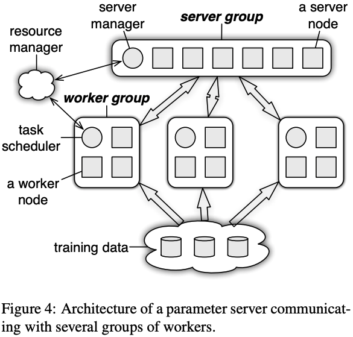
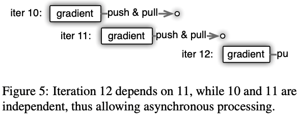
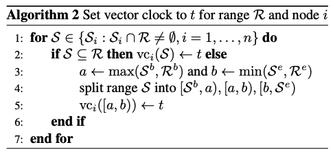
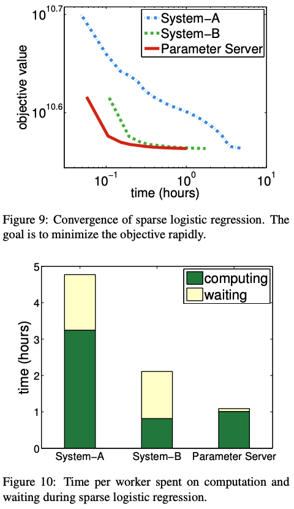

# Scaling Distributed Machine Learning with the Parameter Server

## One-line Summary

This paper presents the design, implementation, and evaluation of an implementation of the parameter server framework for distributed machine learning problems.

## Paper Structure Outline

1. Introduction
   1. Contributions
   2. Engineering Challenges
   3. Related Work 
2. Machine Learning
   1. Goals
   2. Risk Minimization
   3. Generative Models
3. Architecture
   1. \(Key, Value\) Vectors
   2. Range Push and Pull
   3. User-Defined Functions on the Server
   4. Asynchronous Tasks and Dependency
   5. Flexible Consistency
   6. User-defined Filters
4. Implementation
   1. Vector Clock
   2. Messages
   3. Consistent Hashing
   4. Replication and Consistency
   5. Server Management
   6. Worker Management
5. Evaluation
   1. Sparse Logistic Regression
   2. Latent Dirichlet Allocation
   3. Sketches
6. Summary and Discussion

## Background & Motivation

ML jobs and model sizes are getting bigger, thus we distributed the data/model across multiple worker machines. The parameter server model is a framework for distributed machine learning problems.

This paper presents a third-generation parameter server model which has five key features:

1. **Efficient communication**: The asynchronous communication model does not block computation
2. **Flexible consistency models**: Relaxed consistency further hides synchronization cost and latency. The algorithm designers are allowed to balance the algorithmic convergence rate and system efficiency
3. **Elastic Scalability**: New nodes can be added w/o restarting the running framework
4. **Fault Tolerance and Durability**: Recover from non-catastrophic failures w/o interrupting computation
5. **Ease of Use**: The globally shared parameters are represented as \(potentially sparse\) vectors and matrices to facilitate the development of machine learning applications. The linear algebra data types come with high-performance multi-threaded libraries.

## Design

A server node in the server group maintains a partition of the globally shared parameters. The server manager node maintains a consistent view of the metadata \(liveness, assignment of partitions\) of the servers. Server nodes communicate with each other to replicate and/or to migrate parameters for reliability and scaling. Worker groups communicate with the server groups to pull the latest parameters, then compute the gradients locally and push them back.

The model shared among nodes can be represented as a set of \(key, value\) pairs.

An issue with having independent tasks \(is this the same as async training?\) is that inconsistency may arise. For example, in this case, iteration 11 is started before the parameters are pulled back, so it uses the old params from iter 10 and thus obtains the same gradients as iter 10. This is namely a tradeoff between system efficiency and algorithm convergence rate, and the best tradeoff depends on a variety of factors including the algorithm’s sensitivity to data inconsistency, feature correlation in training data, and capacity difference of hardware components. PS gives the algorithm designer the flexibility in defining consistency models. There are three main consistency models:

1. **Sequential**: All tasks are executed sequentially. The next task can only start when the previous one has finished.
2. **Eventual**: All tasks may start simultaneously. This is only recommendable if the underlying algorithms are robust to delays.
3. **Bounded Delay**: A knob, τ, the maximal delay time, shifts bounded delay between the previous two policies \(τ=0 is sequential consistency model, τ=∞ is the eventual consistency model\). When a maximal delay time τ is set, a new task will be blocked until all previous tasks τ times ago have been finished. The idea is to deliver as many updates as possible w/o missing any updates older than a given age. For more info, see this paper \([More Effective Distributed ML via a Stale Synchronous Parallel Parameter Server](http://www.cs.cmu.edu/~seunghak/SSPTable_NIPS2013.pdf)\).

## Implementation

The servers store the parameters \(key-value pairs\) using consistent hashing \(Sec. 4.3\). For fault tolerance, entries are replicated using chain replication \(Sec. 4.4\). Different from prior \(key, value\) systems, the parameter server is optimized for range based communication with compression on both data \(Sec. 4.2\) and range based vector clocks \(Sec. 4.1\).

1. **Vector Clock**: In the naive implementation, each key-value pair is associated with a vector clock \(VC\) which records the time of each individual node on this key-value pair. This requires O\(nm\) space complexity, where n = \#nodes and m = \#parameters. To optimize this, the authors observe that parameters share the same timestamp due to the range-based communication pattern of the PS. As a result, they can be compressed into a single range VC. This requires O\(nk\) vector clocks, where n = \#nodes and k = \#unique ranges communicated by the algorithm. k is usually much smaller than m.
2. **Messages**: Messages sent between nodes/node groups consist of a list of \(key, value\) pairs in the key range R and the associated range vector clock. Both shared parameters and tasks \(taskID, args or return results\) can be communicated. Training data often remains unchanged between iterations \(same key lists are sent again\), and values may contain many zero entries. Hence, the key lists are cached \(**key-caching**, so the sender only needs to send a hash of the list rather than the list itself\), and we only need to use **value-compression** to send nonzero \(key, value\) pairs \(by using a compression library to compress messages and remove zeros\).
3. **Consistent Hashing**: Keys and server node IDs are both inserted into the hash ring \(see Fig. 7\).
4. **Replication and Consistency**: Each server node holds a replica of the k counterclockwise neighbor key ranges relative to the one it owns. The nodes holding the extra copies are denoted as slaves of the appropriate key range.
5. **Server Management**: When a server joins, a key range is assigned by the server manager. The new server fetches the range of data and k additional ranges to keep as slave. Fetching the data requires two phases. Finally, the server manager broadcasts the node changes. The departure is similar to a join.
6. **Worker Management**: When a worker joins, the task scheduler assigns a range of data. The worker loads the range of training data \(w/o a two-phase fetch\), and pulls the parameters from servers. Finally, the task scheduler broadcasts the change.

## Evaluation

### Sparse Logistic Regression

### Latent Dirichlet Allocation

### Distributed Sketching

## Links

* [Paper PDF](http://www.cs.cmu.edu/~muli/file/parameter_server_osdi14.pdf)
* [Parameter Server for Distributed Machine Learning](https://www.cs.cmu.edu/~muli/file/ps.pdf), the same work at a different venue \(NIPS '14\)
* [Presentation Video by the author at Tsinghua](https://www.youtube.com/watch?v=SHu5qHTDai8&ab_channel=ASEStreamLine)
* [Presentation Slides at OSDI '14](https://www.cs.cmu.edu/~muli/file/osdi14_talk.pdf)
* [Course notes on PS from CS 4787 @ Cornell](https://www.cs.cornell.edu/courses/cs4787/2019sp/notes/lecture22.pdf)
* [Course notes on PS from CS 294 @ Berkeley](https://bcourses.berkeley.edu/courses/1413454/files/65798745/download?verifier=kFM8TYOCEAoLPkVzJCDDr8f0oRaUZ03RYgpKlbYg&wrap=1)
* [Course notes on PS from CS 744 @ UW-Madison](http://pages.cs.wisc.edu/~shivaram/cs744-fa19-slides/cs744-paramserver-notes.pdf)
* [ps-lite on GitHub](https://github.com/dmlc/ps-lite)
* [Xiangfeng Zhu](https://xzhu27.me/)'s [paper reading notes](https://xzhu0027.gitbook.io/blog/ml-system/sys-ml-index/parameter-servers)
* [parameterserver.org by the Wayback Machine](https://web.archive.org/web/20150212084849/http://parameterserver.org/)

