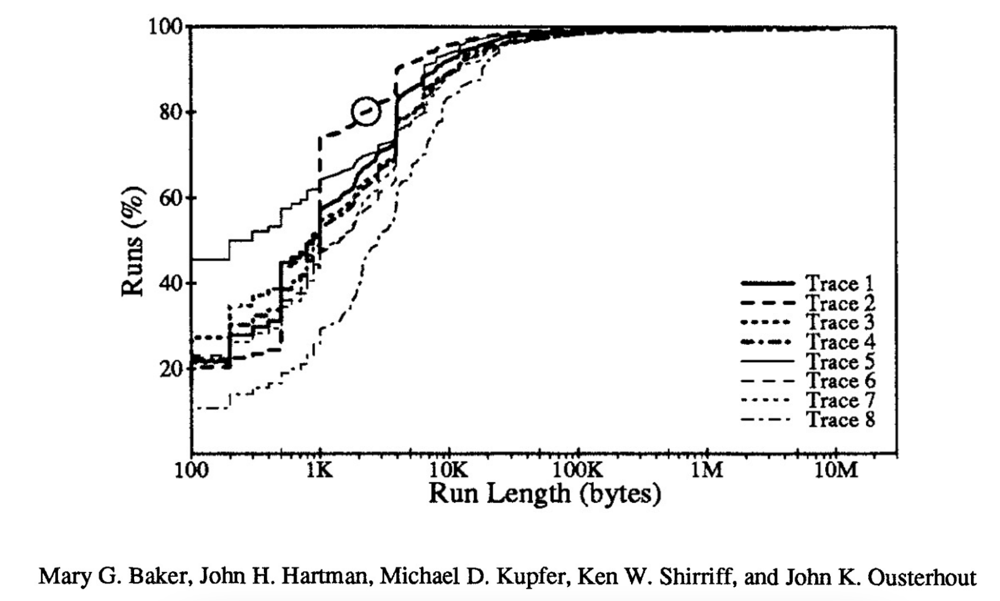
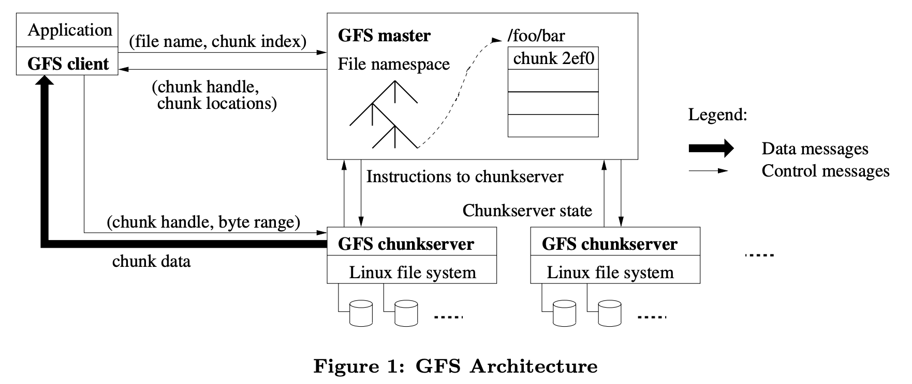
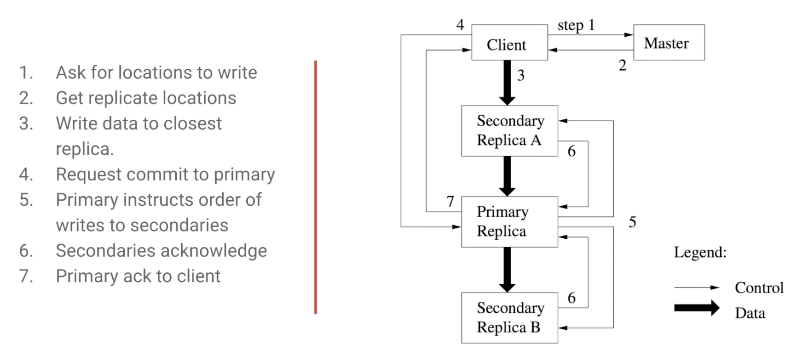
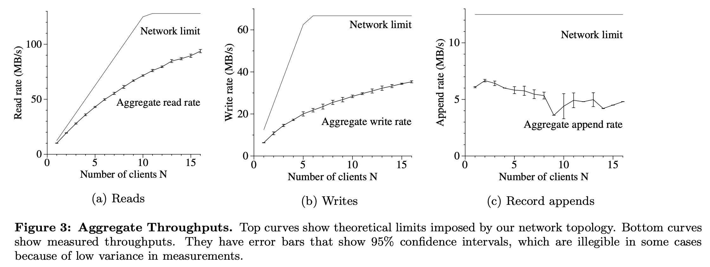
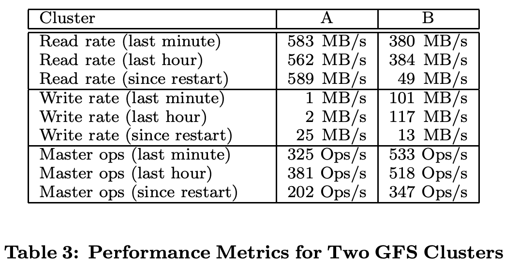

# The Google File System

## One-line Summary

GFS is a system for distributed file storage. The design of GFS is motivated by Google's cluster architecture paradigm and its workload characterizations. It provides fault tolerance while running on inexpensive commodity hardware, and it delivers high aggregate performance to a large number of clients. Hadoop \(HDFS\) is an open-source implementation of GFS.

## Paper Structure Outline

1. Introduction
2. Design Overview
   1. Assumptions
   2. Interface
   3. Architecture
   4. Single Master
   5. Chunk Size
   6. Metadata
      1. In-Memory Data Structures
      2. Chunk Locations
      3. Operation Log
   7. Consistency Model
      1. Guarantees by GFS
      2. Implications for Applications
3. System Interactions
   1. Leases and Mutation Order
   2. Data Flow
   3. Atomic Record Appends
   4. Snapshot
4. Master Operation
   1. Namespace Management and Locking
   2. Replica Placement
   3. Creation, Re-replication, Rebalancing
   4. Garbage Collection
      1. Mechanism
      2. Discussion
   5. Stale Replica Detection
5. Fault Tolerance and Diagnosis
   1. High Availability
      1. Fast Recovery
      2. Chunk Replication
      3. Master Replication
   2. Data Integrity
   3. Diagnostic Tools
6. Measurements
   1. Micro-benchmarks
      1. Reads
      2. Writes
      3. Record Appends
   2. Real World Clusters
      1. Storage
      2. Metadata
      3. Read and Write Rates
      4. Master Load
      5. Recovery Time
   3. Workload Breakdown
      1. Methodology and Caveats
      2. Chunkserver Workload
      3. Appends vs. Writes
      4. Master Workload
7. Experiences
8. Related Work
9. Conclusions

## Background & Motivation

* A little bit of history:
  * NFS
    * File stored on central file server
    * Implements POSIX -&gt; transparent to users
    * Client-side caching + STAT request to validate cache entries \(data blocks\)
    * Bad scalability: Thousands of nodes ask the server for cache validation
  * Andrew File System
    * Designed for scalee
    * Whole-file caching: Wheen a client opens a file, the entire file is read from the server & cached at the client
  * Oceanstore/Past \(late 90s to early 2000s\)
    * Wide area storage systems
    * Fully decentralized
    * Built on Distributed Hash Tables \(DHT\)

* Google was only five years old in 2003: It was a relatively young company. Instead of scaling up \(buying expensive servers\), they chose to scale out \(using commodity, inexpensive hardware\), due to the huge amount of data.
* Certain aspects of the workload drive the design choices. The following observations are different from the assumptions made by previous distributed storage systems:
  * In a cluster of thousands of commodity servers, component failures are inevitable \(and more frequent than that on expensive servers?\), so **fault tolerance** is an important design consideration.
  * GFS is optimized for the reading and writing of a modest number \(a few million\) of **large files** \(hundreds of MBs to multiple GBs\).
  * Writes to files are mostly **append-only**: There are hardly random writes \(consider a web crawler that keeps adding crawled content to a single file\).
  * Reads are either large sequential reads \(consider a batch processing system that reads the large file and creates a search index\) or small random reads.
  * Latency is not a big concern

## Design and Implementation

* Files are split into chunks. Each 64-MB chunk \(this is much larger than traditional file system block sizes\) of a file can be identified by a 64-bit ID, and the chunks are distributed on multiple machines \(GFS chunkservers\). Moreover, multiple \(3 by default\) replicas of each chunk are stored for fault tolerance. If the replication factor of a file falls below a goal \(due to machine failures/corrupted replicas\), chunks are re-replicated.
  * Chunk size trade-offs:
    * Client -&gt; Master: If chunk size is small, clients need to issue more calls to master
    * Client -&gt; Chunkserver: Too small -&gt; need to open connections to many chunkservers; Too large -&gt; chunkserver may become a hotspot
    * Metadata: Chunk size too small -&gt; Metadata size grows, master's memory will suffer
  * Replication
    * Primary replica for each chunk
    * Chain replication
* GFS master: A single master server stores in memory the metadata of the cluster: The file and chunk namespaces, the mapping from files to chunks, and the locations of each chunk's replicas. Having a single master makes things vastly easier.
* GFS clients only communicate with the GFS master about the metadata of the file, and the actual I/O is done between the client and the chunkservers. GFS also caches \(chunk handle, chunk location\) to reduce the GFS master's workload.
* The master keeps track of an operation log, the only persistent record of metadata. In case of a master failure, it can recover the file system state by replaying the operation log.

* Data flow: The data is pushed linearly along a chain of chunkservers to fully utilize each machine's outgoing bandwidth. Aside from that, each machine forwards the data to the closest \(the distance can be estimated from IP addresses\) machine to avoid network bottleneck.
* GFS also provides an atomic append operation, record append, that allows multiple clients to concurrently append to the same file. If this is done using traditional writes, clients would need to do complicated & expensive synchronization.
  * Consistency
    * At-lease once: The append record will appear at least once in the chunk
    * Atomic: The entire record will appear

## Evaluation

## Links & References

* [Paper PDF](http://pages.cs.wisc.edu/~shivaram/cs744-readings/GFS.pdf)
* [Presentation video by Defog Tech on YouTube](https://youtu.be/eRgFNW4QFDc)

