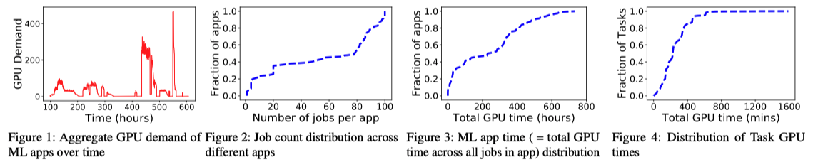
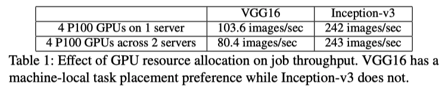
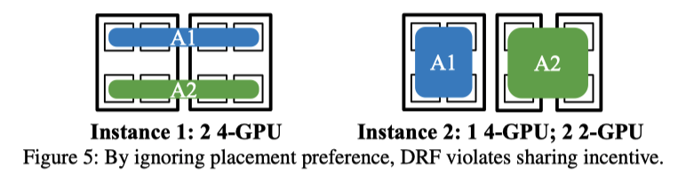
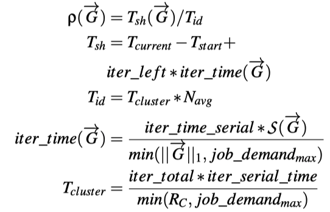
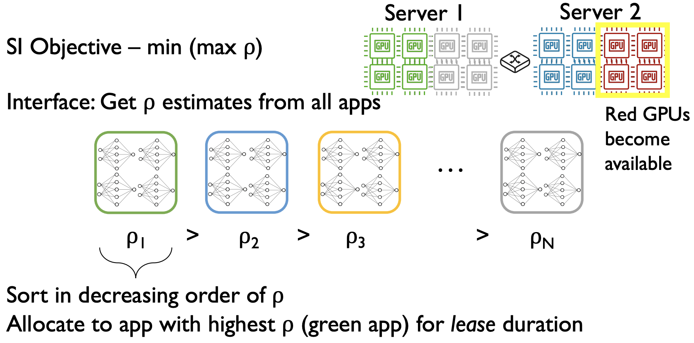
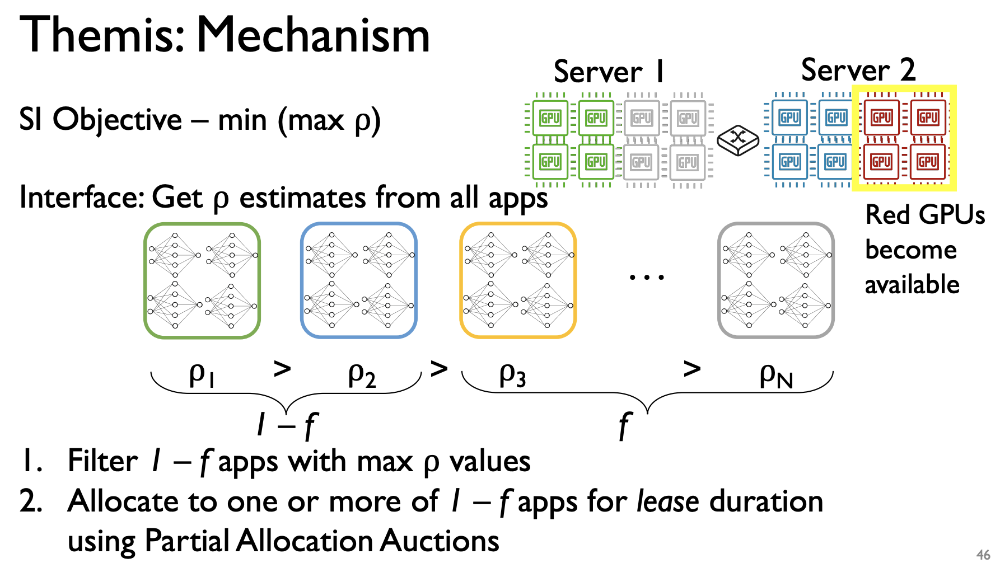
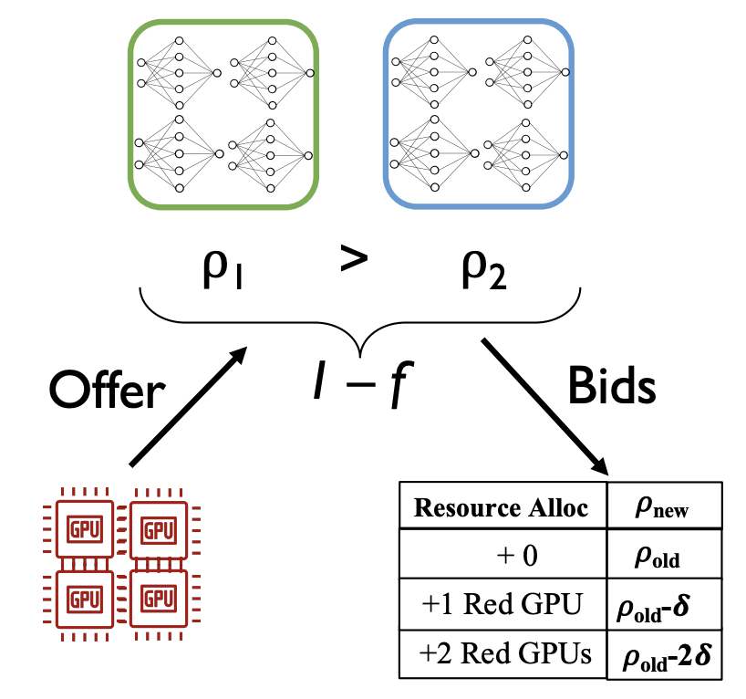
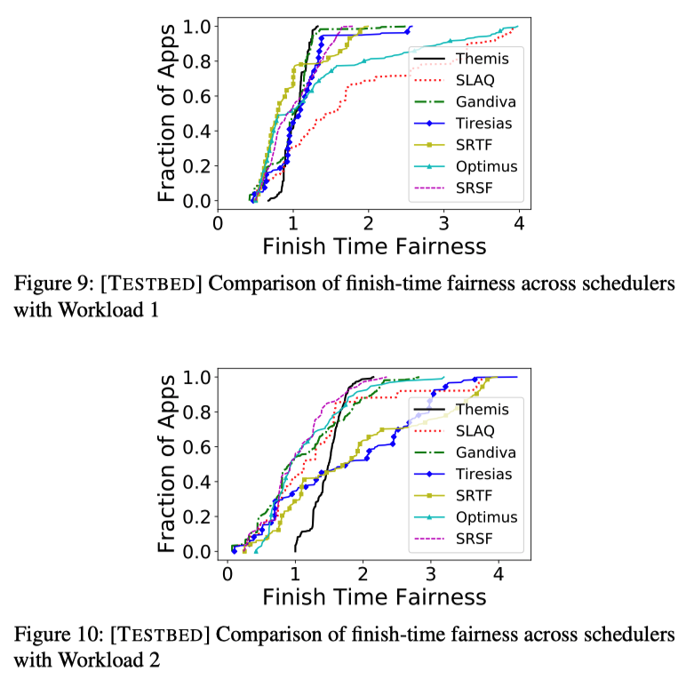
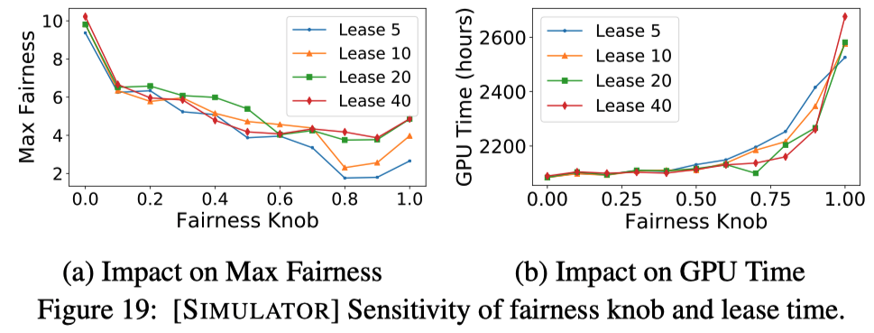

# Themis: Fair and Efficient GPU Cluster Scheduling

## One-line Summary

The authors present a new fairness metric, finish-time fairness, and a newer scheduler architecture and API that supports resource division according to the metric.

## Paper Structure Outline

1. Introduction
2. Motivation
   1. Preliminaries
   2. Characterizing Production ML Apps
   3. Our Goal
3. Finish-Time Fair Allocation
   1. Fair Sharing Concerns for ML Apps
      1. ML Task Durations
      2. Placement Preferences
   2. Metric: Finish-Time Fairness
   3. Mechanism: Partial Allocation Auctions
      1. One-Shot Auction
      2. Multi-round auctions
4. System Design
   1. Design Requirements
   2. THEMIS Scheduler Architecture
      1. Need for a new scheduling architecture
      2. Two-Level Semi-Optimistic Scheduling
   3. AGENT and AppScheduler Interaction
      1. Single-Job ML Apps
      2. Generalizing to Multiple-Job ML Apps
      3. End-to-end Example
5. Implementation
6. Evaluation
   1. Experimental Setup
   2. Macrobenchmarks
      1. Sources of Improvement
      2. Effect of Contention
      3. Systems Overheads
   3. Microbenchmarks
   4. Sensitivity Analysis
7. Related Work
8. Conclusion

## Background & Motivation

In large GPU clusters, existing scheduling disciplines do a poor job in fair sharing. 

The authors presented the Sharing Incentive \(SI\): "If N deep learning apps are sharing a cluster, then no application should run slower than on a private cluster with 1/N resources". Similar fairness metrics include Pareto Efficiency \(PE\) and Envy-Freeness \(EF\).

Existing cluster scheduling frameworks are not adequate:

1. Dominant Resource Fairness \(DRF\): The metric is "application resource share". It only uses instantaneous resource fairness \(whenever resources are available, they are allocated to the task with the least current share\). This is fine for big data analytics workloads, where task durations are short. For ML apps, though, running long, resource-intensive, gang-scheduled tasks might lead to newly-arrived jobs waiting, which is a violation of SI. Also, DRF does not take into account the placement preferences of ML apps. Modern ML apps have vastly different model architectures and placement preferences. For example, VGG16 is affected greatly by the hardware placement, while Inception-v3 is not. This is due to the difference in the amount of communication and synchronization for different workloads.
2. Least Attained Service \(LAS, Tiresias uses this\): The metric is "app attained service, \#GPUs \* time". In Tiresias, GPUs are leased for a certain duration, and when leases expire, available GPUs are given to the job that received the least GPU time thus far. While this resolves the starvation issue mentioned above, it fails to address the placement issue: For two \(sparse vs. dense\) placements, Tiresias considers them to be the same as the attained service is equal, while actually, a poor placement leads to a slower execution time.

## Design and Implementation

### Metric

The authors presented the new metric finish-time fairness, $$\rho$$:$$\rho = T_{sh} / T_{id}$$

* $$T_{sh}$$: finish-time of app in shared cluster
* $$T_{id}$$: finish-time of app in exclusive 1/N share of cluster
* $$N$$: average contention during app lifetime

The SI requires that for every application, $$\rho \leq 1$$.

### Interface

Hyperparameter Optimizers \(Hyperparam-Opt, like Google Vizier\) manage deep learning applications. The Hyperparam-Opt tracks per-job progress and determines which jobs to terminate early. Applications calculate $$\rho$$, and the scheduler pulls updated values of rho from the Agent co-located with the app's Hyperparam-Opt. For the CS 736 final, this is as deep as it will cover. In the future, I'll do a second read to try to dig deeper.

### Mechanism

SI's focus is minimizing the max rho: min\(max\(rho\)\)

Strawman Mechanism: When resources are available, the interface gets rho estimates from all apps, and then allocates the resources to the app with the highest rho for _lease_ duration. There are two drawbacks \(compared with Themis\):

1. May not find the most efficient allocation: It indeed allocates resources to the job that needs resources the most, but the job might not be the one that can utilize the resource the best.
2. Cannot handle applications that lie about high rho values: Applications have the incentive to lie with high rho values to hoard GPU resources, which leads to starvations of honest jobs.

Themis introduces a knob, f, that manages a tradeoff between SI and efficiency.

1. Solving inefficient allocation: When f = 0, more applications are allocated resources and, as a result, get better opportunities to match placement preferences of apps to resources. Analysis suggests f = 0.8 gives a good tradeoff.
2. Incentivizing truth-telling of rho: Partial Allocation Auction within 1-f apps.

## Evaluation

Baseline frameworks for comparison:

* Tiresias: Least Attained Service Job First
* Optimus: Best Throughput Scaling First
* Gandiva: Best Packing Job First
* SLAQ: Best Loss Gradient Job First

From Figure 9, we can observe a few things:

1. Some apps perform very poorly with Tiresias due to placement inefficiency
2. Themis is fair \(rho &lt;= 1.2\)
3. Themis is minimizing the max rho compared to other algorithms

From Figure 19, we can observe:

1. In general, increasing f \(filtering out more jobs\) increases fairness and decreases max rho
2. Increasing f gives us fewer scheduling choices, so it decreases GPU performance
3. Short lease -&gt; switch more rapidly between different jobs -&gt; fairer

## New Vocabulary

* Hyperparameters: Data that govern the training process itself. Hyperparameters are set before the learning process begins. For example, the number of hidden layers, the number of nodes each layer should use, etc. 
* Hyperparameter tuning: The process of finding the best values of the hyperparameters.
* [Preemptive and Non-Preemptive Scheduling](https://www.geeksforgeeks.org/preemptive-and-non-preemptive-scheduling/)

## Links

* [Paper PDF](https://www.usenix.org/system/files/nsdi20-paper-mahajan.pdf)
* [Presentation Video at NSDI '20](https://www.youtube.com/watch?v=K2a7DRcZdIU&ab_channel=USENIX)
* [Presentation Slides](https://www.usenix.org/sites/default/files/conference/protected-files/nsdi20_slides_mahajan.pdf)

