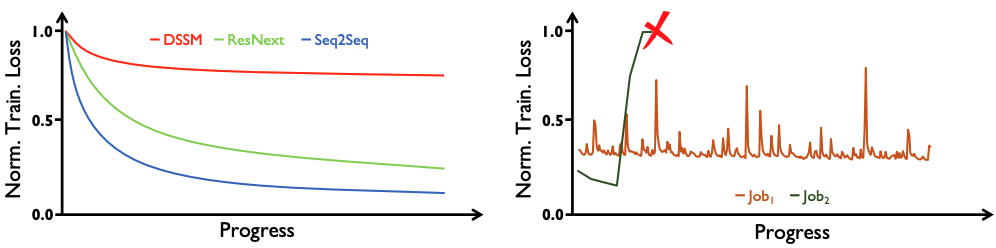

# Tiresias: A GPU Cluster Manager for Distributed Deep Learning

## One-line Summary

Tiresias is a cluster manager that uses \(1\) a Two-Dimensional Attained Service-Based Scheduler to minimize the average JCT and \(2\) a placement algorithm to relax the consolidation constraints for some models.

## Paper Structure Outline

1. Introduction
2. Background and Motivation
   1. Distributed Deep Learning \(DDL\)
   2. Challenges
   3. Potential for Benefits
3. Tiresias Design
   1. Overall Architecture
   2. Scheduling
      1. Why Two-Dimensional Scheduling?
      2. Two-Dimensional Attained Service-Based Scheduler \(2DAS\)
      3. Priority Discretization
   3. Placement
      1. Profiler
      2. The Placement Algorithm
   4. Summary
4. Implementation
5. Evaluation
   1. Experimental Setup
   2. Tiresias in Testbed Experiments
      1. JCT Improvements
      2. Cluster-Wide GPU Utilization
      3. Sources of Improvements
      4. Overheads
   3. Tiresias in Trace-Driven Simulations
      1. Simulator Fidelity
      2. JCT Improvements
   4. Sensitivity Analysis
      1. Impact of Queue Thresholds
      2. Impact of K \(number of priority queues\)
      3. Impact of PROMOTEKNOB
6. Discussion and Future Work
7. Related Work
8. Conclusion

## Background & Motivation

More and more deep learning jobs are being trained on GPU clusters. The design objectives of GPU managers include:

1. Minimizing cluster-wide average job completion time \(JCT\)
2. Achieve high resource \(GPU\) utilization

There are some challenges:

### Unpredictable Training Time

Algorithms like SJF and SRTF \(despite good in minimizing the avg. JCT\) require the prior knowledge of a job's \(remaining\) execution time, which is often unknown for DL training jobs. Existing solutions include predicting the remaining execution time using the smooth loss curve. However, not all jobs have smooth loss curves & run to completion IRL. Thus, state-of-the-art managers are naive.

### Over-Aggressive Job Consolidation

Existing cluster managers try to send jobs onto as few as possible number of servers to improve locality and reduce the network bottleneck. This leads to fragmented free GPUs in the cluster and longer queueing delays for jobs that require a large number of GPUs. In this work, the authors found that only some of the models have structures that are sensitive to placement.

### Preemption is Costly

Existing clusters do not preempt jobs because of the large time overhead.

## Design and Implementation

Tiresias addresses the two aforementioned issues by:

1. Using an age-based scheduler to minimize JCT w/o complete knowledge of jobs
2. Doing model profile-based placement to place jobs w/o additional information from users

A job lifecycle is as follows:

* 1: As soon as a job is submitted, its GPU requirements are known, and the job is appended to a WAITQUEUE
* 2: Scheduler
  * 2a: The scheduler schedules jobs from the WAITQUEUE
  * 2b: The scheduler preempts running jobs from the cluster to the WAITQUEUE
* 3: The placement module accepts starting/resuming jobs for GPU allocation
* 4: For new jobs, the profiler decides if they should be consolidated or not

### Scheduling

In DDL job scheduling, both the spatial \(\#GPUs\) and temporal \(time\) aspects of the jobs need to be considered. In Tiresias, the authors present a Two-Dimensional Attained Service-Based Scheduler \(2DAS\) that generalizes:

1. The classic least-attained-services \(LAS\) scheduling discipline \(2D-LAS\)
2. The Gittins index policy \(2D-Gittins Index\)

...to consider both spatial and temporal aspects of the jobs. LAS prefers jobs that received less service, while the Gittins index value represents how likely the job that has received some amount of service can complete within the next service quantum.

#### Priority Discretization

Using continuous priorities lead to preemptions and resumptions \(which are costly\), and continuous preemption degenerates 2DAS to fair sharing by time-division multiplexing. In Tiresias, a MLFQ is used for priority discretization. 

### Placement

The skew level of a model is a good predictor of whether a job benefits from consolidation, as the message size distribution depends on the tensor size distribution of the model. Observing the network communications sent out by the PS can inform us of the skew. The authors built a RDMA-level traffic monitoring tool for Tiresias as most production DL jobs use RDMA \(e.g., InfiniBand in Microsoft\) for PS-worker communication. The placement algorithm compares the model skew with a threshold, and if the skew is larger than the threshold, consolidation is performed.

## Evaluation

## New Vocabulary

* [Apache Hadoop YARN](https://hadoop.apache.org/docs/current/hadoop-yarn/hadoop-yarn-site/YARN.html)
* SRSF \(Shortest Remaining Service First\): The multiplication of a job's remaining time and the number of GPUs.
* Preemption: The act of temporarily interrupting a task being executed \(w/o requiring its cooperation\) and with the intention of resuming the task later. Such changes are known as context switches.
* ILP formulation: The mathematical formulation of an optimization problem in which variables are restricted to integer values and the constraints and objective function are linear. Mixed integer linear programming \(MILP\) refers to optimization problems in which some of the variables are continuous.

## Links

* [Paper PDF](https://www.usenix.org/system/files/nsdi19-gu.pdf)
* [Presentation video at NSDI '19](https://www.youtube.com/watch?v=-RtcM0oz1lQ)
* [Presentation slides](https://www.usenix.org/sites/default/files/conference/protected-files/nsdi19_slides_gu.pdf)
* [Tiresias on GitHub](https://github.com/SymbioticLab/Tiresias)
* [Xiangfeng Zhu's paper reading notes](https://xzhu0027.gitbook.io/blog/ml-system/sys-ml-index/tiresias-a-gpu-cluster-managerfor-distributed-deep-learning)
* [\[EuroSys 18'\] Optimus: An Efficient Dynamic Resource Scheduler for Deep Learning Clusters](https://i.cs.hku.hk/~cwu/papers/yhpeng-eurosys18.pdf)

