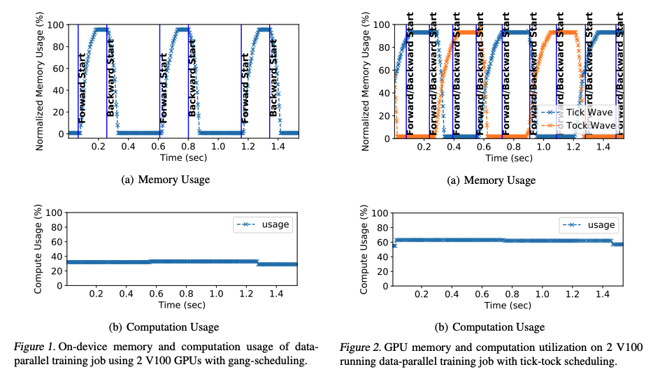
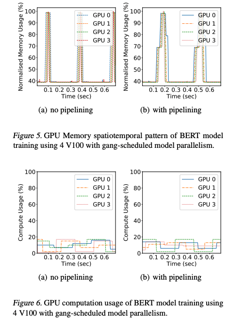
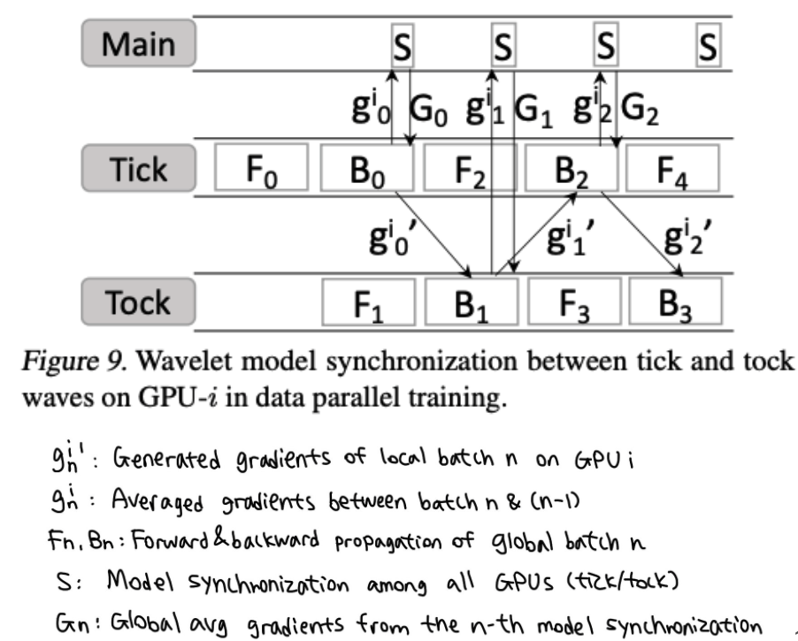
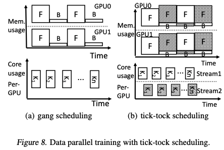
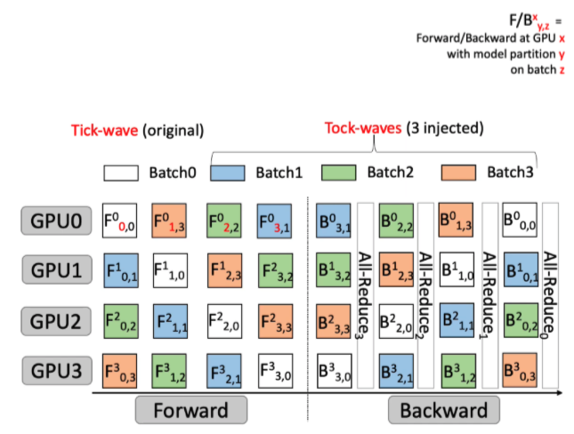

# Wavelet: Efficient DNN Training with Tick-Tock Scheduling

## One-line Summary

Both data and model parallelism suffer from system under-utilization. Wavelet exploits the under-utilized memory & compute by scaling up the number of training tasks and launching the additional tasks with a delay to fully utilize the on-chip memory and improve the compute utilization, speeding up individual jobs.

That was an unnecessarily long sentence... GRE took its toll on me!

## Paper Structure Outline

1. Introduction
2. Background and Motivation
   1. Distributed DNN Training Schemes
   2. Jobs Characteristics of Distributed DNN Training
      1. Zoom-in analysis on data parallel training
      2. Sub-iteration analysis on model parallel training
3. Wavelet Design
   1. System Overview
   2. Wavelet in Data Parallelism
      1. Memory overlapping
      2. Computation overlapping
      3. Model synchronization between waves
   3. Wavelet in Model Parallelism
      1. Launching multiple tock-wave tasks
      2. Model partition switching
      3. Inter-batch synchronization
4. Evaluation
   1. Data parallelism
      1. Single machine multi-GPU
      2. Multi-machine multi-GPU
   2. Model parallelism
      1. Single machine multi-GPU
      2. Multi-machine multi-GPU
      3. Overhead analysis
5. Related Work
   1. Resource allocation for distributed DNN training
   2. GPU sharing
6. Conclusion

## Background & Motivation

Bigger models & datasets call for large-scale distributed machine learning training. The current scheduling policy, gang scheduling, where all training tasks on all workers need to be launched at the same time, contributes to the under-utilization of system resources \(compute & memory\).

In Fig. 1 \(see above\), computation is memory-bounded during the forward propagation. Between time 0.4 and 0.6, memory is underutilized in the backward propagation. Moreover, ~60% of on-chip compute cores are underutilized.

There are existing job multiplexing schemes that boost system utilization. [Gandiva](gandiva-introspective-cluster-scheduling-for-deep-learning.md) lets 2 low-utilization jobs space-share a GPU. [Salus](salus-fine-grained-gpu-sharing-primitives-for-deep-learning-applications.md) provides fine-grained memory sharing via the GPU Lane abstraction. However, neither scheme contributes to the training progress of a single job. In this work, Wavelet relaxes the gang scheduling scheme and accelerates a single job while improving the system utilization.

## Design and Implementation

### Data parallelism

#### Model synchronization

In vanilla allreduce, there are only Main & Tick waves. With this Tock wave added, Wavelet doubles the number of model synchronizations. This is the same as synchronizing over 2\*N data parallel tasks on 2\*N GPUs, thus guaranteeing convergence.  

#### Overlapping memory

In gang scheduling, the memory of all GPUs is underutilized during backprop. Tick-tock scheduling injects tock-wave tasks right after the tick-wave tasks finish the forward pass. To concurrently run 2 tasks \(tick & tock\), 2 model replicas are maintained on the GPU since the two waves train on different data. In the memory, the size of the model is way smaller than the size of the intermediate results, so no need to worry about the extra memory.

#### Overlapping computation

CUDA computation kernels are launched in separate CUDA streams to ensure ordered execution within a stream and non-blocking across different streams. The empty bubbles between kernels is due to the latency of CPUs sending instructions to GPUs.

### Model parallelism

In the vanilla pipelined process \(white blocks\), only 1 batch is active in the system and at most 1 GPU is active at a time. Each GPU also holds the same model partition during the whole training process.

In Wavelet, we inject 3 \(N-1 w/ N GPUs\) tock waves on 1 tick wave. The model partition is swapped on each GPU using a round-robin fashion. There exists an extra model synchronization for each model partition, and the context switching also brings overhead.

## Evaluation

### Data parallelism

* Single machine: Up to 1.88x speedup \(avg: 1.4x, theoretically 2x\) over DP baseline
* Multiple machine: Up to 1.18x speedup over baseline. The worse throughput than baseline is the overhead kicking in: The cross-machine low-bandwidth network becomes the bottleneck during the extra allreduce

### Model parallelism

* Only ~2.5x speedup in 4x/8x parallelism
  * Gpipe/PipeDream breaks a mini-batch into smaller micro-batches -&gt; High-frequency but small-size data chunks
  * Number of CUDA kernel calls **↑**
  * Intermediate result transfer between GPUs that hold different model partitions **↑**
  * Linear scalability in theory

### Overhead analysis

* Context switch: Switching model partition, ~4% of total training time
* Communication: Transferring intermediate results across GPUs \(~15% of total training time\)
* All reduce: Model synchronization during backprop \(~4% of total training time\)

## Links

* [Paper PDF](https://proceedings.mlsys.org/paper/2021/file/c81e728d9d4c2f636f067f89cc14862c-Paper.pdf)
* [Presentation video at MLSys '21](https://mlsys.org/virtual/2021/oral/1586)
* [Presentation slides at MLSys '21](https://mlsys.org/virtual/2021/oral/1586)

